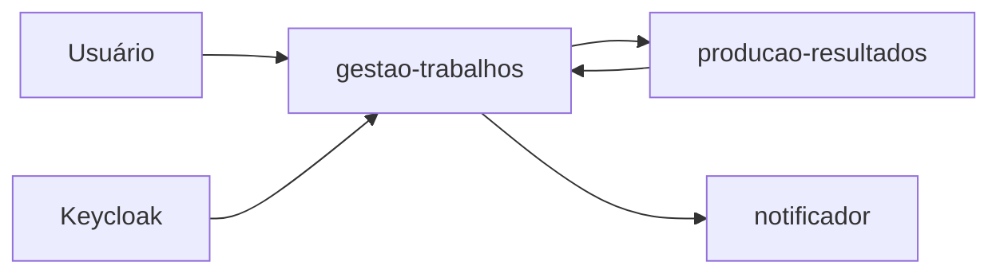

# Mapa da arquitetura do FIAP X

> Navegação: [README principal](README.md) · [catálogo detalhado](docs/arquitetura/README.md) · [roadmap ativo](docs/acompanhamento/roadmap.md)

Este arquivo é o mapa arquitetural de alto nível do repositório. Ele ajuda humanos e agentes a localizar a definição vigente sem substituir componentes, ADRs, ameaças ou evidências mantidos em [`docs/`](docs/README.md).

## Estado atual

- **Observado:** a aplicação-alvo ainda não existe neste repositório. O único código de aplicação é o [protótipo Go de referência](docs/referencia/README.md), usado como evidência do ponto de partida, não como arquitetura a preservar.
- **Decidido:** o núcleo possui oito componentes lógicos em [`CTX-CMP-003`](docs/arquitetura/componentes-coesos.md), aceitos por [`DEC-0004`](docs/arquitetura/decisoes/0004-componentes-coesos-do-nucleo.md).
- **Decidido:** a validação usa três quanta Kubernetes conforme [`DEC-0002`](docs/arquitetura/decisoes/0002-topologia-kubernetes.md), e Keycloak é plataforma de identidade autocontida conforme [`DEC-0005`](docs/arquitetura/decisoes/0005-keycloak-no-ambiente-de-validacao.md).
- **Em análise:** aceite durável, RabbitMQ, outbox/inbox, PostgreSQL e object storage pertencem à [`DEC-0003`](docs/arquitetura/decisoes/0003-entrega-duravel-e-persistencia.md); nenhuma dessas realizações está aceita ou implementada.
- **Preferência:** Java com Quarkus continua sendo preferência declarada, ainda sem ADR ou estrutura de aplicação.

Uma afirmação de direção ou uma alternativa em análise não descreve código existente. Consulte o [contexto do projeto](docs/contexto-projeto.md#decisoes-vigentes) para a separação completa entre declarado, observado, decidido e hipotético.

## Limites lógicos vigentes

| Componente | Autoridade principal |
|---|---|
| `CMP-18` — Autenticação e Identidade | valida identidade OIDC, sem decidir propriedade |
| `CMP-19` — Submissão e Admissão | admite uma origem recuperável antes do aceite |
| `CMP-20` — Ciclo do Trabalho | único escritor do estado e árbitro de tentativas e desfechos |
| `CMP-21` — Processamento de Mídia | executa uma tentativa autorizada e relata fatos técnicos |
| `CMP-22` — Publicação de Resultados | publica manifesto, imagens e ZIP recuperáveis |
| `CMP-23` — Consulta de Trabalhos | projeta os trabalhos visíveis ao sujeito autenticado |
| `CMP-24` — Acesso a Resultados | autoriza o proprietário e entrega o ZIP publicado |
| `CMP-25` — Comunicação de Falhas | comunica uma falha persistida sem alterar o trabalho |

Responsabilidades, contratos e dependências conceituais pertencem ao [modelo ativo](docs/arquitetura/componentes-coesos.md). Modelos anteriores são evidência histórica e não orientam novas mudanças.

## Mapa de implantação aceito para validação

| Quantum da aplicação | Componentes lógicos |
|---|---|
| `gestao-trabalhos` | `CMP-18`, `CMP-19`, `CMP-20`, `CMP-23`, `CMP-24` |
| `producao-resultados` | `CMP-21`, `CMP-22` |
| `notificador` | `CMP-25` |

Keycloak, banco, broker, object storage e observabilidade não são componentes nem quanta do FIAP X. A decisão física detalhada e seus sinais de revisão estão em [`DEC-0002`](docs/arquitetura/decisoes/0002-topologia-kubernetes.md).

## Invariantes

- componente lógico, quantum, processo, repositório, banco e unidade de implantação são conceitos distintos;
- somente `CMP-20` cria ou altera o estado do trabalho;
- origem recuperável precede aceite, tentativa autorizada precede execução e resultado recuperável precede conclusão;
- `CMP-21/22` relatam fatos técnicos; somente `CMP-20` decide falha, retry e transição;
- `CMP-22` publica o resultado; `CMP-24` decide propriedade e acesso;
- tecnologias candidatas não se tornam obrigação antes de evidência e decisão registrada;
- fronteiras aceitas devem futuramente ser protegidas por testes estruturais no código.

## Futuro mapa do código

A estrutura de pacotes e módulos será registrada aqui somente depois da decisão de stack e da primeira fatia executável. Quando existir código-alvo, o mapa deverá relacionar diretórios a componentes e quanta, indicar direções permitidas de dependência e apontar para testes estruturais que apliquem essas regras.

Até lá, não invente uma árvore de código desejada. Use as seguintes autoridades:

| Pergunta | Fonte canônica |
|---|---|
| Objetivo, estado observado e decisões vigentes | [Contexto do projeto](docs/contexto-projeto.md) |
| Responsabilidades e contratos dos componentes | [`CTX-CMP-003`](docs/arquitetura/componentes-coesos.md) |
| Características arquiteturais | [`CTX-CHAR-001`](docs/arquitetura/caracteristicas.md) |
| Topologia aceita | [`DEC-0002`](docs/arquitetura/decisoes/0002-topologia-kubernetes.md) |
| Persistência e mensageria em análise | [`DEC-0003`](docs/arquitetura/decisoes/0003-entrega-duravel-e-persistencia.md) |
| Ameaças e fronteiras de confiança | [`CTX-THREAT-001`](docs/arquitetura/modelo-ameacas.md) |
| Decisões duráveis | [Índice de ADRs](docs/arquitetura/decisoes/README.md) |
| Próximo incremento | [Roadmap ativo](docs/acompanhamento/roadmap.md) |

## Manutenção

Atualize este mapa quando uma decisão aceita mudar limites, topologia ou organização real do código. Registre detalhes e justificativas na fonte apropriada em `docs/`; mantenha aqui apenas o estado corrente, os invariantes e os caminhos de descoberta.
