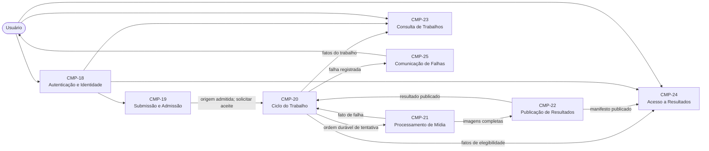
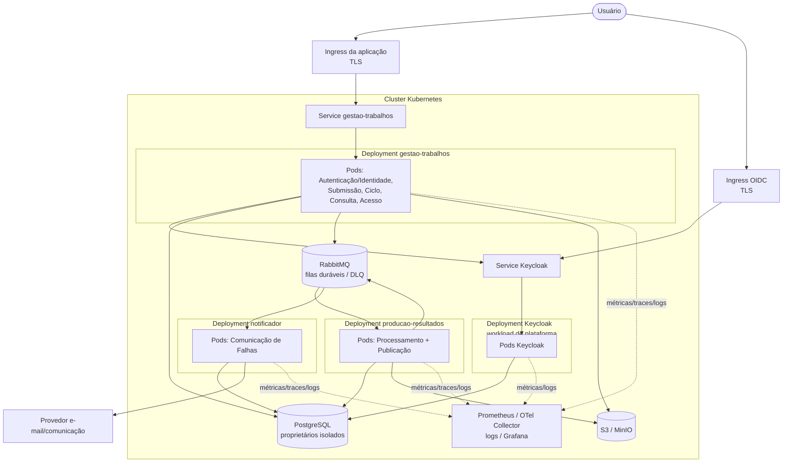

# Comparação e arquitetura recomendada

> Navegação: [arquitetura](README.md) · [decisões](decisoes/README.md) · [README principal](../../README.md)

## Estado, objetivo e linguagem de evidência

Este nó compara o conjunto de [sete histórias `CTX-REQ-001`](../requisitos/historias.md) e o modelo histórico de treze componentes [`CTX-CMP-002`](historico/componentes/ctx-cmp-002-componentes-modulares.md) com a proposta isolada de [dez formulações `R6-REQ-001`](../propostas/base-simplificada-seis-componentes/historias.md) e seis componentes [`R6-CMP-MODEL-001`](../propostas/base-simplificada-seis-componentes/componentes.md). A consolidação confirmada em [`REQ-CHG-0003`](../requisitos/refinamentos/REQ-CHG-0003.md) preserva somente `US-01..07` como núcleo, e [`DEC-0004`](decisoes/0004-componentes-coesos-do-nucleo.md) estabelece o sucessor de oito componentes [`CTX-CMP-003`](componentes-coesos.md).

O documento continua `em_analise` como definição física e plano de validação: não descreve uma implementação existente. Já estão decididos o núcleo conservador, os oito componentes, três quanta Kubernetes e o Keycloak empacotado; [`DEC-0003`](decisoes/0003-entrega-duravel-e-persistencia.md), valores operacionais e resultados de testes permanecem em análise.

As afirmações são diferenciadas assim:

| Classe | Significado neste documento |
|---|---|
| **Observado** | Evidência verificável no Git ou nos arquivos do repositório |
| **Declarado** | Necessidade ou preferência escrita no enunciado ou nas histórias canônicas |
| **Decidido** | Escolha confirmada e ligada a um ADR aceito |
| **Inferido** | Mecanismo ou detalhe proposto para satisfazer uma necessidade; deve ser confirmado por experimento ou ADR |
| **Condicional** | Extensão que só entra no produto se houver confirmação de necessidade e prioridade |

Os identificadores locais `AR-CMP-01..08` usados durante a comparação inicial são preservados como histórico e correspondem, na mesma ordem, a `CMP-18..25`. Os IDs canônicos e suas autoridades pertencem somente a [`CTX-CMP-003`](componentes-coesos.md); este documento não os redefine.

## Snapshot Git da comparação histórica

**Snapshot observado em 2026-08-03:**

| Evidência | Resultado |
|---|---|
| Commit da proposta comparada | `896914135f68c5755e90cd2c173943bb5f8763ee` |
| Pai do commit da proposta | `b71c41478d93bff247bc7412bf3721b808bee070` |
| `git merge-base 8969141 b71c414` | `b71c41478d93bff247bc7412bf3721b808bee070` |
| Assunto de `8969141` | `docs: registra proposta isolada de refinamento` |
| `git diff-tree --no-commit-id --name-status -r 8969141` | 11 arquivos adicionados (`A`), todos sob `docs/propostas/base-simplificada-seis-componentes/` |
| Estatística do commit | 1.029 linhas adicionadas; nenhum arquivo anterior modificado ou removido |

O próprio [README da proposta](../propostas/base-simplificada-seis-componentes/README.md) declara `b71c41478d93bff247bc7412bf3721b808bee070` como base e afirma que o pacote não substitui histórias, componentes, características nem roadmap canônicos. Portanto, o commit `8969141` não alterou a arquitetura então vigente: acrescentou uma alternativa isolada construída sobre seu pai. A comparação histórica correta é entre o canônico existente em `b71c414` e a proposta adicionada em `8969141`, não entre duas implementações.

Também é **observado** que não havia aplicação-alvo implementada nesses snapshots. O [estado corrente do repositório](../../README.md#estado-atual) continua distinguindo o protótipo de referência da arquitetura-alvo; a definição abaixo descreve um destino, não uma implementação existente.

## Comparação das histórias

### Sete histórias canônicas versus dez histórias R6

| História canônica | Tratamento em R6 | Ganho observado | Regressão ou lacuna | Tratamento nesta definição |
|---|---|---|---|---|
| [`US-01`](../requisitos/historias.md#us-01) — Autenticar-se | Adiada, sem história equivalente | Mantém a proposta focada no fluxo de mídia | Retira uma necessidade declarada e inviabiliza garantir “meus trabalhos” e “meus resultados” | Keycloak autentica; `CMP-18` valida `(issuer, subject)`; componentes do recurso aplicam propriedade |
| [`US-02`](../requisitos/historias.md#us-02) — Enviar um vídeo | Simplificada em [`R6-US-01`](../propostas/base-simplificada-seis-componentes/historias.md#r6-us-01) | Nome e objetivo ficam diretos | Critérios de admissão, aceite recuperável e resposta assíncrona ficam enfraquecidos; Submissão passa a conhecer worker e notificação | Submissão valida e preserva a origem; somente Ciclo do Trabalho aceita, após origem, trabalho e outbox duráveis |
| [`US-03`](../requisitos/historias.md#us-03) — Processar concorrentemente | Valor em [`R6-US-05`](../propostas/base-simplificada-seis-componentes/historias.md#r6-us-05); concorrência movida para `R6-CA-02` | Separa valor de negócio de uma característica sistêmica, sem perder a intenção | Faltam metas e mecanismo físico | Processamento de Mídia escala pelo backlog, com isolamento por trabalho e testes concorrentes |
| [`US-04`](../requisitos/historias.md#us-04) — Preservar trabalhos aceitos | Parcialmente coberta por `R6-CA-01` e [`R6-US-07`](../propostas/base-simplificada-seis-componentes/historias.md#r6-us-07) | Explicita reprocessamento manual | Remove tentativa e retentativa automática, apesar das regras canônicas; não define entrega durável ao worker | Mantém tentativas, retentativa limitada, idempotência, outbox/inbox, DLQ e reconciliação |
| [`US-05`](../requisitos/historias.md#us-05) — Consultar os próprios trabalhos | Sobreposta por [`R6-US-03`](../propostas/base-simplificada-seis-componentes/historias.md#r6-us-03) e ampliada por [`R6-US-06`](../propostas/base-simplificada-seis-componentes/historias.md#r6-us-06) | Separa projeção de leitura; sugere detalhe útil | Motivo sanitizado e consulta detalhada não foram confirmados; sem identidade, propriedade não pode ser aplicada | Núcleo lista por `(issuer, subject)`; detalhe e motivo continuam `A confirmar` |
| [`US-06`](../requisitos/historias.md#us-06) — Baixar o resultado | Expandida em [`R6-US-02`](../propostas/base-simplificada-seis-componentes/historias.md#r6-us-02) e [`R6-US-10`](../propostas/base-simplificada-seis-componentes/historias.md#r6-us-10) | Separa publicação física de acesso e permite tratar ZIP como representação | Download individual não foi pedido; mover o ZIP não pode retirar a obrigação de entregar o ZIP | ZIP continua resultado obrigatório; download individual permanece extensão condicional |
| [`US-07`](../requisitos/historias.md#us-07) — Ser notificado sobre falha | Expandida em [`R6-US-04`](../propostas/base-simplificada-seis-componentes/historias.md#r6-us-04) e [`R6-US-09`](../propostas/base-simplificada-seis-componentes/historias.md#r6-us-09) | Isola comunicação e torna canais/preferências explícitos | Submissão, sucesso, preferências e múltiplos canais ampliam escopo; garantias e consentimento continuam abertos | Suporta falha registrada como núcleo; demais eventos, preferências e canais são condicionais |

As dez histórias R6 não são “mais completas” apenas por serem mais numerosas. Quatro delas — cancelamento, preferências de notificação, download individual e notificações além da falha — são extensões úteis, mas não requisitos declarados pelo enunciado. Elas são mapeadas nesta arquitetura para preservar evolutividade, sem entrar automaticamente no primeiro incremento.

### Ganhos, regressões e condições

**Ganhos aproveitados da proposta R6:**

- uma autoridade explícita para o ciclo de vida do trabalho;
- consulta somente leitura separada de comandos e transições;
- disponibilidade física dos artefatos separada do estado de negócio;
- ZIP tratado como representação publicada do resultado, não como responsabilidade da extração;
- notificação isolada dos estados do trabalho;
- componentes mais amplos que os treze canônicos, reduzindo coordenação interna excessivamente fina.

**Regressões que impedem promover R6 sem correção:**

- identidade e segurança foram adiadas, embora sejam declaradas;
- tentativa, retentativa automática e deduplicação de ciclo foram retiradas;
- Submissão aciona Processamento e Notificação diretamente, conhece consequências a jusante e divide a coordenação do ciclo;
- a garantia “não perder uma requisição” não recebe ponto de aceite, outbox e recuperação físicos;
- “meus trabalhos” e “meus resultados” aparecem sem uma autoridade de identidade e propriedade;
- a simplificação de seis componentes não foi acompanhada de uma topologia executável, persistência, broker, observabilidade ou CI/CD.

**Extensões condicionais:**

| Extensão | Responsável se confirmada | Condição de entrada |
|---|---|---|
| Cancelar trabalho (`R6-US-08`) | Ciclo do Trabalho | Estados canceláveis, semântica de interrupção e prioridade confirmados |
| Configurar preferências (`R6-US-09`) | Comunicação de Falhas, se seu escopo for ampliado | Consentimento, canais e padrão de opt-in/opt-out confirmados |
| Baixar imagem individual (`R6-US-10`) | Acesso a Resultados | Valor de produto confirmado e catálogo/endereço de cada imagem definido |
| Notificar submissão, sucesso ou progresso (`R6-US-04`) | Comunicação de Falhas ou sucessor, conforme novo refinamento | Eventos, canais, custo e garantia de entrega confirmados |

O reprocessamento manual de um trabalho falho não é tratado como simples expansão R6: ele já aparece como inferência no conjunto canônico. Tentativas, retentativas automáticas limitadas e idempotência também são retidas porque sustentam a recuperabilidade, embora quantidades e taxonomia de falhas continuem a confirmar.

## Comparação dos componentes

### Treze componentes canônicos versus seis componentes R6

| Responsabilidade canônica | Destino R6 | Avaliação | Destino refinado local |
|---|---|---|---|
| `CMP-05` Identidade e Acesso | Adiada | Regressão incompatível com autenticação e propriedade | `CMP-18` Autenticação e Identidade |
| `CMP-06` Submissão + `CMP-07` Admissão | `R6-CMP-01` Submissão | União coesa enquanto regras de admissão não exigirem ciclo próprio | `CMP-19` Submissão e Admissão |
| `CMP-08` Aceitação | Dividida entre Submissão e Gerenciar | Divide autoridade e faz a borda conhecer efeitos a jusante | `CMP-20` Ciclo do Trabalho |
| `CMP-09` Consulta | `R6-CMP-05` Visualizar | Ganho de linguagem; permanece leitura | `CMP-23` Consulta de Trabalhos |
| `CMP-10` Política de Tentativas | Removida | Regressão de confiabilidade | Absorvida por `CMP-20`, sem retirar o conceito de tentativa |
| `CMP-11` Despacho | Submissão + Gerenciar | Coordenação duplicada | Outbox sob `CMP-20`; publicação física por adaptador |
| `CMP-12` Execução + `CMP-13` Extração | `R6-CMP-03` Processamento | União coesa para o mesmo perfil de CPU/I/O e falha | `CMP-21` Processamento de Mídia |
| `CMP-14` Empacotamento | `R6-CMP-04` Entrega | Transferir ZIP para a fronteira de resultado é coerente | `CMP-22` Publicação de Resultados |
| `CMP-15` Registro de Desfecho | `R6-CMP-02` Gerenciar | Boa centralização de transições | `CMP-20` Ciclo do Trabalho |
| `CMP-16` Acesso | `R6-CMP-04` Entrega | Mistura escrita/publicação com leitura/autorização | `CMP-24` Acesso a Resultados |
| `CMP-17` Comunicação de Falhas | `R6-CMP-06` Notifica | Boa separação, mas escopo ampliado sem confirmação | `CMP-25` Comunicação de Falhas |

O modelo canônico de treze componentes esclarece regras, mas introduz fronteiras muito finas para o primeiro código: admissão, aceite, política, despacho, execução, extração, empacotamento e registro poderiam virar módulos anêmicos se não tiverem política própria. R6 reduz esse risco, porém reúne responsabilidades que têm autoridades, perfis de segurança e direções de dados diferentes. O refinamento local usa oito componentes: mantém as uniões coesas de R6, reintegra Identidade, concentra o ciclo e separa Publicação de Acesso.

## Matriz completa do enunciado e rastreabilidade

Kubernetes, RabbitMQ/Kafka, PostgreSQL/Redis, Prometheus/Grafana/ELK e GitHub Actions aparecem na seção de **stack recomendada** do enunciado. Logo, não nasceram como requisitos obrigatórios. Persistência, capacidade de escala, GitHub, testes e CI/CD são declarados. Kubernetes, os três quanta e o Keycloak autocontido passaram a decisões do projeto em [`DEC-0002`](decisoes/0002-topologia-kubernetes.md) e [`DEC-0005`](decisoes/0005-keycloak-no-ambiente-de-validacao.md). RabbitMQ, PostgreSQL, armazenamento S3-compatible e sua semântica física continuam em análise em [`DEC-0003`](decisoes/0003-entrega-duravel-e-persistencia.md).

| ID local | Necessidade e fonte | Classificação | Mecanismo nesta recomendação | Verificação ou evidência de aceite |
|---|---|---|---|---|
| EN-01 | Enviar vídeo, extrair imagens e baixar ZIP (introdução, linhas 5–11) | Declarado como objetivo do produto | API assíncrona, storage de objetos, Produção de Resultados, publicação de ZIP e acesso autorizado | E2E envia vídeo, aguarda conclusão, baixa ZIP íntegro e confere imagens |
| EN-02 | Desenho de arquitetura | Expectativa pedagógica e entregável declarado | Este nó, diagramas lógico/físico, componentes, quanta, contratos e ADRs | Links, metadados e diagramas válidos; revisão de rastreabilidade |
| EN-03 | Desenvolvimento de microsserviços | Expectativa pedagógica; quantidade não declarada | Três quanta/processos implantáveis, sem equiparar componente a microsserviço | Deploy independente e teste de contrato entre processos |
| EN-04 | Qualidade de software | Expectativa pedagógica | testes, análise estática, arquitetura modular e pipeline | gates de CI aprovados e cobertura de riscos críticos |
| EN-05 | Mensageria | Expectativa pedagógica; produto apenas recomendado | RabbitMQ com exchanges/filas duráveis, DLQ, outbox e inbox | teste de pico, reentrega, indisponibilidade do broker e recuperação |
| EN-06 | Processar mais de um vídeo ao mesmo tempo | Declarado | réplicas concorrentes de `producao-resultados`, isolamento por trabalho e limite de recursos | teste com lote concorrente sem colisão de arquivos/estados |
| EN-07 | Não perder requisição em picos | Declarado | aceite somente após durabilidade; outbox; fila durável; publisher confirms; inbox; retries; reconciliação | balanço `aceitos = pendentes + processando + concluídos + falhos`, inclusive após reinícios |
| EN-08 | Proteger por usuário e senha | Declarado | Keycloak empacotado; senha no IdP; JWT validado; propriedade por `(issuer, subject)` | testes `401/403`, usuário A não lista nem baixa recursos de B |
| EN-09 | Listar estados dos vídeos de um usuário | Declarado | projeção de Consulta filtrada pela identidade autenticada | lista de A nunca contém trabalhos de B; estados convergem após eventos |
| EN-10 | Usuário pode ser notificado em caso de erro | Declarado como possibilidade; canal aberto | evento de falha persistida para Comunicação de Falhas; e-mail é adaptador candidato | falha registrada gera mensagem sanitizada; falha do canal não muda o trabalho |
| EN-11 | Persistir dados | Declarado | recomendação em análise: PostgreSQL para metadados/outbox/inbox e S3/MinIO para origem/resultados | reinício de pods e serviços sem perda do trabalho aceito ou artefato |
| EN-12 | Arquitetura que permita escala | Declarado | workloads stateless onde aplicável; fila, object storage e KEDA/HPA candidatos por perfil e medição | variar réplicas de `producao-resultados` sem mudar API nem duplicar resultado |
| EN-13 | Versionar no GitHub | Declarado | repositório GitHub; proteção de branch e revisão | commit/PR rastreável e remoto configurado; código-alvo ainda pendente |
| EN-14 | Testes que garantam qualidade | Declarado | testes unitários, integração, contrato, E2E, segurança, carga e recuperação | pipeline bloqueia merge quando algum gate falha |
| EN-15 | CI/CD | Declarado | pipeline candidato em GitHub Actions, imagens OCI imutáveis e promoção por ambiente | build, testes, scan, deploy de homologação e smoke test automatizados |
| EN-16 | Docker + Kubernetes ou Docker Compose | Recomendado como alternativas | **Kubernetes decidido** em `DEC-0002`; imagens Docker/OCI; Keycloak incluído | manifests/Helm renderizados, bootstrap em máquina limpa e rollout saudável |
| EN-17 | RabbitMQ, Kafka ou similar | Recomendado como alternativas | RabbitMQ recomendado em `DEC-0003`, ainda em análise, por filas de trabalho, roteamento e DLQ simples | teste de durabilidade, ack, redelivery, DLQ e pressão de backlog |
| EN-18 | PostgreSQL + Redis ou alternativa | Recomendado como alternativas | PostgreSQL recomendado em `DEC-0003`, ainda em análise; Redis não é incluído sem necessidade medida | migrations reproduzíveis, isolamento de credenciais e testes de persistência |
| EN-19 | Prometheus/Grafana, ELK ou alternativa | Recomendado como alternativas | Prometheus/Grafana, logs estruturados e traces OpenTelemetry | dashboards, alertas e correlação por `traceId`, `workId`, `attemptId` |
| EN-20 | GitHub Actions ou alternativa | Recomendado como alternativas | GitHub Actions é candidato coerente, ainda sem ADR aceito | workflow executado em PR e promoção controlada por ambiente |
| EN-21 | Documentação da arquitetura | Entregável declarado | definição, ADRs, diagramas e runbooks | revisão confirma cobertura de todos os itens desta matriz |
| EN-22 | Script de criação do banco ou recursos | Entregável declarado | migrations versionadas e chart/manifests; bootstrap de ambiente de demonstração | ambiente vazio é criado por comando reproduzível e migrations idempotentes |
| EN-23 | Link GitHub do código | Entregável declarado | URL do repositório a informar na entrega | clone limpo, build e testes conforme README; código-alvo ainda pendente |
| EN-24 | Vídeo de até 10 minutos com documentação, arquitetura e sistema funcionando | Entregável declarado | roteiro curto e ambiente de demonstração reproduzível | gravação dentro do limite executa fluxo feliz e evidencia falha/recuperação |

API REST/HTTP, Keycloak, MinIO, Java/Quarkus, “exatamente três serviços” e Redis não são requisitos textuais. Keycloak e os três serviços são escolhas aceitas para a entrega acadêmica, não necessidades do domínio nem prescrição de produção. HTTP/REST continua adaptação proposta; Java com Quarkus é uma **preferência registrada a confirmar**. Redis só deve ser acrescentado se medição demonstrar necessidade de cache ou coordenação que PostgreSQL/RabbitMQ não atendam com segurança.

## Evidência do refinamento dos componentes

O ciclo completo que confrontou as histórias canônicas, o modelo `CTX-CMP-002` e a proposta R6 foi preservado em [`CTX-EVD-CMP-003`](historico/componentes/ctx-cmp-003-refinamento.md). Esse registro contém técnica, inventário congelado, atribuições, análises, refatoração e verificação de convergência.

Este documento mantém somente os deltas comparativos necessários para explicar a proposta R6 e a arquitetura física em análise. As fronteiras, autoridades e contratos correntes pertencem exclusivamente a [`CTX-CMP-003`](componentes-coesos.md); a decisão de adotá-los pertence a [`DEC-0004`](decisoes/0004-componentes-coesos-do-nucleo.md).

## Mapeamento histórico do inventário comparativo

Os rótulos `AR-CMP-01..08` foram usados durante a comparação e permanecem somente para rastreabilidade. Eles não redefinem papéis, autoridades, contratos ou mecanismos de `CMP-18..25`.

| Rótulo histórico | Componente canônico | Delta relevante observado na consolidação |
|---|---|---|
| `AR-CMP-01` | [`CMP-18 — Autenticação e Identidade`](componentes-coesos.md#cmp-18) | reintegrou identidade obrigatória, adiada pela proposta R6, sem transferir propriedade do recurso |
| `AR-CMP-02` | [`CMP-19 — Submissão e Admissão`](componentes-coesos.md#cmp-19) | restringiu a borda à entrada e moveu aceite para o Ciclo |
| `AR-CMP-03` | [`CMP-20 — Ciclo do Trabalho`](componentes-coesos.md#cmp-20) | preservou autoridade única sobre estado, ciclos, tentativas e desfecho |
| `AR-CMP-04` | [`CMP-21 — Processamento de Mídia`](componentes-coesos.md#cmp-21) | preservou execução e concorrência sem autoridade sobre usuário, estado ou retry |
| `AR-CMP-05` | [`CMP-22 — Publicação de Resultados`](componentes-coesos.md#cmp-22) | separou manifestação durável do resultado de sua leitura autorizada |
| `AR-CMP-06` | [`CMP-23 — Consulta de Trabalhos`](componentes-coesos.md#cmp-23) | manteve projeção somente leitura sem promover detalhe de falha ainda não confirmado |
| `AR-CMP-07` | [`CMP-24 — Acesso a Resultados`](componentes-coesos.md#cmp-24) | separou autorização e entrega do ZIP da publicação física |
| `AR-CMP-08` | [`CMP-25 — Comunicação de Falhas`](componentes-coesos.md#cmp-25) | restringiu o núcleo à falha persistida, sem promover eventos e preferências futuras |

A atribuição vigente de `US-01..07` está no [modelo canônico](componentes-coesos.md#hist%C3%B3rias-atribu%C3%ADdas); a atribuição executada durante o ciclo está preservada na [evidência histórica](historico/componentes/ctx-cmp-003-refinamento.md#itera%C3%A7%C3%A3o-2--hist%C3%B3rias-atribu%C3%ADdas).

## Rastreabilidade das formulações R6

As formulações R6 não recebem uma segunda atribuição como se fossem necessidades atuais. [`REQ-CHG-0003`](../requisitos/refinamentos/REQ-CHG-0003.md) registra seu destino:

| Formulação R6 | Classificação após consolidação | Destino |
|---|---|---|
| `R6-US-01` | sobreposição | `US-02` / `CMP-19` |
| `R6-US-02` | sobreposição | `US-06` / `CMP-24` |
| `R6-US-03` | sobreposição | `US-05` / `CMP-23` |
| `R6-US-04` | extensão futura além da falha | `CMP-25` ou novo refinamento, se confirmada |
| `R6-US-05` | sobreposição | `US-03` / `CMP-21` |
| `R6-US-06` | refinamento `A confirmar` | possível evolução de `US-05` / `CMP-23` |
| `R6-US-07` | formulação de inferência já preservada | `US-04` / `CMP-20` |
| `R6-US-08` | extensão futura | `CMP-20`, se confirmada |
| `R6-US-09` | extensão futura | novo refinamento de comunicação, se confirmado |
| `R6-US-10` | extensão futura | `CMP-24`, se confirmada |

## Convergência e revisão das fronteiras

A repetição das atribuições e análises, os critérios de convergência e os achados que motivaram cada fronteira pertencem a [`CTX-EVD-CMP-003`](historico/componentes/ctx-cmp-003-refinamento.md#itera%C3%A7%C3%A3o-2--verifica%C3%A7%C3%A3o-de-converg%C3%AAncia). As autoridades aceitas e os sinais normativos de revisão pertencem, respectivamente, a [`CTX-CMP-003`](componentes-coesos.md#autoridades-e-verifica%C3%A7%C3%A3o-l%C3%B3gica) e [`DEC-0004`](decisoes/0004-componentes-coesos-do-nucleo.md#condi%C3%A7%C3%B5es-de-revis%C3%A3o).

Esta comparação não mantém outra cópia desses critérios. Resultados de código ou medição devem atualizar a evidência apropriada ou motivar um novo nó, nunca alterar silenciosamente o significado dos componentes atuais.

## Quanta, processos e serviços

Somente após a convergência lógica, [`DEC-0002`](decisoes/0002-topologia-kubernetes.md#decis%C3%A3o) agrupou os componentes em três quanta e três `Deployment`s de aplicação. O ADR é a única fonte da composição, dos motivos, custos e condições de revisão. Isso não transforma os oito componentes em oito microsserviços; Keycloak e outras dependências de plataforma também não entram nessa contagem.

Quatro distinções são obrigatórias:

1. **oito componentes lógicos** expressam comportamento e autoridade;
2. **três quanta** expressam coesão de implantação e mudança;
3. **três processos/serviços de aplicação** são empacotados em três `Deployments`;
4. **Keycloak e demais workloads de plataforma** viabilizam a solução, mas não são quanta da aplicação. Objetos Kubernetes `Service` apenas fornecem descoberta/rede.

## Arquitetura lógica

As setas representam contratos lógicos. Entre processos, ordens e fatos exigem mensageria assíncrona; RabbitMQ é a candidata atual de [`DEC-0003`](decisoes/0003-entrega-duravel-e-persistencia.md), ainda em análise. Dentro de `gestao-trabalhos`, portas modulares podem ser chamadas em processo. Mesmo coimplantados, componentes não leem tabelas uns dos outros.

## Arquitetura física recomendada

Toda esta seção elabora a candidata física de [`DEC-0003`](decisoes/0003-entrega-duravel-e-persistencia.md). PostgreSQL, RabbitMQ, object storage, outbox e inbox devem ser lidos como recomendação condicionada até a decisão ser aceita e validada; os três quanta e o Keycloak de demonstração já pertencem a decisões aceitas.

### Tecnologias e fronteiras de dados

| Área | Recomendação em análise | Condição ou trade-off |
|---|---|---|
| Linguagem/framework | Java com Quarkus; versão compatível a fixar | preferência a confirmar; manter portas para evitar acoplamento do domínio ao framework |
| Interface externa | HTTP/REST para submissão, consulta e download; OpenAPI | inferida; upload grande pode usar URL pré-assinada com conclusão explícita |
| Identidade | OIDC; Keycloak empacotado na demo por `DEC-0005`; IdP de produção aberto | senha nunca passa aos componentes de domínio; propriedade usa `(issuer, subject)` |
| Metadados | PostgreSQL | transação local forte; um schema e credencial por proprietário lógico |
| Mídia | S3 em produção; MinIO compatível na demo | evita filesystem local compartilhado; sem transação distribuída com PostgreSQL |
| Mensageria | RabbitMQ com exchanges, filas duráveis, publisher confirms, manual ack e DLQ | at-least-once exige idempotência; não prometer exactly-once global |
| Observabilidade | Micrometer/Prometheus, Grafana, logs JSON e OpenTelemetry traces | controlar cardinalidade; `workId` em logs/traces, não em labels de alta cardinalidade |
| Empacotamento | imagens OCI não root, filesystem somente leitura quando possível | FFmpeg e temporários exigem `emptyDir` limitado e perfil de segurança próprio |

PostgreSQL pode ser uma instância compartilhada na demonstração, com database/schema, credencial e migrations separados para `gestao_trabalhos`, `producao_resultados`, `notificador` e Keycloak. Não há `SELECT`, `JOIN`, foreign key ou escrita entre proprietários. Dentro de `gestao_trabalhos`, cada módulo acessa somente suas tabelas por repositórios/portas próprios, regra verificável no código. Migrations são executadas pelo proprietário com credencial de DDL separada da credencial de runtime.

Object storage usa chaves imutáveis/correlacionadas e políticas de ciclo de vida. Origem e resultado só são referenciados por identificadores opacos. Upload parcial e saída parcial ficam em prefixo temporário; publicação promove um manifesto completo. Como S3 e PostgreSQL não compartilham transação, reconciliação trata origem órfã, resultado sem fato e fato sem objeto.

### Entrega assíncrona e semântica

Na candidata RabbitMQ de `DEC-0003`, a topologia lógica usa, no mínimo:

| Exchange/fila lógica | Produtor | Consumidor | Política |
|---|---|---|---|
| `work.commands` → `media.process.v1` | outbox do Ciclo | `producao-resultados` | quorum/durable, mensagem persistente, manual ack, DLQ `media.process.dlq` |
| `media.events` → `work.lifecycle.v1` | outbox de Produção/Publicação | Ciclo | deduplicação por inbox; somente Ciclo aplica estado e decide retry |
| `work.events` → `work.query.v1` | outbox do Ciclo | projeção de Consulta | fila durável por consumidor e replay/rebuild planejado |
| `work.events` + `result.events` → `result.access.v1` | Ciclo/Publicação | projeção de Acesso | só libera quando proprietário, conclusão e manifesto convergem |
| `work.events` → `notification.send.v1` | outbox do Ciclo | `notificador` | inicialmente apenas falha; DLQ `notification.send.dlq` |

Cada produtor grava evento/ordem na outbox na mesma transação de seus dados e um relay publica com `messageId`, `correlationId`, `workId`, `attemptId`, versão do contrato e timestamp. Publisher confirm só marca a outbox como publicada. Cada consumidor grava uma inbox com unicidade `(consumer, messageId)` antes de aplicar o efeito e confirma a mensagem somente após commit local.

Há dois tipos diferentes de repetição:

- **reentrega técnica:** o mesmo `messageId`/`attemptId` volta por falta de ack; a inbox a torna idempotente e não cria tentativa;
- **retentativa de negócio:** o Ciclo classifica falha transitória e autoriza outra tentativa com novo `attemptId`, limite finito e backoff; falha permanente ou esgotamento termina em `FALHOU`.

DLQ não é estado do negócio nem depósito definitivo. Alertas, runbook e operação de replay preservam correlação e idempotência. Mensagens incompatíveis ou permanentemente inválidas vão à DLQ; indisponibilidades transitórias usam redelivery/retry com atraso limitado.

### Diagrama de deployment

O diagrama mostra dependência física, não acesso irrestrito: credenciais e `NetworkPolicy` limitam cada pod aos schemas, buckets, virtual hosts/filas e destinos necessários. Keycloak é o quarto workload mostrado, mas os três quanta continuam sendo apenas os três deployments da aplicação.

## Fluxos e falhas

### Caminho feliz

1. O usuário autentica no Keycloak empacotado e chama `gestao-trabalhos` com token OIDC.
2. `CMP-18` valida assinatura, validade, issuer e audience e fornece `(issuer, subject)`; Submissão aplica tamanho, tipo, conteúdo e idempotência enquanto grava a origem em S3/MinIO.
3. Com origem finalizada, checksum e referência duráveis, Submissão solicita aceite ao Ciclo.
4. O Ciclo confirma em uma transação o trabalho `AGUARDANDO`, proprietário, referência da origem, tentativa inicial e outbox `ProcessarTentativa`; só então responde `202 Accepted` com `workId`.
5. O relay publica a ordem na fila durável. `producao-resultados` registra inbox, isola temporários, extrai imagens e chama Publicação em processo.
6. Publicação valida o conjunto, grava manifesto e ZIP duráveis e publica `ResultadoPublicado` por sua outbox.
7. O Ciclo consome o fato idempotentemente, transiciona para `CONCLUÍDO` e publica fatos para Consulta e Acesso. O núcleo não notifica sucesso.
8. Consulta atualiza sua projeção; Acesso converge propriedade, estado e manifesto e fornece ZIP por URL temporária/streaming autorizado.

### Falhas e recuperação

| Falha | Resposta obrigatória | Estado/efeito |
|---|---|---|
| credencial inválida ou acesso cruzado | recusar antes de expor metadados | `401/403`; nenhum efeito no trabalho |
| vídeo inválido | reunir problemas verificáveis e rejeitar | sem trabalho processável, tentativa ou notificação assíncrona |
| falha ao persistir origem | não aceitar | upload pode ser retomado/repetido conforme idempotência |
| origem durável, mas transação de aceite falha | não responder aceito; reconciliar objeto órfão | nenhum trabalho parcialmente aceito |
| commit do aceite sucede, broker indisponível | relay da outbox tenta novamente | trabalho segue `AGUARDANDO` e consultável, sem perda |
| mesma submissão/ordem reentregue | chave/inbox devolve o efeito anterior | um trabalho/uma tentativa para a mesma intenção técnica |
| pod de `producao-resultados` morre antes do ack | RabbitMQ redelivery; temporário isolado é descartável | mesma tentativa retoma sem resultado duplicado |
| falha transitória de processamento | Ciclo autoriza nova tentativa limitada | novo `attemptId`, mesmo `workId` e origem |
| falha permanente ou retries esgotados | Ciclo registra `FALHOU` e publica fato mínimo ao `notificador` | consulta mostra o estado; motivo sanitizado permanece `A confirmar`; comunicação pode ser tentada |
| imagens parciais ou ZIP falha | Publicação não emite sucesso | trabalho nunca fica `CONCLUÍDO`; retry/reconciliação conforme classe |
| resultado durável, evento atrasado | reconciliador/outbox republica | convergência para `CONCLUÍDO`, idempotentemente |
| projeção de consulta atrasada | expor consistência eventual e medir lag | autoridade continua no Ciclo; sem leitura cruzada |
| falha de notificação | retry limitado e depois DLQ/alerta | não desfaz nem oculta a falha do trabalho |
| cancelamento futuro, se confirmado | exige novo refinamento do Ciclo e comando idempotente de interrupção | fora do incremento atual; término seria cooperativo |

## Recursos Kubernetes concretos

| Recurso | Definição recomendada | Verificação |
|---|---|---|
| `Ingress` | rotas TLS separadas para `gestao-trabalhos` e endpoints OIDC do Keycloak; administração do IdP não fica pública; limite de body/timeout no upload | scan TLS, issuer estável e teste de upload no limite |
| `Service` | `gestao-trabalhos` e Keycloak `ClusterIP`; observabilidade interna para Produção/Notificador sem expor portas de negócio | nenhum `LoadBalancer` público para consumidores de fila |
| `Deployment` | três da aplicação: `gestao-trabalhos`, `producao-resultados`, `notificador`; Keycloak separado como plataforma; imagens fixadas | rollout, contagem por categoria e policy scan |
| `HPA` | `gestao-trabalhos` por CPU/memória e, se disponível, RPS/latência | carga de API sem saturação |
| `ScaledObject` KEDA | `producao-resultados` por profundidade **e idade** de `media.process.v1`; `notificador` por backlog de `notification.send.v1` | aumento/redução de réplicas sem perda; limite máximo evita tempestade |
| probes | startup/readiness/liveness Quarkus; liveness verifica processo, readiness impede novo tráfego/consumo quando dependências necessárias falham | matar dependência e comprovar comportamento sem restart loop indevido |
| recursos | requests/limits de CPU, memória e `ephemeral-storage`; perfis próprios para Produção e Keycloak | teste de carga/bootstrap e ausência de eviction/OOM nos limites esperados |
| `PodDisruptionBudget` | para workloads com ao menos duas réplicas em produção; não promete disponibilidade contra falhas involuntárias | drain de nó preserva capacidade mínima |
| `NetworkPolicy` | default-deny; allowlists por service account para IdP, PG, RabbitMQ, S3, DNS, telemetria e provedor | teste de conexão permitida/negada |
| `Secret` | URLs sensíveis, usuários, senhas, certificados, chaves e bootstrap do Keycloak; nunca em Git/ConfigMap | scanner de segredo e rotação ensaiada |
| `ConfigMap` | limites não secretos, nomes de filas, feature flags condicionais e parâmetros de observabilidade | configuração versionada e validada |
| `Job` de migration | um Job por release/schema, executado antes do rollout; credencial DDL efêmera e lock de migration | instalar em banco vazio e atualizar da versão anterior |
| `ServiceAccount`/RBAC | conta por deployment da aplicação e do Keycloak, sem permissão de editar workloads/secrets por padrão | `kubectl auth can-i` negativo/positivo |
| segurança de pod | seccomp, capabilities removidas, non-root; exceções do FFmpeg documentadas | policy-as-code |

`producao-resultados` para de consumir ao receber `SIGTERM`, finaliza ou reencaminha a tentativa antes do término do `terminationGracePeriodSeconds` e só então encerra. `preStop`, ack manual e timeout máximo precisam ser testados com vídeos no limite. `emptyDir` é temporário e limitado; nenhum estado durável depende do nó ou do pod.

### Produção versus demonstração

| Dependência | Produção recomendada | Demonstração autocontida |
|---|---|---|
| PostgreSQL | serviço gerenciado, backup/PITR e alta disponibilidade | `StatefulSet` + PVC, backup simples e recursos reduzidos |
| RabbitMQ | serviço gerenciado ou operador com quorum queues multi-zona | `StatefulSet` + PVC; uma réplica pode demonstrar função, não HA |
| Object storage | S3/compatível gerenciado, versionamento/lifecycle | MinIO `StatefulSet` + PVC |
| IdP | OIDC corporativo/gerenciado a decidir | Keycloak `Deployment`, realm/cliente reproduzíveis e dados persistidos no PostgreSQL |
| Observabilidade | stack/serviço gerenciado com retenção definida | Prometheus `StatefulSet` + PVC, Grafana e collector no cluster |

StatefulSets da demonstração são conveniência de entrega, não desenho recomendado de produção. PVC não substitui backup, replicação, teste de restauração ou multi-AZ. Manifests/values de demo e produção devem ser separados para impedir promoção acidental da topologia simplificada.

## Observabilidade e operação

Métricas mínimas:

- aceites, rejeições e latência até o `202`;
- profundidade e idade do backlog por fila, taxa de publish/ack/redelivery e DLQ;
- trabalhos por estado e transições inválidas;
- duração, CPU, memória, falhas e retries por classe de tentativa;
- tempo de publicação, bytes e reconciliações de storage;
- lag das projeções de Consulta/Acesso;
- notificações entregues, reintentadas e em DLQ;
- disponibilidade/latência da API sem usar `workId` como label.

Logs são JSON, sanitizados e correlacionados por `traceId`, `correlationId`, `workId`, `attemptId` e `messageId`; não contêm token, senha, URL assinada, caminho interno, saída bruta de FFmpeg ou dados pessoais desnecessários. OpenTelemetry propaga contexto em HTTP e headers de mensagem. Alertas iniciais cobrem idade de backlog, crescimento de DLQ, outbox antiga, projeção atrasada, falhas de migration, erro de upload e divergência trabalho/manifesto.

## CI/CD, testes e scripts

### Pipeline GitHub Actions proposto

1. **PR:** valida Context Graph/links/Mermaid, formatação, lint, secret scan, SAST, unitários e ArchUnit.
2. **Integração:** sobe PostgreSQL, RabbitMQ, MinIO e Keycloak efêmero; executa migrations, contratos e cenários com dois usuários.
3. **Build:** gera três imagens OCI reproduzíveis, SBOM, assinatura/attestation e scan de CVE; publica por digest.
4. **Manifestos:** renderiza Helm/Kustomize para demo/homologação, valida schema e policies, confere que Secrets não estão materializados.
5. **Deploy:** GitHub Environment protegido; executa Jobs de migration, rollout, smoke/E2E e verifica métricas críticas.
6. **Promoção:** promove o mesmo digest; falha de smoke interrompe rollout e usa rollback compatível com migrations expand/contract.

### Pirâmide de verificação

| Nível | Escopo obrigatório |
|---|---|
| unitário | admissão, transições, retry/backoff, autorização, sanitização e manifesto |
| arquitetura | dependências entre módulos e proibição de acesso a adapters/esquemas alheios |
| integração | PostgreSQL/outbox/inbox, RabbitMQ, S3/MinIO, OIDC, migrations e URLs temporárias |
| contrato | schemas versionados de mensagens e OpenAPI entre processos/consumidores |
| E2E | upload → aceite → processamento → consulta → ZIP; falha → consulta/notificação |
| recuperação | reinício após aceite, publish duplicado, pod de `producao-resultados` morto, broker indisponível, resultado sem evento |
| segurança | `401/403`, acesso cruzado, upload malicioso, traversal, ZIP bomb/limites e segredo em logs |
| carga | pico, concorrência, backlog, KEDA, throttling e recursos por vídeo |

### Artefatos reproduzíveis esperados

- migrations Flyway/Liquibase separadas por schema e com estratégia expand/contract;
- scripts de bootstrap que criem bucket/prefixos, virtual host/exchanges/queues/DLQs e ambiente de demo;
- chart Helm ou overlays Kustomize para os três deployments de aplicação, Keycloak e dependências da demo;
- comandos de verificação de banco vazio, upgrade, rollback de aplicação e restauração;
- dados mínimos de demonstração sem credenciais reais nem conteúdo de usuário.

Esses artefatos são parte da arquitetura recomendada e do entregável EN-22; não são declarados como já existentes.

## Riscos, trade-offs e fitness functions

| Risco/trade-off | Benefício buscado | Fitness function | Sinal de revisão |
|---|---|---|---|
| três processos aumentam operação | escala e falha separadas | deploy/rollback independente e contrato compatível | equipe não consegue operar a topologia ou volume é trivial |
| RabbitMQ + outbox/inbox adicionam complexidade | não perder aceites e tolerar reentrega | reinícios/falhas sem desaparecimento nem duplicidade visível | latência/custo supera benefício ou outra tecnologia prova melhor ajuste |
| consistência eventual das projeções | leitura isolada e escala | lag p95/p99, convergência e ausência de leitura cruzada | UX exige read-your-writes estrito ou lag excede alvo |
| Ciclo concentra `fan-in` | uma autoridade de estado | teste de máquina de estados e regra de único escritor | throughput do escritor vira gargalo medido |
| S3 + PostgreSQL sem 2PC | storage adequado a mídia | reconciliador encontra/corrige órfãos e divergências | taxa de inconsistência ou custo de reconciliação excede alvo |
| K8s amplia custo cognitivo | demonstra escala e automação | ambiente criado do zero, probes/HPA/KEDA/policies testados | prazo/equipe não sustenta operação; Compose pode bastar fora deste pedido |
| schema/credencial por quantum e tabelas por módulo | propriedade e menor blast radius | teste falha ao consultar schema de outro quantum; regra estática bloqueia repositório de outro módulo | sobrecarga operacional sem isolamento efetivo |
| Java/Quarkus ainda não confirmado | familiaridade e produtividade | spike mede startup, memória, FFmpeg, Rabbit e S3 | equipe/medição favorece outra stack |
| `notificador` separado pode ser pequeno | isola canal externo por decisão | falha do canal não afeta Gestão e custo é medido | custo material superar o isolamento aceito |
| ZIP na Publicação pode custar CPU/storage | download previsível e recuperável | tempo/tamanho de ZIP e taxa de reuso | geração sob demanda for comprovadamente mais eficiente |

Fitness functions estruturais adicionais:

- ArchUnit impede dependências inversas e acesso de um módulo ao repositório de outro;
- usuário de runtime de cada schema recebe `permission denied` no schema vizinho;
- teste de contrato rejeita mensagem sem versão/IDs de correlação;
- nenhuma resposta `202` ocorre antes do commit de trabalho + outbox e da origem durável;
- somente Ciclo emite transições de estado, verificado por testes e grants;
- `CONCLUÍDO` sem manifesto/ZIP recuperável é impossível e detectado por reconciliação;
- mensagens duplicadas produzem um único efeito observável;
- alterar réplicas de `producao-resultados` não exige alterar API nem banco do Ciclo;
- scan falha se manifesto contém Secret em claro, container root ou imagem sem digest.

## Decisões e pendências

[`DEC-0002`](decisoes/0002-topologia-kubernetes.md) aceita Kubernetes e os três quanta nomeados; [`DEC-0004`](decisoes/0004-componentes-coesos-do-nucleo.md) aceita os oito componentes; [`DEC-0005`](decisoes/0005-keycloak-no-ambiente-de-validacao.md) aceita Keycloak empacotado. A semântica física de durabilidade de [`DEC-0003`](decisoes/0003-entrega-duravel-e-persistencia.md) continua `em_analise` até a prova vertical.

Permanecem pendentes de confirmação:

- formatos, tamanho, duração, volume, concorrência, throughput, SLO e retenção;
- IdP de produção; a demo já terá realm e dois usuários reproduzíveis no Keycloak;
- quantidade de retentativas, backoff e taxonomia de falhas;
- canal, consentimento e garantia de notificação;
- detalhe e motivo de falha; as extensões R6 já foram mantidas como futuras por `REQ-CHG-0003`;
- Java/Quarkus e estratégia HTTP de upload direto versus URL pré-assinada;
- serviços gerenciados, região, custos, backup/RPO/RTO e política de dados;
- valores de requests/limits, HPA/KEDA, PDB e timeouts, que dependem de medição.

O [roadmap ativo](../acompanhamento/roadmap.md) é a única fonte da sequência e do próximo trabalho; este documento não a replica. Qualquer prova vertical relacionada deve confrontar a afirmação arquitetural mais arriscada — “aceito significa durável e processável sem perda” — sem promover silenciosamente Java/Quarkus, dependências físicas em análise ou extensões futuras.
