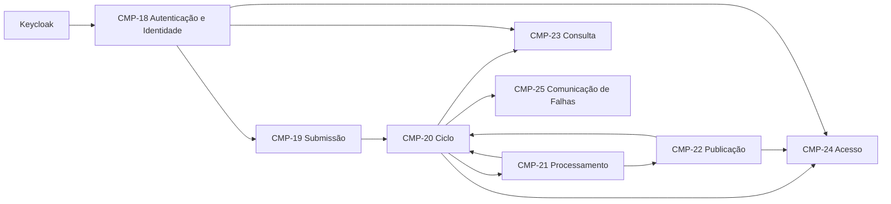

# Componentes coesos do núcleo

> **Definição vigente:** `CTX-CMP-003` é o baseline lógico do núcleo desde 2026-08-03, aceito por [`DEC-0004`](decisoes/0004-componentes-coesos-do-nucleo.md). “Ativo” identifica a fonte corrente; não afirma que a arquitetura já foi implementada ou comprovada fisicamente.
>
> Navegação: [índice de arquitetura](README.md) · [evidência do refinamento](historico/componentes/ctx-cmp-003-refinamento.md) · [topologia de validação](decisoes/0002-topologia-kubernetes.md) · [persistência e mensageria em análise](decisoes/0003-entrega-duravel-e-persistencia.md)

## Estado e precedência

| Camada | Situação vigente | Autoridade |
|---|---|---|
| `CMP-18..25` e suas autoridades | baseline lógico aceito | [`DEC-0004`](decisoes/0004-componentes-coesos-do-nucleo.md) e este modelo |
| Keycloak por OIDC | aceito para o ambiente de validação | [`DEC-0005`](decisoes/0005-keycloak-no-ambiente-de-validacao.md) |
| três quanta e três `Deployment`s | topologia aceita para validação; consequências ainda não comprovadas | [`DEC-0002`](decisoes/0002-topologia-kubernetes.md) |
| PostgreSQL, RabbitMQ, object storage e realização física de outbox/inbox | recomendação ainda `em_analise` | [`DEC-0003`](decisoes/0003-entrega-duravel-e-persistencia.md) |
| código, testes e medições do modelo | evidência física pendente | [roadmap ativo](../acompanhamento/roadmap.md) |
| inventários anteriores e ciclo que produziu este modelo | evidência histórica, não orientação corrente | [histórico de componentes](README.md#evolu%C3%A7%C3%A3o-dos-componentes) |

Componente é um limite lógico e modular de comportamento. Quantum, processo, imagem, `Deployment`, banco, fila e provedor de identidade são decisões físicas separadas e não determinam este inventário.

## Escopo e limites

Este modelo sucede o [`CTX-CMP-002`](historico/componentes/ctx-cmp-002-componentes-modulares.md) e consolida os comportamentos úteis da proposta [`R6-CMP-MODEL-001`](../propostas/base-simplificada-seis-componentes/componentes.md). A [evidência `CTX-EVD-CMP-003`](historico/componentes/ctx-cmp-003-refinamento.md) preserva técnica, inventário inicial, análises, refatoração e verificação de convergência sem competir com esta definição.

O escopo funcional é exatamente o conjunto canônico [`US-01..US-07`](../requisitos/historias.md), consolidado por [`REQ-CHG-0003`](../requisitos/refinamentos/REQ-CHG-0003.md). Cancelamento, download individual, consulta detalhada com motivo de falha e notificações além da falha permanecem fora do núcleo.

As fronteiras, autoridades, projeções e obrigações de idempotência abaixo estão decididas. Nomes de contratos são conceituais; formatos físicos das projeções e mecanismos de idempotência, como inbox, outbox ou deduplicação no transporte, continuam sujeitos à prova vertical e às decisões indicadas na tabela de precedência.

## Inventário vigente

| ID | Componente | Autoridade ou finalidade principal |
|---|---|---|
| [`CMP-18`](#cmp-18) | Autenticação e Identidade | validar a identidade OIDC, sem decidir propriedade |
| [`CMP-19`](#cmp-19) | Submissão e Admissão | admitir uma origem recuperável antes de solicitar aceite |
| [`CMP-20`](#cmp-20) | Ciclo do Trabalho | ser o único escritor do estado e arbitrar tentativas e desfechos |
| [`CMP-21`](#cmp-21) | Processamento de Mídia | executar uma tentativa autorizada e relatar fatos técnicos |
| [`CMP-22`](#cmp-22) | Publicação de Resultados | tornar manifesto, imagens e ZIP recuperáveis antes da conclusão |
| [`CMP-23`](#cmp-23) | Consulta de Trabalhos | manter a projeção somente leitura dos trabalhos do sujeito |
| [`CMP-24`](#cmp-24) | Acesso a Resultados | autorizar o proprietário e entregar o ZIP publicado |
| [`CMP-25`](#cmp-25) | Comunicação de Falhas | comunicar uma falha persistida sem alterar o trabalho |

### CMP-18 — Autenticação e Identidade

- **Papel:** validar uma identidade OIDC e disponibilizar um sujeito confiável às operações protegidas.
- **Responsabilidades e autoridade:** validação de assinatura, emissor, audiência e validade do token; mapeamento de `(issuer, subject)` para `IdentidadeAutenticada`.
- **Não possui:** senha, cadastro, sessão do IdP, trabalho, relação de proprietário ou decisão de acesso a um recurso.
- **Fornece:** `IdentidadeAutenticada(issuer, subject)` ou recusa segura.
- **Dependências decididas:** Keycloak por contrato OIDC e suporte do framework na borda.

Keycloak autentica credenciais e emite tokens. Ciclo, Consulta e Acesso decidem propriedade sobre os dados sob sua autoridade; este componente não fornece um `ExigirProprietario` genérico.

### CMP-19 — Submissão e Admissão

- **Papel:** receber uma origem não confiável, validar sua admissão e entregar uma referência durável candidata ao aceite.
- **Responsabilidades e autoridade:** streaming, limites, validação de formato/conteúdo, checksum, idempotência da submissão e problemas de admissão.
- **Não possui:** estado, tentativa, despacho, processamento, resultado ou notificação.
- **Fornece:** `OrigemAdmitida` ou `EnvioRejeitado`; solicita `AceitarTrabalho` somente depois da origem recuperável.
- **Dependências lógicas:** identidade autenticada, porta de origem recuperável e Ciclo do Trabalho.
- **Realização em análise:** object storage e detalhes de reconciliação pertencem à [`DEC-0003`](decisoes/0003-entrega-duravel-e-persistencia.md).

Submissão nunca aciona Processamento nem Comunicação de Falhas, direta ou indiretamente por adaptador próprio.

### CMP-20 — Ciclo do Trabalho

- **Papel:** aceitar e governar todo o ciclo recuperável do trabalho.
- **Responsabilidades e autoridade:** ID, proprietário `(issuer, subject)`, referência da origem, estado, histórico, ciclos, tentativas, política de falhas, retry finito, reprocessamento e transições.
- **Não possui:** bytes, extração, publicação física, projeção de consulta, download ou canal externo.
- **Fornece:** `AceitarTrabalho`, `AutorizarTentativa`, `AplicarFatoDaTentativa`, `SolicitarReprocessamento` e fatos do trabalho.
- **Dependências lógicas:** origem admitida e fatos idempotentes de Processamento/Publicação.
- **Realização em análise:** inbox, outbox, persistência e entrega ao processamento pertencem à [`DEC-0003`](decisoes/0003-entrega-duravel-e-persistencia.md).

É a única autoridade e o único escritor do estado do trabalho. Categorias técnicas recebidas não alteram o estado por si: o Ciclo decide se a falha é transitória ou permanente, se autoriza outra tentativa e qual transição aplicar.

### CMP-21 — Processamento de Mídia

- **Papel:** executar uma tentativa autorizada e transformar a origem no conjunto completo de imagens.
- **Responsabilidades e autoridade:** execução, deduplicação lógica pela identidade da tentativa autorizada, concorrência, isolamento, scratch, FFmpeg e diagnóstico técnico da tentativa.
- **Não possui:** usuário, estado, decisão de retry, ZIP, autorização de acesso ou notificação.
- **Fornece:** `TentativaIniciada`, `ImagensExtraidas` ou `FalhaTecnicaDaTentativa`, sempre correlacionados.
- **Dependências lógicas:** tentativa autorizada, origem recuperável e Publicação de Resultados.
- **Realização em análise:** o mecanismo físico de deduplicação, broker e object storage pertencem à [`DEC-0003`](decisoes/0003-entrega-duravel-e-persistencia.md).

O componente descreve natureza e evidência técnica da falha; não a classifica como transitória/permanente para o negócio e não cria outra tentativa.

`CMP-20` conserva a identidade da tentativa. Em uma reentrega, `CMP-21` trata a mesma identidade de forma idempotente, e `CMP-22` não publica um segundo resultado visível para ela. Inbox, chaves ou outra realização física dessa garantia permanecem em análise na `DEC-0003`.

### CMP-22 — Publicação de Resultados

- **Papel:** tornar manifesto, imagens e ZIP completos duravelmente recuperáveis.
- **Responsabilidades e autoridade:** catálogo de imagens, empacotamento ZIP, checksums, publicação idempotente pela identidade da tentativa e manifestação completa do resultado antes da conclusão.
- **Não possui:** estado do trabalho, propriedade, download HTTP ou decisão de tentativa.
- **Fornece:** `ResultadoPublicado` ou `FalhaTecnicaDaPublicacao`.
- **Dependências lógicas:** imagens completas de Processamento e porta de publicação durável.
- **Realização em análise:** object storage, chaves imutáveis, promoção de temporários e outbox pertencem à [`DEC-0003`](decisoes/0003-entrega-duravel-e-persistencia.md).

### CMP-23 — Consulta de Trabalhos

- **Papel:** listar os trabalhos do sujeito autenticado por uma projeção somente leitura.
- **Responsabilidades e autoridade:** projeção de identificador, estado e datas; regra de filtragem por `(issuer, subject)`.
- **Não possui:** transição, tentativa, diagnóstico exposto, origem ou resultado.
- **Fornece:** `ListarMeusTrabalhos`.
- **Dependências lógicas:** identidade autenticada e fatos do Ciclo; não lê tabelas internas do Ciclo.

Consulta detalhada e motivo sanitizado de falha permanecem `A confirmar` e não integram o contrato atual.

### CMP-24 — Acesso a Resultados

- **Papel:** autorizar o proprietário e entregar o ZIP publicado de um trabalho concluído.
- **Responsabilidades e autoridade:** elegibilidade por identidade, propriedade e estado; resolução do manifesto publicado.
- **Não possui:** empacotamento, estado, extração ou download individual de imagem.
- **Fornece:** `BaixarResultado` ou recusa segura.
- **Dependências lógicas:** identidade autenticada, fatos de elegibilidade e manifesto publicado.
- **Realização em análise:** streaming, URL temporária, auditoria física e object storage dependem da prova vertical e da [`DEC-0003`](decisoes/0003-entrega-duravel-e-persistencia.md).

### CMP-25 — Comunicação de Falhas

- **Papel:** compor e entregar uma comunicação segura depois de uma falha persistida.
- **Responsabilidades e autoridade:** composição segura da falha, destino permitido, tentativas do canal e resultado da entrega.
- **Não possui:** estado, diagnóstico bruto, aceite, processamento, eventos ampliados ou preferências.
- **Fornece:** `NotificarFalha` e registra o resultado da entrega sem alterar o trabalho.
- **Dependências lógicas:** fato autossuficiente do Ciclo e porta de comunicação.
- **Realização em análise:** inbox, canal e provedor concretos ainda dependem das decisões e critérios da notificação.

## Histórias atribuídas

| História | Responsável principal | Colaboradores | Contrato entre fronteiras |
|---|---|---|---|
| `US-01` | [`CMP-18`](#cmp-18) | Keycloak | OIDC → `IdentidadeAutenticada` |
| `US-02` | [`CMP-19`](#cmp-19) | `CMP-18`, `CMP-20` | `OrigemAdmitida` → `AceitarTrabalho` |
| `US-03` | [`CMP-21`](#cmp-21) | `CMP-20`, `CMP-22` | `ProcessarTentativa` → imagens/publicação ou falha técnica |
| `US-04` | [`CMP-20`](#cmp-20) | `CMP-19`, `CMP-21`, `CMP-22` | aceite, tentativa autorizada e fatos correlacionados |
| `US-05` | [`CMP-23`](#cmp-23) | `CMP-18`, `CMP-20` | identidade + fatos de projeção |
| `US-06` | [`CMP-24`](#cmp-24) | `CMP-18`, `CMP-20`, `CMP-22` | identidade + elegibilidade + manifesto |
| `US-07` | [`CMP-25`](#cmp-25) | `CMP-20` | `TrabalhoFalhou` autossuficiente |

## Autoridades e verificação lógica

| Questão | Resultado |
|---|---|
| História sem responsável ou responsabilidade dupla | nenhuma; cada `US-*` possui um principal |
| Autoridade do estado | somente `CMP-20` cria e altera o ciclo do trabalho |
| Autoridade de identidade e propriedade | Keycloak autentica; `CMP-18` valida; `CMP-20/23/24` aplicam propriedade no recurso que conhecem |
| Autoridade de falha e retry | `CMP-21/22` relatam falha técnica; somente `CMP-20` decide política e estado |
| Publicação versus acesso | `CMP-22` escreve a manifestação durável; `CMP-24` autoriza e entrega |
| Acoplamento temporal | origem recuperável precede aceite; aceite precede despacho; tentativa autorizada precede execução; resultado recuperável precede conclusão; falha persistida precede comunicação |
| Lei de Deméter | Submissão não conhece Produção/Comunicação; mídia não conhece usuário; Comunicação não consulta estado |
| Entity Trap | trabalho aparece em várias fronteiras, mas nenhuma delas oferece CRUD genérico |

`CMP-20` possui maior `fan-in`, coerente com a autoridade de transição. O modelo reduz seu conhecimento a contratos e fatos; a realização física desse desacoplamento está em análise na `DEC-0003`. A quantificação estática de `CA/CE` depende dos módulos implementados.

As características permanecem sistêmicas e pertencem a [`CTX-CHAR-001`](caracteristicas.md). A [evidência do refinamento](historico/componentes/ctx-cmp-003-refinamento.md) registra como elas pressionaram as fronteiras sem atribuí-las a componentes isolados. O modelo lógico convergiu nessa análise e foi aceito por [`DEC-0004`](decisoes/0004-componentes-coesos-do-nucleo.md); código ou medição poderão validá-lo, enfraquecê-lo ou motivar um nó sucessor.

## Dependências e contratos conceituais

| Origem | Destino | Contrato | Restrição |
|---|---|---|---|
| Identidade | Submissão/Consulta/Acesso | `IdentidadeAutenticada(issuer, subject)` | não contém senha nem decisão de propriedade |
| Submissão | Ciclo | `AceitarTrabalho` com origem recuperável | não aciona processamento ou notificação |
| Ciclo | Processamento | `ProcessarTentativa` durável e correlacionada | reentrega não cria tentativa; a identidade permite execução idempotente |
| Processamento | Publicação | imagens completas e referências opacas | sem usuário ou estado; a mesma tentativa não cria dois resultados visíveis |
| Processamento/Publicação | Ciclo | fatos ou falhas técnicas correlacionadas | somente Ciclo decide retry/transição |
| Ciclo/Publicação | Consulta/Acesso | fatos autossuficientes | sem leitura cruzada de tabelas |
| Ciclo | Comunicação de Falhas | falha persistida e sanitizada | canal não altera trabalho |

## Relação com a topologia de validação

Somente depois da convergência lógica, [`DEC-0002`](decisoes/0002-topologia-kubernetes.md) agrupou estes componentes em três quanta e três `Deployment`s para validação. Esse ADR é a fonte da composição física, das consequências e das condições de revisão; a topologia não redefine as fronteiras deste inventário.

Keycloak integra o mesmo ambiente Kubernetes reproduzível por [`DEC-0005`](decisoes/0005-keycloak-no-ambiente-de-validacao.md). Mesmo executado por um `Deployment`, não é componente, quantum nem serviço de negócio do FIAP X.

## Fitness functions do modelo lógico

| Risco de fronteira | Verificação |
|---|---|
| outro componente alterar estado ou criar tentativa | regra estática e teste garantem que apenas `CMP-20` escreve o ciclo |
| identidade decidir propriedade genericamente | testes demonstram que `CMP-18` só valida identidade e que o componente do recurso autoriza |
| Submissão conhecer consequências a jusante | regra de dependência impede `CMP-19` de depender de Processamento ou Comunicação |
| reentrega da mesma tentativa duplicar o resultado visível | contrato e teste garantem execução/publicação idempotentes pela identidade da tentativa; o mecanismo físico pertence à `DEC-0003` |
| Processamento ou Publicação decidir retry | contratos permitem apenas fatos técnicos; a política pertence a `CMP-20` |
| Publicação e Acesso voltarem a compartilhar autoridade | revisão e dependências impedem escrita do resultado por `CMP-24` e autorização por `CMP-22` |
| componente virar simples encaminhamento | ArchUnit, `CA/CE` e revisão de responsabilidades motivam nova evidência antes de unir fronteiras |

Testes físicos de falha, duplicidade, recuperação, topologia e canal pertencem às validações de [`DEC-0002`](decisoes/0002-topologia-kubernetes.md), [`DEC-0003`](decisoes/0003-entrega-duravel-e-persistencia.md) e [`DEC-0005`](decisoes/0005-keycloak-no-ambiente-de-validacao.md). O [roadmap ativo](../acompanhamento/roadmap.md) é a única fonte do próximo trabalho.
