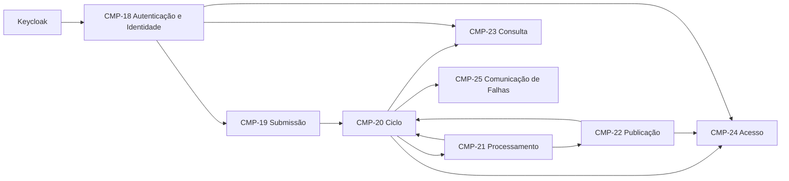

# Componentes coesos do núcleo

## Escopo, evidências e premissas

Este modelo sucede o [`CTX-CMP-002`](componentes.md), preservado como evidência do refinamento granular anterior. Ele consolida os comportamentos úteis da proposta [`R6-CMP-MODEL-001`](../propostas/base-simplificada-seis-componentes/componentes.md) sem promover suas extensões futuras nem remover autenticação, concorrência, tentativas, retentativas, reprocessamento, ZIP ou a garantia de não perder trabalhos aceitos.

O escopo funcional é exatamente o conjunto canônico [`US-01..US-07`](../requisitos/historias.md), consolidado por [`REQ-CHG-0003`](../requisitos/refinamentos/REQ-CHG-0003.md). Cancelamento, download individual, consulta detalhada com motivo de falha e notificações além da falha permanecem fora do núcleo.

Classificação das entradas:

| Classe | Evidência usada |
|---|---|
| **Declarada** | autenticação, envio, processamento concorrente, não perda, consulta por usuário, ZIP e possibilidade de notificação de falha |
| **Validada na descoberta** | admissão antes do aceite, distinção entre submissão, reentrega, retentativa e reprocessamento, retenção atual e ordem da comunicação |
| **Decidida** | ciclo de refinamento de [`DEC-0001`](decisoes/0001-refinamento-de-componentes.md); consolidação conservadora; Keycloak empacotado para a prova; três quanta de aplicação para validação |
| **Inferida** | contratos, projeções, idempotência, outbox/inbox e detalhes de autoridade necessários para tornar as necessidades verificáveis |

Componente continua sendo um limite lógico e modular de comportamento. Quantum, processo, imagem, `Deployment`, banco, fila e provedor de identidade são decisões físicas posteriores e não determinam este inventário.

## Iteração 1 — Componentes identificados

### Técnica e inventário inicial congelado

Foi usado `Workflow`, complementado por `Actor/Action`: autenticar, submeter, governar, processar, publicar/entregar, consultar e comunicar. O particionamento inicial foi orientado ao domínio; mecanismos como HTTP, OIDC, RabbitMQ, storage e FFmpeg não originaram componentes.

| Componente inicial | Papel derivado do fluxo | Evidência principal |
|---|---|---|
| Autenticação e Identidade | estabelecer a identidade confiável de quem realiza uma operação | `US-01` |
| Submissão de Vídeos | receber, admitir e encaminhar um vídeo para aceite | `US-02` |
| Gestão do Trabalho | preservar o trabalho e arbitrar seu ciclo | `US-04` |
| Processamento de Mídia | transformar uma origem em imagens e resultado | `US-03` |
| Entrega de Resultados | tornar o ZIP acessível ao proprietário | `US-06` |
| Consulta de Trabalhos | apresentar os trabalhos do usuário | `US-05` |
| Comunicação de Falhas | comunicar uma falha já registrada | `US-07` |

O inventário permaneceu congelado durante a atribuição e as duas análises seguintes. Não há `Entity Trap`: embora trabalho e resultado apareçam em mais de um candidato, cada uso será confrontado com comportamento, autoridade e razão de mudança.

## Iteração 1 — Histórias atribuídas

| História | Responsável principal | Colaboradores | Observações |
|---|---|---|---|
| `US-01` | Autenticação e Identidade | provedor de identidade | autenticação permanece integralmente no escopo |
| `US-02` | Submissão de Vídeos | Identidade; Gestão do Trabalho | submissão coordena a história nesta iteração |
| `US-03` | Processamento de Mídia | Gestão; Entrega | concorrência e isolamento pertencem ao processamento |
| `US-04` | Gestão do Trabalho | Submissão; Processamento; Entrega | somente Gestão arbitra novas tentativas e desfechos |
| `US-05` | Consulta de Trabalhos | Identidade; Gestão | leitura não altera o ciclo |
| `US-06` | Entrega de Resultados | Identidade; Gestão; Processamento | mistura publicação e autorização nesta hipótese |
| `US-07` | Comunicação de Falhas | Gestão | comunicação ocorre depois da falha persistida |

Cada história possui exatamente um responsável principal; colaboradores fornecem contratos e não compartilham essa autoridade.

## Iteração 1 — Papéis e responsabilidades analisados

O inventário continuou congelado.

| Componente inicial | Achado de responsabilidade ou acoplamento | Sinal para a refatoração posterior |
|---|---|---|
| Autenticação e Identidade | autenticar credenciais, validar token e decidir propriedade são autoridades diferentes | separar Keycloak, identidade autenticada e autorização sobre o recurso |
| Submissão de Vídeos | transferência/admissão e aceite do trabalho possuem transações e falhas distintas | restringir a entrada e deixar o aceite com a autoridade do ciclo |
| Gestão do Trabalho | alto `fan-in` é coerente para arbitrar estado, ciclo e tentativas | manter autoridade única e reduzir conhecimento de adaptadores a jusante |
| Processamento de Mídia | extração e publicação compartilham fluxo, mas publicação possui invariante próprio de recuperabilidade | separar transformação de manifestação durável do resultado |
| Entrega de Resultados | publicação/escrita e autorização/leitura mudam por motivos diferentes | dividir Publicação de Acesso |
| Consulta de Trabalhos | projeção somente leitura possui política própria de propriedade e consistência | manter separada do escritor do ciclo |
| Comunicação de Falhas | falha de canal e retentativas externas não devem alterar trabalho | manter coesa e limitada à falha no núcleo |

Acoplamentos temporais relevantes:

- origem recuperável precede aceite;
- aceite persistido precede despacho;
- tentativa autorizada precede execução;
- imagens, manifesto e ZIP recuperáveis precedem conclusão;
- falha persistida precede notificação.

## Iteração 1 — Características do sistema analisadas

As características permanecem propriedades sistêmicas e não foram atribuídas aos componentes durante esta etapa.

| Característica | Pressão observada nas fronteiras | Verificação que a torna concreta |
|---|---|---|
| Confiabilidade e recuperabilidade | uma autoridade de ciclo, aceite durável, idempotência e publicação antes da conclusão | reinício depois do aceite, mensagem duplicada e reconciliação entre estado e ZIP |
| Segurança | IdP externo, identidade estável, autorização no proprietário do recurso e entrada não confiável | `401/403`, dois usuários e ausência de acesso cruzado |
| Escalabilidade do processamento | execução intensiva separável do fluxo interativo, com concorrência e scratch limitados | variar réplicas sob backlog sem colisão nem perda |
| Viabilidade operacional | poucos processos, mas perfis de falha e escala explícitos | ambiente Kubernetes reproduzível e medição do custo dos três quanta |

Os benefícios de isolar execução e comunicação têm como custo contratos assíncronos, consistência eventual, observabilidade e operação adicional.

## Iteração 1 — Refatoração motivada

| Origem congelada | Achado anterior | Alteração aplicada somente agora | Resultado |
|---|---|---|---|
| Autenticação e Identidade | autoridade sobre propriedade estava sobreposta | manter e restringir à integração OIDC e identidade autenticada | [`CMP-18`](#cmp-18) |
| Submissão de Vídeos | entrada e aceite possuíam falhas/transações distintas | unir submissão e admissão; mover aceite para o ciclo | [`CMP-19`](#cmp-19) |
| Gestão do Trabalho | centralização de transições é coesa | renomear e consolidar aceite, tentativas, desfecho e outbox | [`CMP-20`](#cmp-20) |
| Processamento de Mídia | publicação possui invariante durável próprio | restringir à execução e extração | [`CMP-21`](#cmp-21) |
| Entrega de Resultados | escrita e leitura têm segurança e escala diferentes | dividir em Publicação e Acesso | [`CMP-22`](#cmp-22) e [`CMP-24`](#cmp-24) |
| Consulta de Trabalhos | leitura/propriedade formam papel coeso | manter | [`CMP-23`](#cmp-23) |
| Comunicação de Falhas | canal externo tem falha própria, sem autoridade de estado | manter e restringir à falha | [`CMP-25`](#cmp-25) |

Oito componentes resultam desses achados; a quantidade não foi uma meta de descoberta.

## Iteração 2 — Componentes identificados

### CMP-18 — Autenticação e Identidade

- **Papel:** validar uma identidade OIDC e disponibilizar um sujeito confiável às operações protegidas.
- **Possui:** validação de assinatura, emissor, audiência e validade do token; mapeamento de `(issuer, subject)` para `IdentidadeAutenticada`.
- **Não possui:** senha, cadastro, sessão do IdP, trabalho, relação de proprietário ou decisão de acesso a um recurso.
- **Fornece:** `IdentidadeAutenticada(issuer, subject)` ou recusa segura.
- **Dependências:** Keycloak por contrato OIDC e suporte do framework na borda.

Keycloak autentica credenciais e emite tokens. Ciclo, Consulta e Acesso decidem propriedade sobre os dados sob sua autoridade; este componente não fornece um `ExigirProprietario` genérico.

### CMP-19 — Submissão e Admissão

- **Papel:** receber uma origem não confiável, validar sua admissão e entregar uma referência durável candidata ao aceite.
- **Possui:** streaming, limites, validação de formato/conteúdo, checksum, idempotência da submissão e problemas de admissão.
- **Não possui:** estado, tentativa, despacho, processamento, resultado ou notificação.
- **Fornece:** `OrigemAdmitida` ou `EnvioRejeitado`; solicita `AceitarTrabalho` somente depois da origem recuperável.
- **Dependências:** identidade autenticada, object storage e Ciclo do Trabalho.

Submissão nunca aciona Processamento nem Comunicação de Falhas, direta ou indiretamente por adaptador próprio.

### CMP-20 — Ciclo do Trabalho

- **Papel:** aceitar e governar todo o ciclo recuperável do trabalho.
- **Possui:** ID, proprietário `(issuer, subject)`, referência da origem, estado, histórico, ciclos, tentativas, política de falhas, retry finito, reprocessamento, transições, inbox e outbox.
- **Não possui:** bytes, extração, publicação física, projeção de consulta, download ou canal externo.
- **Fornece:** `AceitarTrabalho`, `AutorizarTentativa`, `AplicarFatoDaTentativa`, `SolicitarReprocessamento` e fatos do trabalho.
- **Dependências:** origem admitida e fatos idempotentes de Processamento/Publicação.

É a única autoridade e o único escritor do estado do trabalho. Categorias técnicas recebidas não alteram o estado por si: o Ciclo decide se a falha é transitória ou permanente, se autoriza outra tentativa e qual transição aplicar.

### CMP-21 — Processamento de Mídia

- **Papel:** executar uma tentativa autorizada e transformar a origem no conjunto completo de imagens.
- **Possui:** deduplicação técnica, concorrência, isolamento, scratch, FFmpeg e diagnóstico técnico da execução.
- **Não possui:** usuário, estado, decisão de retry, ZIP, autorização de acesso ou notificação.
- **Fornece:** `TentativaIniciada`, `ImagensExtraidas` ou `FalhaTecnicaDaTentativa`, sempre correlacionados.
- **Dependências:** broker, object storage e Publicação de Resultados.

O componente descreve natureza e evidência técnica da falha; não a classifica como transitória/permanente para o negócio e não cria outra tentativa.

### CMP-22 — Publicação de Resultados

- **Papel:** tornar manifesto, imagens e ZIP completos duravelmente recuperáveis.
- **Possui:** catálogo de imagens, empacotamento ZIP, checksums, chaves imutáveis, promoção de temporários e outbox de publicação.
- **Não possui:** estado do trabalho, propriedade, download HTTP ou decisão de tentativa.
- **Fornece:** `ResultadoPublicado` ou `FalhaTecnicaDaPublicacao`.
- **Dependências:** imagens completas de Processamento e object storage.

### CMP-23 — Consulta de Trabalhos

- **Papel:** listar os trabalhos do sujeito autenticado por uma projeção somente leitura.
- **Possui:** projeção de identificador, estado e datas; regra de filtragem por `(issuer, subject)`.
- **Não possui:** transição, tentativa, diagnóstico exposto, origem ou resultado.
- **Fornece:** `ListarMeusTrabalhos`.
- **Dependências:** identidade autenticada e fatos do Ciclo; não lê tabelas internas do Ciclo.

Consulta detalhada e motivo sanitizado de falha permanecem `A confirmar` e não integram o contrato atual.

### CMP-24 — Acesso a Resultados

- **Papel:** autorizar o proprietário e entregar o ZIP publicado de um trabalho concluído.
- **Possui:** elegibilidade por identidade/propriedade/estado, resolução do manifesto, streaming ou URL temporária e auditoria mínima.
- **Não possui:** empacotamento, estado, extração ou download individual de imagem.
- **Fornece:** `BaixarResultado` ou recusa segura.
- **Dependências:** identidade autenticada, fatos de elegibilidade, manifesto publicado e object storage.

### CMP-25 — Comunicação de Falhas

- **Papel:** compor e entregar uma comunicação segura depois de uma falha persistida.
- **Possui:** inbox, template de falha, destino permitido, tentativas do canal e resultado da entrega.
- **Não possui:** estado, diagnóstico bruto, aceite, processamento, eventos ampliados ou preferências.
- **Fornece:** `NotificarFalha` e registra o resultado da entrega sem alterar o trabalho.
- **Dependências:** fato autossuficiente do Ciclo e provedor de comunicação.

## Iteração 2 — Histórias atribuídas

| História | Responsável principal | Colaboradores | Contrato entre fronteiras |
|---|---|---|---|
| `US-01` | [`CMP-18`](#cmp-18) | Keycloak | OIDC → `IdentidadeAutenticada` |
| `US-02` | [`CMP-19`](#cmp-19) | `CMP-18`, `CMP-20` | `OrigemAdmitida` → `AceitarTrabalho` |
| `US-03` | [`CMP-21`](#cmp-21) | `CMP-20`, `CMP-22` | `ProcessarTentativa` → imagens/publicação ou falha técnica |
| `US-04` | [`CMP-20`](#cmp-20) | `CMP-19`, `CMP-21`, `CMP-22` | aceite, tentativa autorizada e fatos correlacionados |
| `US-05` | [`CMP-23`](#cmp-23) | `CMP-18`, `CMP-20` | identidade + fatos de projeção |
| `US-06` | [`CMP-24`](#cmp-24) | `CMP-18`, `CMP-20`, `CMP-22` | identidade + elegibilidade + manifesto |
| `US-07` | [`CMP-25`](#cmp-25) | `CMP-20` | `TrabalhoFalhou` autossuficiente |

## Iteração 2 — Papéis e responsabilidades analisados

O inventário refinado permaneceu congelado.

| Questão | Resultado |
|---|---|
| História sem responsável ou responsabilidade dupla | nenhuma; cada `US-*` possui um principal |
| Autoridade do estado | somente `CMP-20` cria e altera o ciclo do trabalho |
| Autoridade de identidade e propriedade | Keycloak autentica; `CMP-18` valida; `CMP-20/23/24` aplicam propriedade no recurso que conhecem |
| Autoridade de falha e retry | `CMP-21/22` relatam falha técnica; somente `CMP-20` decide política e estado |
| Publicação versus acesso | `CMP-22` escreve a manifestação durável; `CMP-24` autoriza e entrega |
| Acoplamento temporal | todos os cinco precedentes relevantes possuem fatos/contratos explícitos |
| Lei de Deméter | Submissão não conhece Produção/Comunicação; mídia não conhece usuário; Comunicação não consulta estado |
| Entity Trap | trabalho aparece em várias fronteiras, mas nenhuma delas oferece CRUD genérico |

`CMP-20` possui maior `fan-in`, coerente com a autoridade de transição. Seu `fan-out` físico é reduzido por outbox e fatos; quantificação estática de `CA/CE` depende dos módulos implementados.

## Iteração 2 — Características do sistema analisadas

| Característica | Evidência de adequação | Custo ou pendência |
|---|---|---|
| Confiabilidade | aceite, outbox, tentativa, publicação e desfecho possuem autoridades testáveis | atomicidade física e reconciliação ainda precisam da prova vertical |
| Segurança | credenciais ficam no Keycloak; identidade e propriedade não se confundem | realm, clientes, limites e Threat Modeling precisam ser materializados |
| Escalabilidade | processamento/publicação podem variar capacidade sem possuir o trabalho | carga, concorrência e recursos-alvo continuam a medir |
| Operabilidade | notificação isolada impede que falha de canal afete o núcleo | terceiro processo aumenta manifests, dados, observabilidade e custo de operação |

## Iteração 2 — Verificação de convergência

| Critério | Resultado |
|---|---|
| Sete histórias com um responsável principal | atendido |
| Oito papéis distintos e justificados | atendido pelas histórias e características prioritárias |
| Autoridades não duplicadas | atendido para identidade, propriedade, estado, falha/retry e resultado |
| Contratos e ordens relevantes explícitos | atendido conceitualmente |
| Mecanismos não tratados como componentes | atendido para IdP, broker, storage, outbox, FFmpeg e Kubernetes |
| Extensões futuras fora do núcleo | atendido conforme `REQ-CHG-0003` |
| Evidência física | pendente de código, testes, Threat Modeling e medição |

O modelo converge e passa a ser o baseline modular ativo por [`DEC-0004`](decisoes/0004-componentes-coesos-do-nucleo.md). Evidência do código poderá substituí-lo por um novo nó, sem reescrever este raciocínio.

## Dependências e contratos conceituais

| Origem | Destino | Contrato | Restrição |
|---|---|---|---|
| Identidade | Submissão/Consulta/Acesso | `IdentidadeAutenticada(issuer, subject)` | não contém senha nem decisão de propriedade |
| Submissão | Ciclo | `AceitarTrabalho` com origem recuperável | não aciona processamento ou notificação |
| Ciclo | Processamento | `ProcessarTentativa` durável e correlacionada | reentrega não cria tentativa |
| Processamento | Publicação | imagens completas e referências opacas | sem usuário ou estado |
| Processamento/Publicação | Ciclo | fatos ou falhas técnicas correlacionadas | somente Ciclo decide retry/transição |
| Ciclo/Publicação | Consulta/Acesso | fatos autossuficientes | sem leitura cruzada de tabelas |
| Ciclo | Comunicação de Falhas | falha persistida e sanitizada | canal não altera trabalho |

## Agrupamentos de quanta para validação

Os agrupamentos foram definidos somente depois da convergência lógica. A escolha de três processos é uma topologia para a prova, não a origem dos oito componentes.

| Estado | Quantum | Componentes | Deployment | Motivo e custo |
|---|---|---|---|---|
| `selecionado_para_validacao` | **Gestão de Trabalhos de Vídeo** | `CMP-18`, `CMP-19`, `CMP-20`, `CMP-23`, `CMP-24` | `gestao-trabalhos` | agrupa interação, aceite e autorização; preserva módulos/tabelas, mas compartilha implantação |
| `selecionado_para_validacao` | **Produção de Resultados** | `CMP-21`, `CMP-22` | `producao-resultados` | isola CPU/I/O, backlog e scratch; exige mensageria, inbox e storage durável |
| `selecionado_para_validacao` | **Comunicação de Falhas** | `CMP-25` | `notificador` | isola falha/retentativa do canal desde o início; acrescenta um processo pequeno e custo operacional |

Keycloak será instalado no mesmo ambiente Kubernetes reproduzível como dependência de plataforma. Mesmo executado por um `Deployment`, não é componente, quantum nem serviço de negócio do FIAP X.

## Riscos, fitness functions e próximo incremento

| Risco | Fitness function |
|---|---|
| aceitação sem despacho recuperável | matar `gestao-trabalhos` depois do commit e observar publicação posterior pela outbox |
| duplicidade sob `at-least-once` | entregar duas vezes o mesmo `messageId/attemptId` e observar um resultado visível |
| conclusão prematura | impedir object storage e garantir que não exista `CONCLUÍDO` sem manifesto e ZIP |
| acesso cruzado | dois usuários do Keycloak; A nunca lista nem baixa trabalho de B |
| retry decidido pelo processador | regra de dependência/contrato impede `producao-resultados` de alterar estado ou criar tentativa |
| falha do canal afetar trabalho | indisponibilizar provedor e preservar o estado `FALHOU` |
| terceiro quantum desproporcional | medir backlog, recursos, cadência e esforço do `notificador` e reabrir a topologia se não houver benefício |
| fronteiras virarem apenas encaminhamento | ArchUnit e revisão de responsabilidades; unir somente com evidência de ausência de política própria |

O menor próximo incremento é implementar a fatia autenticada de envio até ZIP em Kubernetes, com os três processos e o Keycloak empacotado, e executar reinício, duplicidade, acesso cruzado e falha do canal. Resultados devem alimentar [`DEC-0002`](decisoes/0002-topologia-kubernetes.md) e [`DEC-0003`](decisoes/0003-entrega-duravel-e-persistencia.md).
