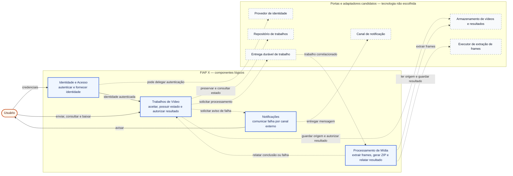

# Fluxo de identificação e refinamento de componentes

## Escopo, evidências e premissas

Este ciclo cobre as histórias descritas em [histórias de usuário](../requisitos/historias.md), usa o [glossário do domínio](../requisitos/glossario.md) e é orientado pelas [características arquiteturais prioritárias](caracteristicas.md). Foram usadas estas evidências:

- `Declarada`: o [enunciado](../enunciado.md) exige autenticação, concorrência, ausência de perda durante picos, status por usuário, notificação, persistência, escala e testes.
- `Observada`: o [código-base](../referencia/projeto-original/main.go#L30) concentra HTTP, arquivos, processamento, ZIP, status e frontend em um processo e um arquivo.
- `Observada`: [`handleVideoUpload`](../referencia/projeto-original/main.go#L75) salva o arquivo e chama [`processVideo`](../referencia/projeto-original/main.go#L126) de forma síncrona; [`handleStatus`](../referencia/projeto-original/main.go#L253) deriva o estado dos ZIPs presentes em disco.
- `Observada`: o [timestamp do upload](../referencia/projeto-original/main.go#L94), o [diretório temporário](../referencia/projeto-original/main.go#L129) e o [resultado](../referencia/projeto-original/main.go#L160) usam precisão de um segundo, criando colisão possível em execuções concorrentes.
- `Inferida; em validação`: o [Event Storming](../requisitos/event-storming.md) ordena autenticação, aceitação, solicitação e tentativa de processamento, registro do resultado, consulta, download e eventual notificação sem impor topologia.
- `Preferência`: Java com Quarkus favorece viabilidade pela familiaridade, mas não define componentes nem unidades de implantação.

As histórias e os critérios inferidos permanecem `em_analise`. Este documento descreve componentes lógicos; não decide quantidade de aplicações, microsserviços, repositórios, bancos, filas ou containers.

## Hipótese preliminar de escopo e quanta

O [agrupamento preliminar das características](caracteristicas.md#agrupamento-preliminar-por-escopo) produz duas alternativas que orientam a análise sem decidir a topologia:

| Alternativa | Composição candidata | Benefício procurado | Custo e condição |
|---|---|---|---|
| Quantum único | Os quatro componentes em um monólito modular; identidade ou canal ainda podem ser integrações externas | Menor custo operacional e ausência de falhas de rede internas | Processamento e interação escalam e são implantados juntos; reavaliar se a carga exigir capacidade independente |
| Processamento destacável | Núcleo com Identidade e Acesso, Trabalhos de Vídeo e Notificações; Processamento de Mídia em outro quantum | Escalar e isolar a execução intensiva sem transferir a autoridade sobre o trabalho | Exige entrega e relato duráveis, idempotência, referências opacas de artefatos e ausência de chamada síncrona obrigatória entre os limites |

A hipótese de processamento destacável deixa de representar dois quanta independentes se núcleo e processamento precisarem ser implantados juntos, compartilharem esquema de dados mutável ou dependerem de comunicação síncrona para aceitar e concluir cada trabalho. Nenhuma alternativa está aceita; volume, semântica de aceitação e medições ainda faltam.

## Estratégia inicial de descoberta e particionamento

Foi escolhido particionamento inicial por capacidade de negócio porque as mudanças relevantes ocorrem em ritmos diferentes: identidade, ciclo de vida dos trabalhos, processamento intensivo e comunicação externa. Um particionamento puramente técnico (`API`, `service`, `repository`) facilitaria mapear frameworks, mas esconderia autoridade sobre estados e dados e reproduziria o acoplamento do protótipo.

A técnica principal foi `Workflow`, usando o fluxo feliz e as ramificações de falha do Event Storming. `Actor/Action` foi considerada, mas não acrescentou fronteiras: há um ator humano principal e as ações internas do sistema já aparecem no fluxo. Cada passo não virou automaticamente um componente.

| Trecho do workflow | Candidato inicial | Resultado após atribuir histórias e responsabilidades |
|---|---|---|
| Autenticar e recusar acesso inválido | Identidade e Acesso | Mantido como capacidade condicional, realizável internamente ou por provedor |
| Receber, aceitar, consultar e autorizar resultado | Recebimento; Acompanhamento; Entrega | Unificado em Trabalhos de Vídeo por compartilhar identidade, estado, propriedade e invariantes |
| Solicitar, executar e relatar processamento | Processamento de Mídia | Execução mantida separada; a solicitação e a transição do trabalho permanecem com Trabalhos de Vídeo |
| Solicitar e entregar aviso de falha | Notificações | Mantido provisoriamente; pode ser reduzido a adaptador se não surgirem regras próprias |

### Verificação do Entity Trap

| Candidato corrente | Sinal inspecionado | Conclusão |
|---|---|---|
| Identidade e Acesso | Nome de capacidade e responsabilidade sobre identidade | Não representa CRUD de usuário; permanece coeso |
| Trabalhos de Vídeo | Nome coincide com uma entidade e concentra várias operações | Sinal presente, mas não configura o antipadrão no modelo corrente: aceitação, propriedade, estado, consulta e autorização compartilham a mesma autoridade e invariantes; reabrir se a responsabilidade crescer sem essa coesão |
| Processamento de Mídia | Nome de transformação e uso de executor externo | Representa comportamento, não uma entidade nem o mecanismo `ffmpeg` |
| Notificações | Nome amplo e regras ainda incompletas | Não é depósito atual, mas sua justificativa é provisória; reduzir a adaptador se canal, preferência e retentativa não formarem responsabilidade própria |

## Diagrama lógico do modelo corrente

O diagrama resume o modelo lógico mantido após a iteração 3. Ele mostra responsabilidades e contratos lógicos, não microsserviços, quanta, processos, bancos ou unidades de implantação.

Legenda:

- azul: componente lógico com responsabilidade de negócio;
- cinza tracejado: porta ou adaptador candidato, ainda sem tecnologia definida;
- seta contínua: interação com o usuário ou fornecimento de identidade;
- seta tracejada: colaboração por contrato; o diagrama não decide se o transporte será local, síncrono, assíncrono ou distribuído.

`Trabalhos de Vídeo` continua sendo a autoridade sobre proprietário e estado. `Processamento de Mídia` não altera esses dados livremente: ele relata um resultado correlacionado para que o primeiro componente valide a transição. As hipóteses de quantum único e processamento destacável agrupam esses elementos de maneiras diferentes sem modificar automaticamente suas responsabilidades lógicas.

## Iteração 1 — Inventário inicial

| Componente candidato | Finalidade inicial | Evidência |
|---|---|---|
| Identidade e Acesso | Estabelecer a identidade e proteger operações | US-01 e proteção por usuário e senha |
| Recebimento de Vídeo | Validar e aceitar um upload | US-02 e `handleVideoUpload` |
| Acompanhamento de Trabalhos | Manter propriedade e estados consultáveis | US-04 e US-05 |
| Processamento de Mídia | Extrair frames e produzir o ZIP | US-03 e `processVideo` |
| Entrega de Resultados | Autorizar e entregar o ZIP | US-06 e `handleDownload` |
| Notificações | Comunicar falhas por canal externo | US-07 |

### Primeira atribuição das histórias

| História | Responsável principal | Colaboradores | Observações |
|---|---|---|---|
| US-01 — Autenticar-se | Identidade e Acesso | — | Provisionamento de contas ainda indefinido |
| US-02 — Enviar um vídeo | Recebimento de Vídeo | Identidade e Acesso; Acompanhamento de Trabalhos | Recebimento e acompanhamento disputam a criação do trabalho |
| US-03 — Processar concorrentemente | Processamento de Mídia | Acompanhamento de Trabalhos | Requer isolamento e limite de concorrência |
| US-04 — Preservar trabalhos | Acompanhamento de Trabalhos | Recebimento de Vídeo; Processamento de Mídia | Ponto de aceitação atravessa dois candidatos |
| US-05 — Consultar trabalhos | Acompanhamento de Trabalhos | Identidade e Acesso | Estado e propriedade pertencem ao mesmo limite |
| US-06 — Baixar resultado | Entrega de Resultados | Identidade e Acesso; Acompanhamento de Trabalhos | Autorização e disponibilidade dependem do trabalho |
| US-07 — Notificar falha | Notificações | Acompanhamento de Trabalhos | Canal e garantias ainda indefinidos |

### Problemas encontrados

1. `Recebimento de Vídeo` e `Acompanhamento de Trabalhos` compartilham a autoridade sobre criação, propriedade, aceitação e estado. Separá-los exigiria uma transação ou contrato antes de haver um motivo de escala independente.
2. `Entrega de Resultados` possui pouca regra própria neste escopo. Disponibilidade, propriedade e expiração são aspectos do trabalho; o transporte do arquivo pode ser um adaptador.
3. O processamento não deve ser autoridade concorrente sobre o estado persistente. Ele executa uma tentativa e relata fatos; o ciclo do trabalho valida as transições.
4. Fila, banco, armazenamento de objetos, REST e `ffmpeg` são mecanismos ou adaptadores. Promovê-los a componentes agora confundiria arquitetura lógica com tecnologia.

## Impacto das características prioritárias

| Característica | Impacto nas fronteiras |
|---|---|
| Confiabilidade e recuperabilidade | Um componente deve possuir a aceitação e a máquina de estados; processamento precisa ser idempotente e relatar resultados por contrato |
| Segurança | A identidade deve chegar aos casos de uso, e a autoridade sobre o trabalho deve aplicar propriedade antes de listar ou entregar artefatos |
| Escalabilidade do processamento | A execução de mídia deve poder variar sua capacidade sem transferir a autoridade sobre usuários e trabalhos |

## Reestruturação da iteração 1

| Alteração | Justificativa | Consequência |
|---|---|---|
| Unir Recebimento de Vídeo e Acompanhamento de Trabalhos em `Trabalhos de Vídeo` | Ambos participam da mesma aceitação, propriedade e máquina de estados | Um único componente passa a possuir o registro durável e o contrato de submissão/consulta |
| Incorporar a regra de entrega em `Trabalhos de Vídeo` | O direito e a disponibilidade do download decorrem do estado e da propriedade do trabalho | O armazenamento e o transporte do ZIP permanecem portas/adaptadores substituíveis |
| Manter `Processamento de Mídia` separado | Consome recursos, escala de forma diferente e pode falhar ou repetir independentemente | Exige contrato idempotente de trabalho e de relato de resultado |
| Manter `Notificações` separado provisoriamente | Integração externa, retentativas e falhas não devem alterar o estado do processamento | Pode ser reduzido a um adaptador se não surgirem regras de canal, preferência ou entrega |
| Manter `Identidade e Acesso` separado e condicional | Possui responsabilidade distinta, mas pode ser realizado por provedor externo | O componente lógico não implica serviço próprio nem armazenamento interno de credenciais |

## Iteração 2 — Inventário refinado, mantido na iteração 3

| ID | Componente | Papel | Responsabilidades | Fora do escopo | Autoridade e contratos/dependências |
|---|---|---|---|---|---|
| `CMP-01` | Identidade e Acesso | Estabelecer quem realiza uma operação | Autenticar credenciais; fornecer identidade confiável | Upload, estado do trabalho, processamento e armazenamento de vídeo | Autoridade sobre identidade/credenciais somente se interno; fornece `IdentidadeAutenticada`; pode depender de provedor externo |
| `CMP-02` | Trabalhos de Vídeo | Possuir o ciclo de vida de uma solicitação de processamento | Aceitar submissão; gerar identidade única; associar proprietário; validar transições; listar trabalhos; autorizar resultado; aplicar retenção quando definida | Extrair frames, executar `ffmpeg`, implementar banco/fila/storage, entregar notificação | Autoridade sobre trabalho, proprietário, estado, datas e referências opacas dos artefatos; consome `IdentidadeAutenticada`; solicita `ProcessarTrabalho`; aceita `ResultadoDoProcessamento`; solicita `NotificarFalha` |
| `CMP-03` | Processamento de Mídia | Transformar um vídeo aceito em um resultado reproduzível | Consumir uma solicitação; isolar tentativa; extrair frames; gerar ZIP; preservar o resultado; relatar sucesso ou falha; tolerar repetição | Autenticar usuário, aceitar upload, decidir propriedade, listar status, escolher a transição persistente do trabalho | Autoridade sobre execução transitória e política de extração; consome `ProcessarTrabalho`; fornece `ResultadoDoProcessamento` correlacionado; depende de referências opacas de artefato e processador externo |
| `CMP-04` | Notificações | Comunicar eventos relevantes sem interferir no resultado do trabalho | Receber solicitação de notificação; formatar mensagem segura; selecionar canal quando definido; controlar tentativas conforme política futura | Alterar o estado do trabalho, expor diagnóstico interno, processar vídeo | Autoridade sobre tentativas de notificação; consome `NotificarFalha`; depende de contato autorizado e adaptador de canal |

### Atribuição após o refinamento

| História | Responsável principal | Colaboradores | Contrato principal |
|---|---|---|---|
| US-01 | Identidade e Acesso | — | Autenticar e fornecer identidade |
| US-02 | Trabalhos de Vídeo | Identidade e Acesso; adaptador de artefatos | Submeter vídeo e devolver ID aceito |
| US-03 | Processamento de Mídia | Trabalhos de Vídeo; adaptadores de artefatos e processador | Processar trabalho correlacionado e relatar resultado |
| US-04 | Trabalhos de Vídeo | Processamento de Mídia; mecanismo durável de entrega | Preservar trabalho e controlar transições idempotentes |
| US-05 | Trabalhos de Vídeo | Identidade e Acesso | Listar trabalhos do proprietário |
| US-06 | Trabalhos de Vídeo | Identidade e Acesso; adaptador de artefatos | Autorizar e fornecer acesso ao resultado disponível |
| US-07 | Notificações | Trabalhos de Vídeo; adaptador de canal | Solicitar e tentar entrega de notificação segura |

## Iteração 3 — Acoplamento, tempo e conhecimento

Esta iteração reaplica o ciclo com dependências direcionadas, acoplamento temporal e Lei de Deméter. Usuário, portas e adaptadores também são analisados quando alteram a fronteira, mas não são promovidos a componentes.

### Acoplamento estático candidato

Ainda não é possível calcular `CA` e `CE` como métricas estáticas: a propriedade dos contratos, os namespaces e a direção das dependências de código não foram escolhidos. Contar setas do fluxo como acoplamento de implementação produziria falsa precisão. O inventário abaixo registra apenas relações lógicas candidatas para orientar essa decisão futura.

| Componente | Dependentes candidatos (`fan-in`) | Dependências candidatas (`fan-out`) | Estado de CA/CE | Leitura |
|---|---:|---:|---|---|
| Identidade e Acesso | 1 | 0 | A medir após definir contratos físicos | Fornece identidade ao ciclo do trabalho e não conhece o domínio de vídeo |
| Trabalhos de Vídeo | 1 | 3 | A medir após definir contratos físicos | Recebe relato do processamento e coordena identidade, processamento e eventual notificação |
| Processamento de Mídia | 1 | 1 | A medir após definir contratos físicos | Recebe solicitação e devolve relato correlacionado sem possuir o estado do trabalho |
| Notificações | 1 | 0 | A medir após definir contratos físicos | Recebe solicitação autossuficiente e não coordena o fluxo principal |

As três dependências candidatas de Trabalhos de Vídeo são o principal sinal de revisão pela Lei de Deméter. Elas não justificam divisão automática: decorrem da autoridade sobre o ciclo de vida. Tornam-se problema se o componente precisar conhecer executor, transporte, tentativas de canal ou detalhes de armazenamento para coordenar os colaboradores.

### Matriz de dependências e acoplamento temporal

| Origem | Destino | Tipo estático/temporal | CA/CE | Conhecimento permitido | Contrato conceitual | Impacto e tratamento |
|---|---|---|---|---|---|---|
| Trabalhos de Vídeo | Identidade e Acesso | Temporal; dependência estática a confirmar | A medir | Identificador e capacidades da identidade, não credencial ou mecanismo de sessão | `IdentidadeAutenticada` | Identidade precede operação protegida; pode ser fornecida pela borda síncrona ou por provedor externo |
| Trabalhos de Vídeo | Processamento de Mídia | Temporal; dependência estática a confirmar | A medir | ID do trabalho, ID da tentativa, referência da origem e parâmetros de extração; não executor nem quantidade de consumidores | `ProcessarTrabalho` | Trabalho aceito e origem preservada precedem a tentativa; chamada síncrona obrigatória propagaria falhas e uniria os quanta |
| Processamento de Mídia | Trabalhos de Vídeo | Temporal; dependência estática a confirmar | A medir | Correlação, referência do resultado ou falha classificada; não máquina de estados, proprietário ou política de notificação | `ResultadoDoProcessamento` | Resultado ou falha preservados precedem a transição; evitar ciclo de implementação por porta ou fato de integração idempotente |
| Trabalhos de Vídeo | Notificações | Temporal; dependência estática a confirmar | A medir | Destinatário autorizado e conteúdo mínimo; não canal concreto nem política interna de tentativas | `NotificarFalha` | Falha registrada precede solicitação; execução pode ser assíncrona e falha do canal não reverte o trabalho |

Há ainda acoplamento indireto pelo armazenamento de artefatos. Trabalhos de Vídeo deve conhecer apenas referências e regras de autorização; Processamento de Mídia lê a origem e grava o resultado por contratos próprios. Caminhos, esquema físico ou transação compartilhada entre os dois seriam acoplamento acidental e enfraqueceriam a hipótese de processamento destacável.

### Lei de Deméter

- Identidade e Acesso não conhece trabalhos, vídeos nem processamento.
- Processamento de Mídia não escolhe transições persistentes, não autentica usuários e não dispara notificações.
- Notificações não consulta a máquina de estados nem interpreta diagnósticos internos; recebe uma solicitação autossuficiente.
- Trabalhos de Vídeo conhece a necessidade de solicitar processamento e, após uma falha registrada, de avaliar uma notificação. Essa coordenação é conhecimento de domínio justificado; conhecer os próximos colaboradores de cada etapa interna seria conhecimento excessivo.

### Reestruturação da iteração 3

| Alteração | Justificativa | Consequência |
|---|---|---|
| Manter os quatro componentes e seus IDs | Workflow, histórias, coesão e Entity Trap não revelaram nova responsabilidade autônoma nem duplicada | Preserva o modelo corrente sem fabricar serviços ou componentes para cada passo |
| Tornar os três contratos entre componentes explícitos | Expõe direção, informação mínima e dependências temporais | Permite testar idempotência e substituir transporte sem transferir autoridade |
| Limitar o conhecimento de Processamento e Notificações | Aplicação da Lei de Deméter | Trabalhos de Vídeo continua coordenador do ciclo, mas detalhes operacionais ficam encapsulados |
| Registrar quantum único e processamento destacável antes de escolher implantação | Os escopos das características diferem, mas faltam carga e semântica de falha | A topologia permanece reversível e pode ser confrontada por experimento |

## Portas e adaptadores candidatos

Os itens abaixo são necessidades de contrato, não tecnologias escolhidas:

- repositório de trabalhos;
- armazenamento de vídeos e resultados;
- entrega durável de solicitações de processamento;
- executor de extração de frames;
- canal de notificação;
- transporte HTTP ou outra interface de entrada.

Banco relacional, mensageria, armazenamento local ou de objetos e `ffmpeg` devem ser avaliados quando os contratos e cenários forem implementados. Nenhum deles cria, por si só, uma fronteira de componente.

## Verificação de convergência

| Critério | Resultado |
|---|---|
| Toda história possui um responsável principal | Atendido no modelo corrente |
| Papéis distintos e sem responsabilidade duplicada | Atendido após unir recebimento, acompanhamento e regra de entrega |
| Descoberta por workflow e Entity Trap verificados | Atendido; nenhuma nova fronteira foi justificada |
| Dependências lógicas e contratos relevantes explícitos | Atendido em nível conceitual; propriedade física e formatos ainda não definidos |
| Acoplamento temporal explícito | Parcialmente atendido; ordens críticas foram registradas, mas atomicidade, retentativa e entrega continuam `A confirmar` |
| CA/CE e direção das dependências estáticas | Não atendido; depende da organização dos contratos e do código |
| Conhecimento excessivo reduzido ou justificado | Atendido provisoriamente; o fan-out lógico de Trabalhos de Vídeo permanece sinal de revisão |
| Características prioritárias verificáveis | Parcialmente atendido; cenários existem, valores-alvo faltam |
| Todo componente justificado | Atendido provisoriamente; Notificações e Identidade podem ser externalizados ou reduzidos conforme as decisões pendentes |

O ciclo produziu um modelo lógico corrente e hipóteses de quanta suficientes para orientar experimentos, mas não convergiu para uma topologia. Seu estado permanece `em_analise` enquanto as dependências estáticas, a semântica temporal e as medidas de carga não forem verificadas.

## Riscos, lacunas e sinais para novo refinamento

| Risco ou lacuna | Efeito possível | Menor forma de obter evidência |
|---|---|---|
| Semântica de "não perder" indefinida | Escolha inadequada do ponto de aceitação e da entrega | Definir cenários de falha aceitos e executar spike de reinício/duplicidade |
| Volume e concorrência desconhecidos | Granularidade ou infraestrutura superdimensionada | Definir uma carga de demonstração e medir `ffmpeg` com vídeos sintéticos |
| Retenção indefinida | Responsabilidade de artefatos pouco clara e custo imprevisível | Escolher prazo e comportamento de expiração |
| Identidade sem estratégia | Componente interno pode ser criado sem necessidade | Comparar provedor externo, mecanismo do framework e implementação própria contra o escopo acadêmico |
| Notificação pouco especificada | Componente pode ser prematuro | Definir canal, opt-in e necessidade de retentativa |
| Ordem aceitar/processar/concluir sem atomicidade definida | Confirmação prematura, trabalho órfão ou resultado marcado sem artefato | Testar falhas em cada transição e definir os pontos duráveis |
| Fan-out lógico concentrado em Trabalhos de Vídeo | Coordenador pode conhecer detalhes demais e criar mudanças em cascata | Testar contratos autossuficientes e revisar pela Lei de Deméter |
| Topologia ainda aberta | Componentes podem ser confundidos com microsserviços | Comparar monólito modular com processamento destacável e alternativas distribuídas após definir cenários |

Reabra este refinamento quando uma questão acima for respondida, quando a implementação revelar um contrato inadequado ou quando uma característica atravessar as fronteiras de modo diferente do previsto.

## Menor próximo incremento verificável

Antes de implementar todos os componentes, defina e registre:

1. o que significa aceitar um trabalho e quais falhas ele deve sobreviver;
2. a carga mínima da demonstração;
3. a escolha de Java com Quarkus e o estilo inicial de implantação;
4. o contrato conceitual `submeter -> preservar -> solicitar processamento -> relatar resultado -> consultar`.

Em seguida, construa uma fatia de risco que aceite um trabalho sintético, preserve seu ID e estado, simule entrega repetida e reinício, e permita consultá-lo. Essa prova valida a fronteira entre `Trabalhos de Vídeo` e `Processamento de Mídia` antes de acrescentar todo o fluxo de arquivos, autenticação e notificação.
