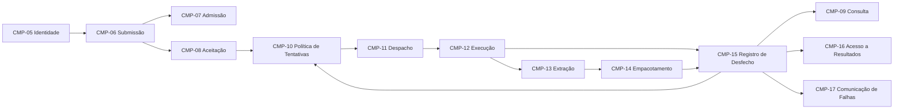

# Identificação e refatoração de componentes modulares

> Este modelo foi substituído pelo [`CTX-CMP-003`](../../componentes-coesos.md) em 2026-08-03. Ele permanece íntegro como evidência da granularidade anterior e das duas iterações que a produziram; não representa mais o inventário corrente.

## Escopo e lente

Este modelo sucede o [`CTX-CMP-001`](ctx-cmp-001-componentes-macro.md), que permanece como evidência do refinamento macro anterior. Aqui, componente significa manifestação modular de comportamento: um pacote, módulo ou biblioteca com responsabilidade e dependências controladas. Componente não significa serviço, processo, banco, bounded context ou quantum.

O ciclo segue a ordem `identificar → atribuir histórias → analisar responsabilidades → analisar características do sistema → refatorar → repetir e verificar`. Nenhuma quantidade desejada de componentes ou unidades de implantação orienta a descoberta.

| Estado do ciclo | Evidência | Alteração do inventário permitida? |
|---|---|---|
| Componentes identificados | Técnica e inventário inicial | Sim, somente para formar a hipótese inicial |
| Histórias atribuídas | Cada `US-*` possui um responsável principal | Não |
| Responsabilidades analisadas | Papéis, conhecimento, coesão e acoplamento registrados | Não |
| Características analisadas | Pressões sistêmicas registradas | Não |
| Refatorado | Toda mudança cita um achado anterior | Sim |
| Verificado | Nova atribuição, análises e convergência | Não |

## Iteração 1 — Componentes identificados

### Técnica de descoberta

A técnica principal foi `Workflow`, complementada por `Actor/Actions`. O [Event Storming validado](../../../requisitos/event-storming.md#fluxo-principal-candidato) distingue autenticar, receber um vídeo, acompanhar o trabalho, processar mídia, fornecer resultado e comunicar falha. `Entity Trap` será verificado nas análises; não se criou um componente por tabela, tecnologia ou passo mecânico.

### Inventário inicial congelado

| Componente inicial | Papel derivado do fluxo | Evidência principal |
|---|---|---|
| Identidade e Acesso | Estabelecer quem realiza uma operação protegida | [`US-01`](../../../requisitos/historias.md#us-01) |
| Recebimento de Vídeo | Receber, validar e aceitar o envio | [`US-02`](../../../requisitos/historias.md#us-02) |
| Acompanhamento de Trabalhos | Preservar trabalho, estado, ciclos, tentativas e consulta | [`US-04`](../../../requisitos/historias.md#us-04) e [`US-05`](../../../requisitos/historias.md#us-05) |
| Processamento de Mídia | Executar processamento concorrente e produzir o resultado | [`US-03`](../../../requisitos/historias.md#us-03) |
| Entrega de Resultados | Autorizar e fornecer o resultado | [`US-06`](../../../requisitos/historias.md#us-06) |
| Notificações | Comunicar uma falha já registrada | [`US-07`](../../../requisitos/historias.md#us-07) |

Este inventário permanece inalterado até a etapa explícita de refatoração.

## Iteração 1 — Histórias atribuídas

| História | Responsável principal | Colaboradores | Observações |
|---|---|---|---|
| `US-01` | Identidade e Acesso | — | Provisionamento continua pendente |
| `US-02` | Recebimento de Vídeo | Identidade e Acesso; Acompanhamento de Trabalhos | A história inteira pertence ao recebimento nesta iteração |
| `US-03` | Processamento de Mídia | Acompanhamento de Trabalhos | Concorrência e isolamento fazem parte do comportamento atribuído |
| `US-04` | Acompanhamento de Trabalhos | Recebimento; Processamento | Preservação, falha e novas tentativas atravessam colaboradores |
| `US-05` | Acompanhamento de Trabalhos | Identidade e Acesso | Consulta não altera o estado |
| `US-06` | Entrega de Resultados | Identidade; Acompanhamento; Processamento | Autorização depende do trabalho e do artefato |
| `US-07` | Notificações | Acompanhamento de Trabalhos | A falha já deve estar registrada |

Cada história possui exatamente um responsável. Colaboradores fornecem contratos e não compartilham a responsabilidade principal.

## Iteração 1 — Papéis e responsabilidades analisados

O inventário continua congelado nesta análise.

| Componente inicial | Achado de responsabilidade ou acoplamento | Sinal para refatoração posterior |
|---|---|---|
| Identidade e Acesso | Papel distinto e pouco conhecimento do domínio de vídeo | Preservar a separação; autogestão futura não integra este ciclo |
| Recebimento de Vídeo | Concentra condução da transferência, decisão de admissão e aceitação durável | `Envio recebido`, `Envio rejeitado` e `Trabalho aceito` possuem regras e resultados diferentes |
| Acompanhamento de Trabalhos | Reúne consulta, política de ciclos, entrega ao processamento e aplicação de desfechos | Compartilhar `Trabalho` não torna esses comportamentos coesos nem lhes dá a mesma razão de mudança |
| Processamento de Mídia | Mistura consumo idempotente, concorrência, extração e empacotamento | Controle da tentativa e transformação possuem conhecimento e falhas diferentes |
| Entrega de Resultados | Possui decisão própria de autorização por identidade, propriedade, estado e artefato | Manter como comportamento modular, sem transformar storage em componente |
| Notificações | Mistura política e canal, mas consentimento e garantias ainda estão pendentes | Manter coeso até existir evidência para outra divisão |

Riscos registrados sem alteração: dependência circular entre acompanhamento e processamento, atualização livre do mesmo estado, vazamento de caminhos físicos e componentes anêmicos que apenas encaminhem chamadas.

## Iteração 1 — Características do sistema analisadas

As características permanecem propriedades do sistema. Esta etapa registra impactos, sem criar, remover, unir ou dividir componentes.

| Característica sistêmica | Escopo observado | Pressão registrada para a refatoração |
|---|---|---|
| Confiabilidade e recuperabilidade | Da aceitação até o estado terminal e resultado disponível | Distinguir aceitação durável, despacho idempotente e aplicação do desfecho |
| Segurança | Identidade, entrada não confiável, propriedade, download e mensagem externa | Separar validação da entrada da autorização de trabalho e resultado |
| Escalabilidade do processamento | Backlog, tentativas e transformação intensiva | Separar controle da tentativa da transformação e impedir concorrência ilimitada |

Nenhuma característica foi atribuída a um componente nem determinou quantidade de quanta.

## Iteração 1 — Refatoração motivada

| Componente inicial | Achado motivador registrado | Alteração aplicada | Componentes resultantes |
|---|---|---|---|
| Identidade e Acesso | Papel já distinto e coeso | Preservar comportamento com nova identidade no modelo sucessor | [`CMP-05`](#cmp-05) Identidade e Acesso |
| Recebimento de Vídeo | Transferência, admissão e aceitação possuem decisões e falhas distintas | Manter coordenador da história e extrair duas responsabilidades | [`CMP-06`](#cmp-06) Submissão; [`CMP-07`](#cmp-07) Admissão; [`CMP-08`](#cmp-08) Aceitação |
| Acompanhamento de Trabalhos | Consulta, ciclos, despacho e desfecho mudam por motivos diferentes | Dividir comportamento sem duplicar transições | [`CMP-09`](#cmp-09) Consulta; [`CMP-10`](#cmp-10) Política de Tentativas; [`CMP-11`](#cmp-11) Despacho; [`CMP-15`](#cmp-15) Registro de Desfecho |
| Processamento de Mídia | Controle concorrente, transformação e pacote possuem conhecimento distinto | Separar execução das duas etapas comportamentais do resultado | [`CMP-12`](#cmp-12) Execução; [`CMP-13`](#cmp-13) Extração; [`CMP-14`](#cmp-14) Empacotamento |
| Entrega de Resultados | Decisão própria de autorização confirmada pela análise | Renomear para explicitar comportamento, sem mudar sua finalidade | [`CMP-16`](#cmp-16) Acesso a Resultados |
| Notificações | Não há evidência para separar política e canal | Manter coeso e restringir à falha | [`CMP-17`](#cmp-17) Comunicação de Falhas |

O total de treze componentes é resultado desta tabela, não uma meta usada na identificação.

## Iteração 2 — Componentes identificados

| ID | Componente | Papel e autoridade comportamental | Fora do escopo | Contratos principais |
|---|---|---|---|---|
| `CMP-05` | Identidade e Acesso | Estabelecer identidade autenticada | Vídeos, trabalhos e resultados | fornece `IdentidadeAutenticada` ou recusa |
| `CMP-06` | Submissão de Vídeos | Coordenar o envio e devolver rejeição ou trabalho aceito | Regras de validação e estado persistente | `EnviarVideo`; consome Admissão e Aceitação |
| `CMP-07` | Admissão de Vídeos | Avaliar formato, tamanho e conteúdo; consolidar problemas | Criar ou alterar trabalho | fornece `SubmissaoAdmitida` ou `EnvioRejeitado` |
| `CMP-08` | Aceitação de Trabalhos | Criar ID, proprietário, estado inicial e referência recuperável | Processar mídia, consultar ou reprocessar | fornece `TrabalhoAceito` |
| `CMP-09` | Consulta de Trabalhos | Servir lista, detalhe, estado e histórico do proprietário | Alterar estado | fornece consultas autorizadas |
| `CMP-10` | Política de Tentativas | Decidir ciclo inicial, reprocessamento, retentativa, duplicidade e encerramento | Executar mídia ou persistir desfecho livremente | fornece `TentativaAutorizada` |
| `CMP-11` | Despacho de Processamento | Entregar duravelmente uma tentativa autorizada | Decidir política ou executar transformação | fornece `ProcessarTentativa` |
| `CMP-12` | Execução de Tentativas | Deduplicar reentrega, controlar concorrência e isolar recursos | Conhecer usuário ou escolher estado do trabalho | fornece fatos correlacionados da tentativa |
| `CMP-13` | Extração de Imagens | Transformar a origem em imagens conforme parâmetros | Ciclos, ZIP, usuário ou trabalho | fornece `ImagensExtraidas` ou falha classificada |
| `CMP-14` | Empacotamento de Resultados | Validar imagens, gerar pacote e preservar referência utilizável | Autorizar download ou concluir trabalho | fornece `ResultadoProduzido` ou falha classificada |
| `CMP-15` | Registro de Desfecho | Aplicar estados de tentativa, conclusão ou falha e preservar histórico | Decidir nova tentativa ou executar mídia | fornece `TrabalhoConcluido` ou `TrabalhoFalhou` |
| `CMP-16` | Acesso a Resultados | Autorizar e fornecer resultado por identidade, propriedade, estado e existência | Empacotar ou publicar diretório físico | fornece resultado ou `DownloadRecusado` |
| `CMP-17` | Comunicação de Falhas | Decidir e tentar comunicação segura depois da falha registrada | Alterar trabalho ou interpretar diagnóstico interno | consome `TrabalhoFalhou`; relata entrega |

Controllers HTTP, repositórios genéricos, banco, broker, outbox, storage, `ffmpeg`, biblioteca ZIP, WebSocket, SSE, observabilidade, CI/CD e containers permanecem portas, adaptadores, bibliotecas ou infraestrutura.

## Iteração 2 — Histórias atribuídas

| História | Responsável principal | Colaboradores | Observações |
|---|---|---|---|
| `US-01` | [`CMP-05`](#cmp-05) | — | A história permanece integralmente com identidade |
| `US-02` | [`CMP-06`](#cmp-06) | [`CMP-07`](#cmp-07), [`CMP-08`](#cmp-08), identidade | Submissão coordena, mas não absorve regras ou estado |
| `US-03` | [`CMP-12`](#cmp-12) | [`CMP-11`](#cmp-11), [`CMP-13`](#cmp-13), [`CMP-14`](#cmp-14), [`CMP-15`](#cmp-15) | Execução possui concorrência e isolamento |
| `US-04` | [`CMP-10`](#cmp-10) | [`CMP-08`](#cmp-08), [`CMP-11`](#cmp-11), [`CMP-12`](#cmp-12), [`CMP-15`](#cmp-15) | Política decide novas tentativas; colaboradores executam e registram |
| `US-05` | [`CMP-09`](#cmp-09) | identidade; publicadores de fatos do trabalho | Consulta permanece somente leitura |
| `US-06` | [`CMP-16`](#cmp-16) | identidade, [`CMP-09`](#cmp-09), [`CMP-14`](#cmp-14) | Acesso decide autorização e disponibilidade |
| `US-07` | [`CMP-17`](#cmp-17) | [`CMP-15`](#cmp-15) | Comunicação ocorre depois do desfecho persistido |

## Iteração 2 — Papéis e responsabilidades analisados

O inventário refinado permanece congelado nesta análise.

| Questão | Resultado da análise |
|---|---|
| Histórias sem responsável ou com responsabilidade dupla | Nenhuma; cada `US-*` possui exatamente um responsável principal |
| Entity Trap | Vários componentes tratam `Trabalho`, mas cada um possui comportamento ou transição específica; nenhum representa CRUD genérico |
| Autoridade concorrente | Aceitação cria; Política autoriza tentativas; Registro aplica desfechos; Consulta lê; Acesso autoriza entrega |
| Acoplamento temporal | Submissão precede Aceitação; Despacho precede Execução; referência do resultado precede Conclusão |
| Dependência circular | Fluxo de retorno usa fatos correlacionados; worker não chama componentes internos do núcleo para alterar estado |
| Componentes anêmicos | Despacho e Admissão possuem política verificável; reavaliar se a implementação apenas encaminhar chamadas |
| Conhecimento excessivo | Extração e Empacotamento não conhecem identidade, ciclos ou estados; Comunicação recebe fato autossuficiente |

## Iteração 2 — Características do sistema analisadas

O inventário continua congelado. A repetição mostrou:

| Característica sistêmica | Evidência no inventário refinado | Pendência |
|---|---|---|
| Confiabilidade e recuperabilidade | Aceitação, Despacho e Registro expõem pontos duráveis testáveis | Atomicidade e reconciliação ainda precisam de decisão e experimento |
| Segurança | Admissão isola entrada não confiável; Consulta e Acesso explicitam propriedade | Limites numéricos e estratégia de identidade continuam abertos |
| Escalabilidade do processamento | Execução, Extração e Empacotamento podem variar capacidade sem possuir o trabalho | Carga, throughput e concorrência-alvo ainda não foram medidos |

Nenhuma nova divisão foi aplicada durante esta análise.

## Iteração 2 — Verificação de convergência

| Critério | Resultado |
|---|---|
| Toda história possui um responsável principal | Atendido |
| Todo componente refinado possui achado motivador | Atendido pela tabela de refatoração |
| Papéis distintos e comportamentos não duplicados | Atendido provisoriamente |
| Contratos e ordens relevantes explícitos | Atendido em nível conceitual |
| Mecanismos não confundidos com componentes de negócio | Atendido |
| CA/CE estático | Ainda não mensurável sem namespaces e código |
| Características verificáveis | Cenários existem; valores-alvo permanecem pendentes |

Na verificação de 2026-08-02, o inventário modular convergia como hipótese para orientar código e Threat Modeling e ainda estava `em_analise`. Em 2026-08-03, ele foi substituído pelo [`CTX-CMP-003`](../../componentes-coesos.md), que passou a deter o inventário vigente.

## Dependências e contratos conceituais

| Origem | Destino | Contrato | Restrição |
|---|---|---|---|
| Submissão | Admissão | `AvaliarSubmissao` | Admissão não acessa trabalho |
| Submissão | Aceitação | `AceitarTrabalho` | Somente depois de `SubmissaoAdmitida` e origem recuperável |
| Política | Despacho | `TentativaAutorizada` | Reentrega técnica não cria nova tentativa |
| Despacho | Execução | `ProcessarTentativa` | Contrato durável e correlacionado |
| Execução | Extração | `ExtrairImagens` | Sem identidade ou estado do trabalho |
| Execução | Empacotamento | `EmpacotarResultado` | Recebe somente referências das imagens |
| Execução/Empacotamento | Registro | Fatos de tentativa e `ResultadoProduzido` | Worker não escreve livremente no núcleo |
| Registro | Consulta/Acesso/Política/Comunicação | Fatos do trabalho | Consumidores não reinterpretam diagnóstico interno |

## Agrupamentos candidatos de quanta

Estes quatro agrupamentos são hipóteses futuras sem IDs próprios e não representam topologia aceita. Eles foram avaliados somente depois da verificação do inventário modular.

| Agrupamento candidato | Componentes candidatos | Motivação a verificar | Risco pendente |
|---|---|---|---|
| **Interação e acesso** | [`CMP-05`](#cmp-05), [`CMP-06`](#cmp-06), [`CMP-07`](#cmp-07), [`CMP-09`](#cmp-09), [`CMP-16`](#cmp-16) | Segurança na borda e perfil de interação do usuário | Separação pode ampliar coordenação com Aceitação |
| **Controle do ciclo** | [`CMP-08`](#cmp-08), [`CMP-10`](#cmp-10), [`CMP-11`](#cmp-11), [`CMP-15`](#cmp-15) | Transições, confiabilidade e recuperação do trabalho | Aceitação distribuída exige prova de durabilidade |
| **Execução de mídia** | [`CMP-12`](#cmp-12), [`CMP-13`](#cmp-13), [`CMP-14`](#cmp-14) | CPU, I/O, concorrência e escala diferenciada | Contrato e medição de carga ainda ausentes |
| **Comunicação** | [`CMP-17`](#cmp-17) | Isolar canal e tentativas externas se regras próprias surgirem | Pode não justificar unidade independente |

Identidade pode ser fornecida externamente, e Comunicação pode permanecer junto a outro agrupamento. A quantidade e a topologia serão decididas somente depois de riscos, contratos físicos e medições.

## Riscos, fitness functions e próximo incremento então proposto

| Risco | Verificação futura |
|---|---|
| Dependências cíclicas entre pacotes | Regra estática que imponha a direção documentada |
| Acesso irrestrito ao mesmo esquema | Portas específicas por comportamento e teste de dependência |
| Componente anêmico | Unir somente quando não houver política, contrato ou razão de mudança própria |
| Perda após aceitação | Reiniciar depois do aceite e consultar o mesmo trabalho |
| Duplicidade de tentativa | Reentregar o mesmo comando e observar um único desfecho visível |
| Conclusão antes do artefato | Falhar entre empacotamento e registro e executar reconciliação |

Em 2026-08-02, o incremento seguinte proposto era o Threat Modeling de [`WORK-011`](../../../acompanhamento/roadmap.md#work-011--executar-threat-modeling-inicial). Caso Java fosse posteriormente aceito, a primeira estrutura deveria representar como módulos os limites que viessem a ser confirmados. O [roadmap ativo](../../../acompanhamento/roadmap.md) e o [`CTX-CMP-003`](../../componentes-coesos.md) contêm a orientação vigente.
