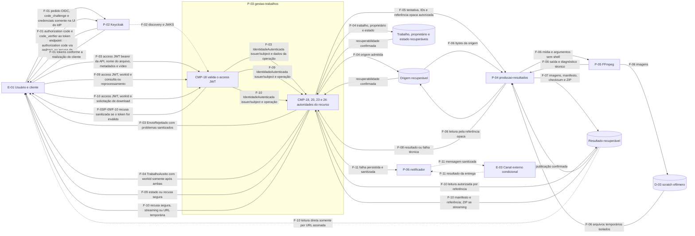
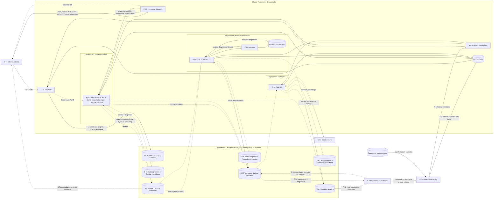

# Modelo de ameaças inicial

> Navegação: [índice de arquitetura](README.md) · [WORK-011](../acompanhamento/roadmap.md#work-011--executar-threat-modeling-inicial) · [histórias](../requisitos/historias.md) · [componentes vigentes](componentes-coesos.md)

## Estado deste incremento

O modelo registra o fluxo de dados, os ativos e as fronteiras de confiança do ambiente Kubernetes de validação. O segundo incremento acrescenta a primeira onda de ameaças priorizadas e rastreia controles, propostas, testes e risco residual provisório. Isso avança `WORK-011`, mas **não conclui o threat modeling**: as fronteiras secundárias e a validação dos tratamentos ainda permanecem abertas.

O desenho possui duas camadas para preservar a situação real:

- a camada lógica usa requisitos, autoridades e contratos já vigentes;
- a camada física distingue decisões aceitas de mecanismos ainda candidatos em [`DEC-0003`](decisoes/0003-entrega-duravel-e-persistencia.md).

## Escopo e classificação

O fluxo coberto começa no login e no bootstrap do ambiente, atravessa envio, aceite, processamento, consulta, download e comunicação de falha. O ambiente de produção, a autogestão de contas e uma cadeia de suprimentos completa permanecem fora deste primeiro recorte.

Classificações usadas:

- `Declarado` ou `Validado na descoberta`: necessidade ou regra de negócio registrada nas histórias e no glossário;
- `Decidido`: direção aceita em ADR;
- `Inferido`: detalhe necessário ao modelo, ainda corrigível;
- `Candidato`: realização descrita em documento `em_analise` ou opção ainda não escolhida.

O repositório ainda não contém a aplicação-alvo. Portanto, este documento modela a direção vigente e suas superfícies, não afirma controles implementados.

`E-*`, `P-*`, `D-*`, `AT-*` e `F-*` são rótulos locais deste nó e podem ser refinados enquanto o modelo estiver `em_analise`. `CTX-THREAT-001`, `TB-01..10` e `THR-001..020` possuem identidade estável no Context Graph; seus significados não devem ser reciclados quando prioridade, tratamento ou evidência mudarem.

| Aspecto | Situação | Fonte |
|---|---|---|
| oito autoridades lógicas e escritor único do estado | `Decidido` | [`CTX-CMP-003`](componentes-coesos.md) e [`DEC-0004`](decisoes/0004-componentes-coesos-do-nucleo.md) |
| três quanta e três `Deployment`s de aplicação | `Decidido` para validação | [`DEC-0002`](decisoes/0002-topologia-kubernetes.md) |
| Keycloak, cliente interativo, Authorization Code com PKCE e identidade `(issuer, subject)` | `Decidido` para validação | [`DEC-0005`](decisoes/0005-keycloak-no-ambiente-de-validacao.md) |
| realização do cliente como SPA, BFF ou aplicação server-side e custódia do token | `A definir` | a decisão de identidade não escolhe a realização do cliente |
| PostgreSQL, RabbitMQ, object storage, outbox/inbox e DLQ | `Candidato` | [`DEC-0003`](decisoes/0003-entrega-duravel-e-persistencia.md) |
| canal, destino e consentimento da notificação | `A confirmar` | [`US-07`](../requisitos/historias.md#us-07) |
| download por streaming autorizado ou URL assinada | alternativas `Candidatas` | [`DEC-0002`](decisoes/0002-topologia-kubernetes.md#seguran%C3%A7a) |

## Atores, processos e armazenamentos

### Entidades externas

| ID | Entidade | Papel no fluxo |
|---|---|---|
| `E-01` | Usuário por cliente interativo | autentica, envia vídeo, consulta, solicita reprocessamento e baixa resultado; continua sendo fonte não confiável mesmo autenticado |
| `E-02` | Operador ou avaliador | instala o ambiente e fornece entradas secretas sem registrá-las no Git |
| `E-03` | Provedor ou canal externo de notificação | entrega comunicação de falha; é condicional porque canal, consentimento e provedor não foram escolhidos |

Usuário malicioso autenticado, cliente anônimo e workload comprometido serão personas de abuso das superfícies existentes, não novos atores funcionais.

### Processos e autoridades

| ID | Processo | Situação e autoridades |
|---|---|---|
| `P-01` | Ingress/Gateway | entrada pública decidida para `gestao-trabalhos` |
| `P-02` | Keycloak | workload de plataforma que autentica credenciais e emite tokens |
| `P-03` | `gestao-trabalhos` | `CMP-18`, `CMP-19`, `CMP-20`, `CMP-23` e `CMP-24` |
| `P-04` | `producao-resultados` | `CMP-21` e `CMP-22`, sem endpoint público |
| `P-05` | FFmpeg | subprocesso que interpreta mídia não confiável dentro do perfil isolado de Produção |
| `P-06` | `notificador` | `CMP-25`, sem endpoint público |
| `P-07` | bootstrap/deploy | procedimento privilegiado ainda sem realização física detalhada |

Componentes internos de um mesmo quantum continuam fronteiras de autoridade lógica. Eles não são representados como processos ou microsserviços independentes.

### Armazenamentos

| ID | Armazenamento | Situação |
|---|---|---|
| `D-01` | banco próprio do Keycloak | obrigação `Decidida`; tecnologia, localização e operação detalhada ainda pertencem à implementação |
| `D-02` | Secrets e entrada externa de segredos | obrigação decidida; backend e ciclo de rotação ainda não definidos |
| `D-03` | scratch `emptyDir` limitado | `Decidido` e efêmero; nunca é origem ou resultado durável |
| `D-04` | dados próprios de Gestão: trabalho, proprietário, ciclos, tentativas, projeções, inbox/outbox | `Candidato` da `DEC-0003` |
| `D-05` | dados próprios de Produção: inbox/deduplicação, lease, manifesto e outbox | `Candidato` da `DEC-0003` |
| `D-06` | dados próprios do Notificador: inbox e tentativas de entrega | `Candidato` da `DEC-0003` |
| `D-07` | broker, filas e DLQ | `Candidato` da `DEC-0003` |
| `D-08` | origem, imagens, manifesto e ZIP recuperáveis | porta lógica obrigatória; object storage é `Candidato` |
| `D-09` | telemetria e diagnósticos | necessária como suporte; tecnologia, localização, acesso e retenção ainda não definidos |

## Ativos iniciais

| ID | Ativo | Propriedade prioritária |
|---|---|---|
| `AT-01` | senhas de usuários e segredo administrativo do Keycloak | confidencialidade; nunca alcançar aplicação, Git, imagem ou logs |
| `AT-02` | códigos OIDC, verificador PKCE, tokens, sessões, chaves e configuração esperada de issuer/audience | integridade, confidencialidade e validade temporal |
| `AT-03` | identidade `(issuer, subject)` e vínculo de proprietário | integridade e isolamento entre usuários |
| `AT-04` | vídeo de origem e metadados | confidencialidade, integridade e disponibilidade; conteúdo permanece hostil |
| `AT-05` | trabalho, estado, histórico, ciclos, tentativas e referências | integridade e recuperabilidade; somente `CMP-20` escreve o estado |
| `AT-06` | `workId`, `cycleId`, `attemptId`, `messageId`, comandos e fatos | autenticidade, correlação e resistência a repetição |
| `AT-07` | imagens, manifesto, checksums e ZIP | confidencialidade, integridade e disponibilidade |
| `AT-08` | destino e conteúdo da notificação | confidencialidade e minimização |
| `AT-09` | CPU, memória, I/O, scratch, backlog e capacidade do canal | disponibilidade e uso limitado |
| `AT-10` | ServiceAccounts, credenciais de dados e Secrets | privilégio mínimo e isolamento por quantum |
| `AT-11` | logs, traces, métricas e diagnósticos | confidencialidade, integridade e acesso operacional |
| `AT-12` | backups e dados de recuperação | confidencialidade, integridade e restauração verificável |

A retenção sem expiração automática é regra vigente. Ela amplia exposição e custo, mas não autoriza introduzir silenciosamente uma cota acumulada ou expiração funcional.

A custódia esperada separa os artefatos de identidade: credenciais, código, verificador PKCE e sessão existem somente entre cliente e Keycloak; o cliente apresenta à API apenas o access JWT; `CMP-18` deriva dele `IdentidadeAutenticada(issuer, subject)` e somente essa identidade segue para as autoridades do recurso. Chaves, discovery e configuração esperada chegam a `CMP-18` por fontes confiáveis, nunca por campos fornecidos pelo solicitante.

## Fluxo lógico estável

A seta tracejada `F-02` indica que a obtenção ou cache das chaves é inferida da validação de assinatura; o contrato físico ainda não foi registrado. Os dois sentidos externos de `F-11` são condicionais à escolha de canal. Os nós dentro de `P-03` são autoridades lógicas no mesmo quantum, não processos ou unidades de implantação independentes.

## Sobreposição física do ambiente de validação

Linhas sólidas representam topologia ou obrigações aceitas. Linhas tracejadas representam realização física candidata, integração ainda não detalhada ou bifurcação condicional; não transformam `DEC-0003` em decisão aceita.

O agrupador de dados foi colocado fora da caixa do cluster para deixar sua localização em aberto; isso não afirma que as dependências serão externas. O fluxo `F-12` fornece também a configuração confiável de issuer e audience esperados pela aplicação, sem derivá-los dos claims apresentados pelo cliente.

## Registro dos fluxos

| Fluxo | Dados e direção | Situação | Fronteiras |
|---|---|---|---|
| `F-01` | cliente → Keycloak: pedido OIDC, `code_challenge` e credenciais apenas na UI do IdP; Keycloak → cliente: sessão e authorization code; cliente → token endpoint: code e `code_verifier`; Keycloak → cliente: tokens | OIDC e PKCE decididos; realização do cliente e custódia do token pendentes | `TB-01` |
| `F-02` | Keycloak → Gestão: discovery e JWKS | validação decidida; cache, rotação e falha de JWKS pendentes | `TB-02` |
| `F-03` | cliente → `CMP-18`: access JWT bearer destinado à API, nome do arquivo, metadados e stream; `CMP-18` → `CMP-19`: `IdentidadeAutenticada(issuer, subject)` e dados da operação; `CMP-19` → cliente: rejeição sanitizada, quando aplicável | fluxo lógico vigente; identidade nunca vem do corpo ou de headers auxiliares; limites concretos pendentes | `TB-01`, `TB-02`, `TB-03` |
| `F-04` | Gestão ↔ origem e estado: proprietário, referência, trabalho e confirmação; depois Gestão → cliente: `TrabalhoAceito(workId)` | ambas as recuperabilidades precedem a resposta; persistência e atomicidade são candidatas | `TB-03`, `TB-05` |
| `F-05` | Gestão → Produção: tentativa, IDs, versão e referência opaca | contrato lógico decidido; transporte candidato | `TB-04`, `TB-05` |
| `F-06` | Produção usa a referência opaca para ler bytes da origem; Produção ↔ FFmpeg/scratch: mídia, argumentos, imagens, temporários, saída e diagnóstico técnico | processamento decidido; confinamento detalhado pendente | `TB-03`, `TB-05`, `TB-06` |
| `F-07` | Produção → resultado recuperável: imagens, manifesto, checksums e ZIP | publicação antes da conclusão decidida; storage candidato | `TB-05` |
| `F-08` | Produção → Gestão: início, resultado ou falha técnica correlacionada | contrato lógico decidido; transporte candidato | `TB-04`, `TB-05` |
| `F-09` | cliente → `CMP-18`: access JWT, `workId` e consulta ou reprocessamento; `CMP-18` → autoridades: `IdentidadeAutenticada(issuer, subject)` e operação; Gestão → cliente: estado ou recusa segura | propriedade aplicada por `CMP-20` e `CMP-23`; persistência/transporte físicos candidatos | `TB-01`, `TB-02`, `TB-05` |
| `F-10` | cliente → `CMP-18`: access JWT, `workId` e download; `CMP-18` → `CMP-24`: `IdentidadeAutenticada(issuer, subject)` e operação; resultado → Gestão: manifesto/referência e bytes se streaming; Gestão → cliente: recusa segura, streaming ou URL temporária; cliente → resultado somente pela URL assinada | autorização decidida; streaming ou URL assinada pendente | `TB-01`, `TB-02`, `TB-05`, `TB-09` |
| `F-11` | Gestão → Notificador: falha persistida e sanitizada; Notificador → canal: mensagem; canal → Notificador: resultado da entrega | primeiro trecho lógico; persistência/transporte físicos, destino, consentimento e provedor pendentes | `TB-04`, `TB-05`, `TB-07` |
| `F-12` | operador/repositório → bootstrap/control plane/Secrets → workloads | manifests sem segredo e entrada externa decididos; inclui configuração esperada de issuer/audience; geração, rotação e descarte pendentes | `TB-08` |
| `F-13` | workloads → telemetria → operador | suporte necessário; tecnologia, sanitização e retenção pendentes | `TB-10` |
| `F-14` | operador ↔ broker/DLQ: diagnóstico, quarentena e replay | fluxo privilegiado `Candidato`; autorização, auditoria e procedimento ainda não definidos | `TB-04`, `TB-05`, `TB-08`, `TB-10` |

## Fronteiras de confiança

| ID | Fronteira | Fluxos | Razão para tratá-la separadamente |
|---|---|---|---|
| `TB-01` | Internet/cliente ↔ entradas públicas | `F-01`, `F-03`, `F-09`, `F-10` | token, identificadores, nomes e conteúdo são controláveis externamente |
| `TB-02` | Keycloak e cliente → `CMP-18` → autoridades do recurso | `F-02`, `F-03`, `F-09`, `F-10` | credenciais, código e sessão ficam no domínio cliente/Keycloak; a API recebe access JWT e somente `CMP-18` deriva `(issuer, subject)` para as demais autoridades |
| `TB-03` | mídia não confiável ↔ admissão, origem e parser | `F-03`, `F-04`, `F-06` | autenticação e admissão não tornam o conteúdo seguro |
| `TB-04` | `gestao-trabalhos` ↔ `producao-resultados` e `notificador` | `F-05`, `F-08`, `F-11`, `F-14` | quanta, credenciais e autoridades distintas; adulteração ou replay pode provocar efeitos |
| `TB-05` | cada quantum ↔ banco, transporte e armazenamento | `F-04` a `F-11`, `F-14` | propriedade física, credencial mínima, integridade e disponibilidade dos dados |
| `TB-06` | container de Produção ↔ FFmpeg e scratch | `F-06` | subprocesso nativo interpreta entrada hostil e consome recursos finitos |
| `TB-07` | aplicação ↔ provedor externo de notificação | `F-11` | dados deixam o cluster e passam a outro domínio operacional |
| `TB-08` | operador/repositório/control plane ↔ runtime e Keycloak | `F-12`, `F-14` | caminho privilegiado capaz de introduzir segredos, configuração e replay |
| `TB-09` | cliente ↔ object storage | `F-10` | existe somente para a leitura direta se a alternativa de URL assinada for aceita; streaming permanece via Gestão e Ingress |
| `TB-10` | runtime ↔ telemetria e operadores | `F-13`, `F-14` | diagnósticos e DLQ podem carregar tokens, caminhos, URLs, dados do usuário e mensagens capazes de provocar efeitos |

Compartilhar cluster ou namespace não elimina `TB-04` e `TB-05`. A topologia aceita já exige ServiceAccount, credencial mínima por quantum e rede restritiva.

## Cobertura do escopo funcional

| História | Fluxos principais | Autoridade principal |
|---|---|---|
| [`US-01`](../requisitos/historias.md#us-01) | `F-01`, `F-02`, apresentação e validação do JWT em `F-03` | `CMP-18` e Keycloak |
| [`US-02`](../requisitos/historias.md#us-02) | `F-03`, `F-04` | `CMP-19` |
| [`US-03`](../requisitos/historias.md#us-03) | `F-05` a `F-08` | `CMP-21` |
| [`US-04`](../requisitos/historias.md#us-04) | `F-04`, `F-05`, `F-08`, `F-09` | `CMP-20` |
| [`US-05`](../requisitos/historias.md#us-05) | `F-09` | `CMP-23` |
| [`US-06`](../requisitos/historias.md#us-06) | `F-10` | `CMP-24` |
| [`US-07`](../requisitos/historias.md#us-07) | `F-11` | `CMP-25` |

## Checklist de consistência do DFD

Este checklist é reexecutado sempre que processos, fluxos, armazenamentos ou a semântica de aceite mudarem. Ele é a prevenção local para as omissões encontradas na primeira revisão do modelo.

| Controle | Evidência nesta versão |
|---|---|
| cada quantum possui seus dados próprios e fluxo de credencial, sem leitura cruzada implícita | `P-03/D-04`, `P-04/D-05` e `P-06/D-06`; realização ainda candidata |
| o aceite mostra origem recuperável, trabalho/proprietário/estado recuperáveis e resposta somente depois de ambos | `F-04` no DFD lógico e no registro de fluxos |
| cada diagrama e registro separa origem, destino e custódia dos artefatos de identidade | credencial/código/sessão somente cliente ↔ Keycloak; access JWT somente cliente → `CMP-18`; `(issuer, subject)` somente `CMP-18` → autoridade do recurso; nenhum fluxo usa o rótulo genérico “identidade” |
| cada fluxo mostra entrada, sucesso, rejeição/falha e acknowledgement quando esses resultados existem, distinguindo leitura de escrita | rejeição em `F-03`, aceite em `F-04`, leitura/saída do FFmpeg em `F-06`, variantes de download em `F-10` e retorno de entrega em `F-11` |
| toda tecnologia ou localização não aceita está marcada como candidata ou aberta | agrupador `DATA`, linhas tracejadas e tabela de situação |
| todos os três quanta e `US-01..07` possuem fluxo rastreável | tabela de cobertura e `F-01..14` |
| bootstrap, Secrets, control plane, telemetria, DLQ e integrações externas aparecem no modelo | `F-11..14` e `TB-04/TB-07/TB-08/TB-10` |
| componentes lógicos não foram convertidos em processos independentes | tabela de processos agrupa `CMP-18..25` nos três `Deployment`s aceitos |

## Método de priorização e confiança

As ameaças são hipóteses técnicas, não prioridades de produto. A ordem de tratamento combina impacto e exposição sem inventar probabilidade numérica:

- impacto alto (`I-A`) inclui acesso cruzado, comprometimento de workload, perda de trabalho aceito, transição indevida, resultado incorreto ou indisponibilidade sistêmica;
- impacto médio (`I-M`) afeta uma tentativa e permite recuperação sem exposição entre usuários;
- exposição alta (`E-A`) pode ocorrer pela entrada pública, operação normal, falha comum ou reentrega esperada;
- exposição média (`E-M`) requer defeito ou comprometimento de cliente, workload ou credencial;
- exposição baixa (`E-B`) exige acesso privilegiado ou uma superfície física ainda condicional.

`P0` bloqueia a prova da primeira fatia porque combina impacto alto e exposição alta no fluxo vigente ou rompe uma invariante de aceite, propriedade, estado ou publicação. `P1` precisa ser confrontada antes de alegar atendimento às características, mas depende de escolha ainda aberta, comprometimento interno ou condição menos direta. `P2` acompanha uma superfície privilegiada ou condicional e deve ser tratada se ela for introduzida.

Quando o par for `I-A/E-A`, mas ainda não existir um oráculo verificável porque política, formatos, capacidade ou realização física estão explicitamente abertos, essa ausência prevalece e mantém `P1`; a ameaça deve declarar a lacuna e ser reavaliada assim que o oráculo existir. Nesta versão, essa regra alcança `THR-006`, `THR-007`, `THR-016` e `THR-020`.

A confiança do controle também é explícita:

| Nível | Evidência disponível |
|---|---|
| `C0` | controle ausente ou somente candidato/proposto |
| `C1` | requisito ou decisão existente, ainda sem implementação |
| `C2` | controle implementado, ainda sem teste de abuso ou falha |
| `C3` | controle passou pelo teste registrado para a ameaça |

Como a aplicação-alvo ainda não existe, nenhum controle supera `C1`. O risco residual abaixo é provisório e **não é reduzido** por mitigação proposta; somente evidência `C3` poderá justificar reclassificação ou aceite explícito. Mitigações físicas ligadas à [`DEC-0003`](decisoes/0003-entrega-duravel-e-persistencia.md) continuam candidatas.

### Regras de consistência do registro

Estas regras são a prevenção local para as inconsistências de prioridade e sobreposição causal encontradas na primeira revisão deste registro; ainda não há recorrência que justifique uma regra global ou skill.

- cada entidade `THR-*` conserva um mecanismo e uma autoridade primários; efeitos vizinhos só compartilham ameaça quando exigem o mesmo controle e o mesmo teste;
- ator, capacidade e ativo ameaçado precisam atravessar os fluxos e fronteiras citados; superfícies administrativas ou condicionais não são absorvidas por uma entrada pública diferente;
- sobreposições possíveis declaram o corte temporal ou de autoridade entre as ameaças;
- toda ameaça mantém abuso, ativos/superfície, rastreabilidade, controle vigente, mitigação proposta, teste e residual/lacuna;
- a prioridade obedece a impacto/exposição ou registra a exceção de oráculo ausente prevista acima;
- controle candidato ou proposto não supera `C0`, controle declarado/decidido sem implementação não supera `C1` e nenhum deles reduz risco residual sem `C3`;
- qualquer mudança de prioridade atualiza a matriz, as contagens do roadmap e a lista de gates `P0` no mesmo incremento.

## Ameaças priorizadas

| Grupo | `P0` | `P1` | `P2` |
|---|---|---|---|
| identidade e autorização — `TB-01/TB-02` | [`THR-001`](#thr-001), [`THR-002`](#thr-002), [`THR-003`](#thr-003) | [`THR-004`](#thr-004), [`THR-005`](#thr-005), [`THR-006`](#thr-006), [`THR-020`](#thr-020) | — |
| mídia e FFmpeg — `TB-03/TB-06` | [`THR-008`](#thr-008), [`THR-009`](#thr-009), [`THR-010`](#thr-010) | [`THR-007`](#thr-007), [`THR-011`](#thr-011), [`THR-012`](#thr-012) | — |
| quanta, dados e transporte — `TB-04/TB-05` | [`THR-013`](#thr-013), [`THR-014`](#thr-014), [`THR-015`](#thr-015) | [`THR-016`](#thr-016), [`THR-017`](#thr-017), [`THR-018`](#thr-018) | [`THR-019`](#thr-019) |

### Identidade e autorização — `TB-01/TB-02`

#### THR-001 — JWT ilegítimo aceito

- **História de abuso (hipótese):** um atacante faz `CMP-18` aceitar token falsificado, alterado, expirado ou emitido para outro issuer/audience e obtém uma identidade escolhida.
- **Ativos e superfície:** `AT-02`, `AT-03`, `AT-04`, `AT-05`, `AT-07`; `F-02/F-03/F-09/F-10`; `TB-01/TB-02`.
- **Rastreabilidade:** [`US-01`](../requisitos/historias.md#us-01), `US-02/04/05/06`; [`CA-02`](caracteristicas.md#ca-02--seguran%C3%A7a); [`CMP-18`](componentes-coesos.md#cmp-18); [`DEC-0005`](decisoes/0005-keycloak-no-ambiente-de-validacao.md); `gestao-trabalhos`.
- **Controle vigente:** `Decidido/C1` — validar assinatura, expiração, issuer e audience; somente `CMP-18` produz `(issuer, subject)` e token inválido recebe `401`.
- **Mitigação proposta:** definir perfil e algoritmos aceitos, prender discovery/JWKS ao issuer configurado, rejeitar fontes de chave indicadas pelo token e definir claims obrigatórios, rotação, cache e clock skew.
- **Teste futuro:** apresentar token ausente, malformado, adulterado, expirado, com algoritmo/issuer/audience incorretos, `nbf` futuro, `sub` ausente, `kid` desconhecido e ID token no lugar do access token; todos devem produzir `401` sem efeito. Separadamente, rotacionar a chave e verificar tokens válidos conforme a política escolhida.
- **Prioridade e residual provisório:** `P0 (I-A/E-A)`; risco não reduzido em `C1`. Biblioteca, perfil do token e comportamento sob falha de JWKS permanecem abertos; token válido roubado pertence à `THR-005`.

#### THR-002 — Contorno de `CMP-18` ou identidade injetada

- **História de abuso (hipótese):** um atacante alcança rota protegida sem o gate OIDC ou envia `issuer`, `subject`, username, e-mail, role ou header auxiliar para assumir outro sujeito.
- **Ativos e superfície:** `AT-03`, `AT-05`, `AT-07`; `F-03/F-09/F-10`; `TB-01/TB-02`.
- **Rastreabilidade:** [`US-01`](../requisitos/historias.md#us-01), `US-02/04/05/06`; [`CA-02`](caracteristicas.md#ca-02--seguran%C3%A7a); [`CMP-18`](componentes-coesos.md#cmp-18), `CMP-19/20/23/24`; [`DEC-0005`](decisoes/0005-keycloak-no-ambiente-de-validacao.md); `gestao-trabalhos`.
- **Controle vigente:** `Decidido/C1` — somente `CMP-18` deriva `IdentidadeAutenticada`; username, e-mail e roles não substituem `(issuer, subject)`.
- **Mitigação proposta:** rotas protegidas por padrão, contexto autenticado criado apenas pelo adaptador OIDC, DTO externo sem proprietário e regra estrutural que impeça autoridades de construir identidade a partir de token ou campos externos.
- **Teste futuro:** inventariar rotas e chamá-las sem token; enviar token de A com body/headers alegando B; usar o mesmo `subject` sob issuer diferente; verificar estruturalmente que somente `CMP-18` constrói `IdentidadeAutenticada`.
- **Prioridade e residual provisório:** `P0 (I-A/E-A)`; risco não reduzido em `C1`. Framework, endpoints e fitness function concreta ainda não foram escolhidos.

#### THR-003 — Acesso cruzado por `workId` ou projeção

- **História de abuso (hipótese):** usuário A autenticado faz o trabalho de B aparecer em sua listagem ou usa o `workId` de B para reprocessar, baixar ou inferir sua existência.
- **Ativos e superfície:** `AT-03` a `AT-07`; associação em `F-03/F-04`, operações em `F-09/F-10`; `TB-01/TB-02`.
- **Rastreabilidade:** [`US-02`](../requisitos/historias.md#us-02), `US-04/05/06`; [`CA-02`](caracteristicas.md#ca-02--seguran%C3%A7a); [`CMP-20`](componentes-coesos.md#cmp-20), `CMP-23/24`; [`DEC-0005`](decisoes/0005-keycloak-no-ambiente-de-validacao.md); `gestao-trabalhos`.
- **Controle vigente:** `Decidido/C1` — proprietário é `(issuer, subject)`; Ciclo, Consulta e Acesso autorizam no recurso sob sua própria autoridade.
- **Mitigação proposta:** resolver conjuntamente `workId` e proprietário no servidor, tornar o proprietário imutável após o aceite e impedir que referência física conceda acesso sem autorização do recurso.
- **Teste futuro:** dois usuários criam trabalhos; A não lista, reprocessa nem baixa B e não provoca transição ou leitura de bytes; repetir em toda rota existente, com ID aleatório e mesmo `subject` sob issuer diferente. Consulta detalhada entra somente se for introduzida futuramente.
- **Prioridade e residual provisório:** `P0 (I-A/E-A)`; risco não reduzido em `C1`. Semântica `403/404`, diferenças observáveis e URL assinada ainda dependem de decisão e de `TB-09`.

#### THR-004 — Sequestro da transação OIDC

- **História de abuso (hipótese):** um atacante manipula redirect/origin, authorization code, PKCE ou vínculo da transação para roubar o código/token ou associar a sessão da vítima ao login errado.
- **Ativos e superfície:** `AT-01` a `AT-03`; `F-01`; `TB-01`, com efeito posterior em `TB-02`.
- **Rastreabilidade:** [`US-01`](../requisitos/historias.md#us-01); [`CA-02`](caracteristicas.md#ca-02--seguran%C3%A7a); Keycloak, cliente interativo e [`CMP-18`](componentes-coesos.md#cmp-18); [`DEC-0005`](decisoes/0005-keycloak-no-ambiente-de-validacao.md). Keycloak é plataforma, não quantum; `gestao-trabalhos` é o quantum impactado.
- **Controle vigente:** `Decidido/C1` — Authorization Code com PKCE, redirects/origins coerentes e credenciais somente na interface do IdP.
- **Mitigação proposta:** redirects exatos, PKCE S256 sem downgrade, vínculo por `state`/`nonce` conforme o cliente escolhido, TLS/cookies adequados e desativação de grants não usados.
- **Teste futuro:** recusar redirect/origin não cadastrado, `code_verifier` ausente/incorreto e código reutilizado; quando aplicável ao cliente escolhido, alterar `state`/`nonce`; confirmar que senha nunca alcança aplicação ou logs.
- **Prioridade e residual provisório:** `P1 (I-A/E-M)`; risco não reduzido em `C1`. Tipo do cliente, custódia, cookies e risco de cliente/dispositivo comprometido permanecem abertos.

#### THR-005 — Vazamento e replay do access token

- **História de abuso (hipótese):** um atacante obtém um bearer token por storage do cliente, URL, referrer, log, trace, erro ou proxy e o reproduz até expirar.
- **Ativos e superfície:** `AT-02`, `AT-03`, `AT-04`, `AT-05`, `AT-07`, `AT-11`; emissão em `F-01`, uso em `F-03/F-09/F-10`; `TB-01/TB-02`, com propagação possível a `TB-10`.
- **Rastreabilidade:** [`US-01`](../requisitos/historias.md#us-01), `US-02/04/05/06`; [`CA-02`](caracteristicas.md#ca-02--seguran%C3%A7a); [`CMP-18`](componentes-coesos.md#cmp-18), `CMP-20/23/24`; [`DEC-0002`](decisoes/0002-topologia-kubernetes.md), [`DEC-0005`](decisoes/0005-keycloak-no-ambiente-de-validacao.md); `gestao-trabalhos`.
- **Controle vigente:** `Decidido/C1` — TLS, expiração validada e proibição de credenciais em logs; custódia e política de expiração ainda não foram decididas.
- **Mitigação proposta:** escolher a custódia, nunca transportar token em URL, redigir headers/queries, usar vida curta proporcional e definir refresh, logout e revogação; avaliar token vinculado ao cliente somente se o risco justificar a complexidade.
- **Teste futuro:** usar token-canário e inspecionar logs, traces, erros, histórico e referrer; recusar token em query quando o contrato exigir header; verificar expiração e comportamento após logout/desabilitação.
- **Prioridade e residual provisório:** `P1 (I-A/E-M)`; risco não reduzido em `C1`. Bearer roubado pode funcionar até expirar; cliente e políticas concretas permanecem abertos.

#### THR-006 — Guessing de credenciais e tomada de conta de usuário

- **História de abuso (hipótese):** um atacante tenta senhas repetidamente para tomar uma conta de usuário, inclusive uma das contas de demonstração. A credencial administrativa pertence à análise posterior de `TB-08`.
- **Ativos e superfície:** `AT-01` somente quanto às senhas de usuários, além de `AT-02` e `AT-03`; `F-01`; `TB-01`.
- **Rastreabilidade:** [`US-01`](../requisitos/historias.md#us-01); [`CA-02`](caracteristicas.md#ca-02--seguran%C3%A7a); Keycloak e [`CMP-18`](componentes-coesos.md#cmp-18); [`DEC-0005`](decisoes/0005-keycloak-no-ambiente-de-validacao.md). Keycloak é plataforma, não quantum; `gestao-trabalhos` é o quantum impactado.
- **Controle vigente:** `Decidido/C1` — credencial inválida não autentica e segredos de demonstração não entram no Git. Política de senha, throttling e lockout está em `C0`.
- **Mitigação proposta:** gerar senhas de demonstração não previsíveis e confrontar proteção de brute force/rate limit com recuperação e risco de lockout abusável.
- **Teste futuro:** tentativas inválidas contra contas de usuário nunca obtêm token nem enumeram usuário; exercitar throttling, lockout e recuperação somente depois de escolhida a política.
- **Prioridade e residual provisório:** `P1 (I-A/E-A)` pela superfície pública; o oráculo de resistência depende da política de credenciais ainda aberta. Risco não reduzido entre `C0/C1`; ataques distribuídos e reutilização real de senha permanecem.

#### THR-020 — Saturação ou lockout abusivo indisponibiliza o IdP

- **História de abuso (hipótese):** um atacante inunda login/token/discovery ou provoca lockouts para impedir novos logins, renovação e obtenção das chaves necessárias à validação.
- **Ativos e superfície:** `AT-02`, `AT-09`; `F-01/F-02`; `TB-01/TB-02`.
- **Rastreabilidade:** [`US-01`](../requisitos/historias.md#us-01); [`CA-02`](caracteristicas.md#ca-02--seguran%C3%A7a); Keycloak e [`CMP-18`](componentes-coesos.md#cmp-18); [`DEC-0002`](decisoes/0002-topologia-kubernetes.md), [`DEC-0005`](decisoes/0005-keycloak-no-ambiente-de-validacao.md). Keycloak é plataforma, não quantum; `gestao-trabalhos` é o quantum impactado.
- **Controle vigente:** `Decidido/C1` — Keycloak possui perfil de recursos, probes e banco próprio; a validação do token não confia em claims sem assinatura. Meta de disponibilidade, cache de JWKS e rate limit estão entre `C0/C1`.
- **Mitigação proposta:** limitar taxa e recursos por endpoint, isolar administração, definir cache/rotação de JWKS e comportamento seguro durante indisponibilidade, evitando que proteção de brute force permita lockout em massa.
- **Teste futuro:** executar carga controlada em login/token/discovery e lockout repetido; medir o comportamento de login legítimo e de tokens válidos conforme a política escolhida, sem emitir token para requisição inválida ou enumerar usuários.
- **Prioridade e residual provisório:** `P1 (I-A/E-A)`; falta um oráculo de capacidade/disponibilidade, previsto pela exceção do método. Risco não reduzido entre `C0/C1`; ataques distribuídos e falha total do IdP permanecem.

### Mídia e FFmpeg — `TB-03/TB-06`

#### THR-007 — Origem processada difere da origem admitida

- **História de abuso (hipótese):** conteúdo malformado, truncado ou poliglota passa por nome/MIME/extensão aceitável, ou os bytes são substituídos após a admissão, e o FFmpeg recebe outra origem. Esta ameaça termina nos bytes entregues ao parser; adulteração das imagens, manifesto ou ZIP depois da extração pertence à `THR-015`.
- **Ativos e superfície:** `AT-04` a `AT-07`; `F-03/F-04/F-06`; `TB-03`, secundariamente `TB-05`.
- **Rastreabilidade:** [`US-02`](../requisitos/historias.md#us-02), `US-04`; [`CA-01`](caracteristicas.md#ca-01--confiabilidade-e-recuperabilidade), [`CA-02`](caracteristicas.md#ca-02--seguran%C3%A7a); [`CMP-19`](componentes-coesos.md#cmp-19), `CMP-20/21`; [`DEC-0002`](decisoes/0002-topologia-kubernetes.md); Gestão e Produção.
- **Controle vigente:** `Declarado/Decidido/C1` — validações aplicáveis precedem o aceite, rejeição não cria trabalho, `CMP-19` controla formato/conteúdo/checksum e Produção recebe referência opaca.
- **Mitigação proposta:** após definir formatos, validar container e streams sem confiar em nome/MIME; gerar chave opaca no servidor, vincular referência/tamanho/checksum e verificar o vínculo antes do parser. Imutabilidade física continua candidata em `DEC-0003`.
- **Teste futuro:** extensão válida com conteúdo inválido, truncado, poliglota e metadados divergentes; depois, adaptador devolvendo bytes alterados. Rejeição não cria trabalho e divergência posterior não inicia FFmpeg nem publica resultado.
- **Prioridade e residual provisório:** `P1 (I-A/E-A)` porque formato aceito, checksum e realização imutável ainda não fornecem o oráculo de integridade exigido pelo método; risco não reduzido em `C1`. Validação estrutural não prova segurança.

#### THR-008 — Exaustão durante transferência pré-aceite

- **História de abuso (hipótese):** corpo grande, lento, chunked ou abandonado consome conexões, memória, buffering, temporários ou I/O antes de o sistema aceitar ou rejeitar a submissão. Acumulação durável depois do aceite pertence à `THR-016`.
- **Ativos e superfície:** `AT-04`, `AT-09`; `F-03`; `TB-03`, secundariamente `TB-01`.
- **Rastreabilidade:** [`US-02`](../requisitos/historias.md#us-02), `US-04`; [`CA-01`](caracteristicas.md#ca-01--confiabilidade-e-recuperabilidade), `CA-02/03`; [`CMP-19`](componentes-coesos.md#cmp-19); [`DEC-0002`](decisoes/0002-topologia-kubernetes.md); Gestão.
- **Controle vigente:** `Declarado/Decidido/C1` — violações verificáveis podem interromper a transferência; frequência, concorrência e capacidade são limitáveis; backpressure é obrigatório. Não existe cota acumulada nem expiração automática.
- **Mitigação proposta:** limites coerentes em Ingress/aplicação para bytes, tempo, buffering e concorrência; streaming com memória limitada; cancelamento e limpeza de multipart, temporários e origens rejeitadas ou incompletas.
- **Teste futuro:** com limites pequenos, exercitar `limite−1`, `limite+1`, chunked, slow upload, abandono e concorrência excedida; rejeitados não criam trabalho, resíduos são limpos e aceitos/consulta permanecem disponíveis.
- **Prioridade e residual provisório:** `P0 (I-A/E-A)`; risco não reduzido em `C1`. Valores e buffering estão abertos; a mitigação não pode introduzir cota vitalícia, expiração silenciosa ou apagar aceitos.

#### THR-009 — Escape ou abuso de capacidades do FFmpeg

- **História de abuso (hipótese):** mídia explora demuxer, codec ou protocolo para executar código, ler arquivos, alcançar rede/credenciais ou interferir no quantum.
- **Ativos e superfície:** `AT-04`, `AT-07`, `AT-09` a `AT-11`; `F-06`; `TB-03/TB-06`.
- **Rastreabilidade:** [`US-03`](../requisitos/historias.md#us-03), `US-04`; [`CA-02`](caracteristicas.md#ca-02--seguran%C3%A7a); [`CMP-21`](componentes-coesos.md#cmp-21); [`DEC-0002`](decisoes/0002-topologia-kubernetes.md); Produção.
- **Controle vigente:** `Decidido/C1` — argumentos sem shell, container sem root, capabilities removidas, `seccomp`, raiz somente leitura, imagem por digest, credencial mínima e rede restritiva.
- **Mitigação proposta:** aceitar apenas caminho/pipe controlado, limitar protocolos/codecs/mounts/egress, não expor segredo ao subprocesso e manter build mínimo suportado com SBOM/scan; se insuficiente, avaliar sandbox ou isolamento por execução como revisão arquitetural.
- **Teste futuro:** corpus malformado, tentativa de protocolo de rede, leitura de arquivo-sentinela e escrita fora do scratch; verificar ausência de egress, UID, capabilities, mounts, token de ServiceAccount e contenção da falha à tentativa.
- **Prioridade e residual provisório:** `P0 (I-A/E-A)`; risco não reduzido em `C1`. Zero-days, build, codecs, syscalls e o blast radius de aplicação/FFmpeg no mesmo runtime permanecem.

#### THR-010 — Amplificação de CPU, memória, tempo e scratch

- **História de abuso (hipótese):** mídia pequena em bytes exige decodificação cara, contém duração/resolução/streams excessivos ou gera muitas imagens; concorrência provoca OOM, eviction ou starvation.
- **Ativos e superfície:** `AT-05`, `AT-07`, `AT-09`; `F-06/F-07/F-08`; `TB-03/TB-06`.
- **Rastreabilidade:** [`US-03`](../requisitos/historias.md#us-03), `US-04`; [`CA-01`](caracteristicas.md#ca-01--confiabilidade-e-recuperabilidade), `CA-03`; [`CMP-21`](componentes-coesos.md#cmp-21), [`CMP-22`](componentes-coesos.md#cmp-22); [`DEC-0002`](decisoes/0002-topologia-kubernetes.md); Produção.
- **Controle vigente:** `Declarado/Decidido/C1` — concorrência controlada, isolamento, requests/limits, `emptyDir` limitado, `maxReplicas`/concorrência por pod e backpressure.
- **Mitigação proposta:** orçamento configurável por tentativa para tempo, CPU, memória, scratch, inodes, frames e saída; encerrar toda a árvore de processos, limpar idempotentemente e manter limites durante a execução.
- **Teste futuro:** vídeos de alta resolução/duração/streams e grande expansão, isolados e concorrentes, sob limites pequenos; confirmar término, cleanup, falha correlacionada, ausência de resultado parcial e progresso de outros trabalhos.
- **Prioridade e residual provisório:** `P0 (I-A/E-A)`; risco não reduzido em `C1`. Todos os valores estão a confirmar e uma entrada dentro do limite ainda pode ser cara.

#### THR-011 — Interferência entre tentativas no scratch

- **História de abuso (hipótese):** nome malicioso, colisão, symlink, limpeza ampla ou concorrência faz uma tentativa ler, sobrescrever ou remover temporários de outra.
- **Ativos e superfície:** `AT-04`, `AT-06`, `AT-07`, `AT-09`; `F-06`; `TB-03/TB-06`.
- **Rastreabilidade:** [`US-03`](../requisitos/historias.md#us-03); [`CA-02`](caracteristicas.md#ca-02--seguran%C3%A7a), `CA-03`; [`CMP-21`](componentes-coesos.md#cmp-21), `CMP-22`; [`DEC-0002`](decisoes/0002-topologia-kubernetes.md); Produção.
- **Controle vigente:** `Declarado/Decidido/C1` — IDs, temporários e resultados isolados; scratch limitado, raiz somente leitura e execução sem root.
- **Mitigação proposta:** nomes do cliente nunca compõem caminho; diretório exclusivo criado atomicamente por `attemptId`, permissões restritivas, proteção contra symlink e cleanup limitado à tentativa; promover somente manifesto/checksum esperados.
- **Teste futuro:** trabalhos paralelos com nomes iguais, traversal, absolutos, Unicode e metacaracteres; tentativa de symlink e encerramento durante cleanup; comprovar checksums, isolamento e preservação dos demais.
- **Prioridade e residual provisório:** `P1 (I-A/E-M)`; risco não reduzido em `C1`. Diretórios não contêm FFmpeg comprometido sob o mesmo UID; granularidade de sandbox depende de medição.

#### THR-012 — Vazamento por diagnóstico e metadados

- **História de abuso (hipótese):** filename, metadata ou saída do FFmpeg injeta caminho, URL, token, conteúdo pessoal, caracteres de controle ou volume excessivo em fato, API, log, trace ou notificação.
- **Ativos e superfície:** `AT-04`, `AT-08`, `AT-10`, `AT-11`; origem em `F-06`, propagação por `F-08/F-11/F-13`; `TB-06`, secundariamente `TB-07/TB-10`.
- **Rastreabilidade:** [`US-04`](../requisitos/historias.md#us-04), `US-07`; [`CA-02`](caracteristicas.md#ca-02--seguran%C3%A7a); [`CMP-21`](componentes-coesos.md#cmp-21), `CMP-20/25`; [`DEC-0002`](decisoes/0002-topologia-kubernetes.md); Produção, Gestão e Notificador.
- **Controle vigente:** `Decidido/C1` — falha técnica não decide estado, comunicação é mínima/sanitizada e logs não registram credenciais, URLs assinadas ou conteúdo sensível.
- **Mitigação proposta:** taxonomia estruturada e allowlist de campos, limite de captura, remoção de caminhos/nomes/comandos/metadata, neutralização de controle e propagação de código/correlação em vez de stdout/stderr bruto.
- **Teste futuro:** inserir sentinelas, caminhos, URLs, quebras de linha e caracteres de terminal; provocar FFmpeg verboso e inspecionar resposta, `F-08`, logs/traces e `F-11` quanto a conteúdo, tamanho e correlação.
- **Prioridade e residual provisório:** `P1 (I-A/E-M)`; risco não reduzido em `C1`. Detalhe operacional, retenção/acesso da telemetria e canal permanecem abertos.

### Quanta, dados e transporte — `TB-04/TB-05`

#### THR-013 — Repetição ou reordenação produz efeito duplicado

- **História de abuso (hipótese):** comando, resultado ou falha válidos são repetidos/reordenados para executar novamente, publicar outro resultado, aplicar transição obsoleta ou notificar duas vezes.
- **Ativos e superfície:** `AT-05` a `AT-09`; `F-05/F-08/F-11/F-14`; `TB-04/TB-05`.
- **Rastreabilidade:** [`US-03`](../requisitos/historias.md#us-03), `US-04/07`; [`CA-01`](caracteristicas.md#ca-01--confiabilidade-e-recuperabilidade), `CA-03`; [`CMP-20`](componentes-coesos.md#cmp-20), `CMP-21/22/25`; [`DEC-0002`](decisoes/0002-topologia-kubernetes.md), [`DEC-0003`](decisoes/0003-entrega-duravel-e-persistencia.md); todos os quanta.
- **Controle vigente:** `Decidido/C1` — escritor único, identidade estável da tentativa e idempotência lógica sem segundo resultado visível. Inbox/outbox são somente realização candidata.
- **Mitigação proposta:** deduplicação durável por `messageId/attemptId`, pré-condições monotônicas, efeitos/publicação imutáveis e acknowledgement após efeito local; mecanismo depende da escolha física.
- **Teste futuro:** duplicar e reordenar comandos/fatos, interrompendo o consumidor entre efeito e acknowledgement; observar uma execução efetiva, um resultado visível e uma transição.
- **Prioridade e residual provisório:** `P0 (I-A/E-A)` porque reentrega é condição normal de entrega recuperável; risco não reduzido em `C1`. Semântica e mecanismo físico continuam abertos.

#### THR-014 — Trabalho aceito fica perdido, órfão ou sem progresso

- **História de abuso (hipótese):** falha entre persistência e despacho, acknowledgement prematuro, relay/consumidor interrompido ou restauração inconsistente faz o aceito desaparecer ou ficar eternamente parado.
- **Ativos e superfície:** `AT-05`, `AT-06`, `AT-08`, `AT-12`; `F-04/F-05/F-08/F-11/F-14`; `TB-04/TB-05`.
- **Rastreabilidade:** [`US-02`](../requisitos/historias.md#us-02), `US-04/05/07`; [`CA-01`](caracteristicas.md#ca-01--confiabilidade-e-recuperabilidade); [`CMP-19`](componentes-coesos.md#cmp-19), `CMP-20/21/25`; [`DEC-0002`](decisoes/0002-topologia-kubernetes.md), [`DEC-0003`](decisoes/0003-entrega-duravel-e-persistencia.md); todos os quanta.
- **Controle vigente:** `Declarado/Decidido/C1` — aceite somente após origem/trabalho/proprietário/estado recuperáveis, nada durável no pod e aceito consultável após reinício.
- **Mitigação proposta:** escolher e provar ligação recuperável entre estado e despacho — polling transacional, outbox ou equivalente —, reconciliação, detector de falta de progresso e restauração coordenada.
- **Teste futuro:** falhar em cada corte entre aceite, despacho, consumo, publicação e retorno; reiniciar dependências e restaurar backup; todo aceito permanece terminal ou em estado transitório explicável.
- **Prioridade e residual provisório:** `P0 (I-A/E-A)`; risco não reduzido em `C1`. Decisão física, semântica de acknowledgement, RTO e prova de restauração faltam.

#### THR-015 — Conclusão aponta para resultado parcial, adulterado ou alheio

- **História de abuso (hipótese):** depois da extração, imagens, referência ou manifesto do resultado são trocados entre trabalhos, bytes do resultado mudam após checksum, publicação fica parcial ou `ResultadoPublicado` antecede manifesto/ZIP recuperáveis. Integridade da origem até a entrada do FFmpeg pertence à `THR-007`.
- **Ativos e superfície:** `AT-03`, `AT-05` a `AT-07`, `AT-12`; `F-07` a `F-10`; `TB-04/TB-05`.
- **Rastreabilidade:** [`US-03`](../requisitos/historias.md#us-03), `US-04/06`; [`CA-01`](caracteristicas.md#ca-01--confiabilidade-e-recuperabilidade), [`CA-02`](caracteristicas.md#ca-02--seguran%C3%A7a); [`CMP-20`](componentes-coesos.md#cmp-20), `CMP-21/22/24`; [`DEC-0002`](decisoes/0002-topologia-kubernetes.md), [`DEC-0003`](decisoes/0003-entrega-duravel-e-persistencia.md); Gestão e Produção.
- **Controle vigente:** `Decidido/C1` — artefatos isolados, manifestação/checksum completos antes da conclusão, autorização pelo proprietário e ausência de diretório/bucket público.
- **Mitigação proposta:** vincular manifesto/referências a `workId/cycleId/attemptId`, escrita condicional e promoção de temporário, políticas mínimas por prefixo e reconciliação estado–artefato; realização depende do storage.
- **Teste futuro:** interromper cada etapa depois da extração, alterar imagens/ZIP, substituir manifesto ou referência de resultado entre trabalhos/usuários e restaurar snapshots divergentes; nunca concluir nem entregar conteúdo incorreto.
- **Prioridade e residual provisório:** `P0 (I-A/E-A)`; risco não reduzido em `C1`. Tecnologia, versionamento, criptografia e consistência de backup estão abertos.

#### THR-016 — Backlog, retries ou retenção esgotam dependências

- **História de abuso (hipótese):** submissões/reprocessamentos, falhas repetidas ou mensagens venenosas acumulam fila, conexões e armazenamento até impedir progresso dos trabalhos aceitos.
- **Ativos e superfície:** `AT-04` a `AT-06`, `AT-09`, `AT-12`; `F-04` a `F-08`, `F-11/F-14`; `TB-04/TB-05`.
- **Rastreabilidade:** [`US-02`](../requisitos/historias.md#us-02), `US-03/04/07`; [`CA-01`](caracteristicas.md#ca-01--confiabilidade-e-recuperabilidade), `CA-03`; [`CMP-19`](componentes-coesos.md#cmp-19), `CMP-20/21/22/25`; [`DEC-0002`](decisoes/0002-topologia-kubernetes.md), [`DEC-0003`](decisoes/0003-entrega-duravel-e-persistencia.md); todos os quanta.
- **Controle vigente:** `Declarado/Decidido/C1` — retry automático finito, concorrência e frequência limitáveis, resources/limits e backpressure. Retenção não expira automaticamente.
- **Mitigação proposta:** orçamento de retry, espera progressiva, concorrência/prefetch limitados, watermarks de storage/backlog, isolamento de poison message e recusa antes do aceite sem capacidade durável.
- **Teste futuro:** pico de submissão/reprocessamento, dependência indisponível, poison message e storage próximo do limite; aceitos não desaparecem e Gestão/consulta mantêm progresso mensurável.
- **Prioridade e residual provisório:** `P1 (I-A/E-A)` porque backlog, capacidade durável e realização física ainda não fornecem um oráculo mensurável; risco não reduzido em `C1`. Exclusão silenciosa e cota vitalícia não são mitigações permitidas.

#### THR-017 — Workload ou credencial atravessa a autoridade de outro quantum

- **História de abuso (hipótese):** workload comprometido usa credencial ampla/compartilhada para ler outro quantum, alterar estado/artefato ou publicar/consumir mensagens indevidas.
- **Ativos e superfície:** `AT-03`, `AT-05` a `AT-11`; `F-04` a `F-14`; `TB-04/TB-05/TB-08`.
- **Rastreabilidade:** [`US-04`](../requisitos/historias.md#us-04), `US-05/06/07`; [`CA-01`](caracteristicas.md#ca-01--confiabilidade-e-recuperabilidade), [`CA-02`](caracteristicas.md#ca-02--seguran%C3%A7a); [`CMP-20`](componentes-coesos.md#cmp-20) a `CMP-25`; [`DEC-0002`](decisoes/0002-topologia-kubernetes.md), [`DEC-0003`](decisoes/0003-entrega-duravel-e-persistencia.md); todos os quanta.
- **Controle vigente:** `Decidido/C1` — Produção/Notificador não públicos, ServiceAccount/RBAC/credencial mínima, rede deny-by-default e somente `CMP-20` escritor do estado.
- **Mitigação proposta:** autenticação de workload e transporte, ACL distinta por produtor/consumidor e credenciais separadas para stores, com rotação e egress mínimo; schemas/filas/prefixos concretos continuam candidatos.
- **Teste futuro:** matriz de credenciais contra operações cruzadas: Produção não altera estado, Notificador não lê trabalho/Keycloak e produtor não autorizado não publica ou consome.
- **Prioridade e residual provisório:** `P1 (I-A/E-M)`; risco não reduzido em `C1`. Workload identity e ACLs físicas estão abertos; comprometimento do control plane permanece residual mesmo após teste.

#### THR-018 — Contrato inválido ou incompatível produz efeito ou poison loop

- **História de abuso (hipótese):** mensagem malformada, excessiva, de versão desconhecida ou com IDs incoerentes trava consumidor, repete indefinidamente ou afeta o trabalho errado.
- **Ativos e superfície:** `AT-05`, `AT-06`, `AT-08`, `AT-09`, `AT-11`; `F-05/F-08/F-11/F-14`; `TB-04/TB-05`.
- **Rastreabilidade:** [`US-03`](../requisitos/historias.md#us-03), `US-04/07`; [`CA-01`](caracteristicas.md#ca-01--confiabilidade-e-recuperabilidade), [`CA-02`](caracteristicas.md#ca-02--seguran%C3%A7a); [`CMP-20`](componentes-coesos.md#cmp-20), `CMP-21/22/25`; [`DEC-0002`](decisoes/0002-topologia-kubernetes.md), [`DEC-0003`](decisoes/0003-entrega-duravel-e-persistencia.md); todos os quanta.
- **Controle vigente:** `Decidido/C1` — contratos correlacionados/versionados, fatos técnicos não decidem política e somente Ciclo altera estado.
- **Mitigação proposta:** validar tipo, versão, tamanho, correlação e transição antes do efeito; teste automático de compatibilidade, repetição técnica limitada e quarentena neutra quanto ao estado.
- **Teste futuro:** fuzz de contrato, payload excessivo, versão desconhecida, referência trocada e sequência inválida; nenhuma transição ocorre e o consumidor mantém progresso com diagnóstico sanitizado.
- **Prioridade e residual provisório:** `P1 (I-A/E-M)`; risco não reduzido em `C1`. Serialização, limites, compatibilidade e mecanismo de quarentena estão abertos.

#### THR-019 — Operador usa diagnóstico ou replay para contornar controles

- **História de abuso (hipótese):** operador lê conteúdo sensível da DLQ ou repete mensagem no ambiente, versão ou quantidade errados, produzindo efeitos como um quantum autorizado.
- **Ativos e superfície:** `AT-05` a `AT-08`, `AT-10`, `AT-11`; `F-14` e efeitos em `F-05/F-08/F-11`; `TB-04/TB-05/TB-08/TB-10`.
- **Rastreabilidade:** [`US-04`](../requisitos/historias.md#us-04), `US-06/07`; [`CA-01`](caracteristicas.md#ca-01--confiabilidade-e-recuperabilidade), [`CA-02`](caracteristicas.md#ca-02--seguran%C3%A7a); [`CMP-20`](componentes-coesos.md#cmp-20), `CMP-21/22/25`; [`DEC-0002`](decisoes/0002-topologia-kubernetes.md), [`DEC-0003`](decisoes/0003-entrega-duravel-e-persistencia.md); operador e todos os quanta.
- **Controle vigente:** `C0` para replay físico; privilégio mínimo, sanitização, autoridade de `CMP-20` e idempotência lógica permanecem `C1`.
- **Mitigação proposta:** somente se DLQ/replay forem escolhidos, ferramenta/runbook que reaplique validação normal, vincule ambiente/versão, exija justificativa, audite sem payload sensível e impeça publicação bruta ou replay massivo acidental.
- **Teste futuro:** operador sem papel é recusado, mensagem de outro ambiente/versão é rejeitada, repetição não cria efeito e a auditoria não expõe conteúdo.
- **Prioridade e residual provisório:** `P2 (I-A/E-B)`, condicional a `F-14`; risco nasce não reduzido em `C0` se a superfície for introduzida.

## Cobertura, lacunas e próxima onda

Esta onda cobre as fronteiras inicialmente escolhidas e toca secundariamente notificação, telemetria, bootstrap e acesso direto. Ela não esgota:

1. `TB-07`: provedor externo, destino/consentimento e abuso do canal;
2. `TB-08`: segredo administrativo, bootstrap, repositório e control plane;
3. `TB-09`: escopo, duração, revogação, cache e vazamento de URL assinada;
4. `TB-10`: acesso, sanitização, integridade e retenção de telemetria;
5. privacidade, criptografia, exclusão, backup e restauração de vídeo/resultado sob retenção sem prazo.

Continuam pendentes o tipo do cliente e a custódia dos tokens; perfil JWT e política do Keycloak; formatos e limites de mídia; capacidade da máquina; build/confinamento do FFmpeg; identidade de workload; escolha física da `DEC-0003`; semântica `401/403/404`; idempotência da submissão; download; canal de notificação e política de telemetria.

O próximo incremento deve transformar os testes de `THR-001/002/003/008/009/010/013/014/015` em gates da primeira fatia e em entradas explícitas para as decisões afetadas. Em paralelo, deve enumerar a onda restante de `TB-07..10` antes de concluir o modelo.

`WORK-011` só estará concluído quando as ameaças relevantes das dez fronteiras estiverem tratadas ou explicitamente adiadas, seus testes estiverem encaminhados e nenhuma mitigação candidata for apresentada como controle comprovado. Até lá, este nó permanece `em_analise`.
