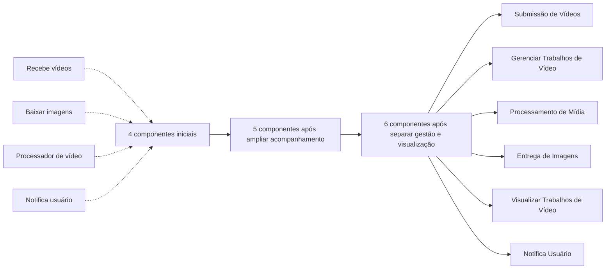
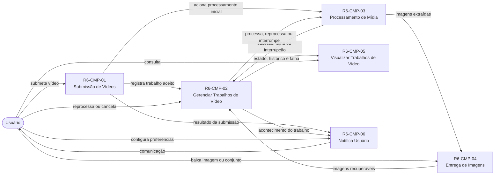
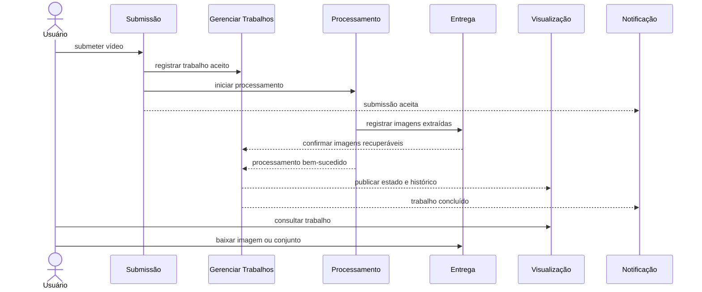

# Diagramas da proposta

> Navegação: [índice da proposta histórica](README.md) · [modelo proposto](componentes.md)

Os blocos Mermaid podem ser renderizados pelo visualizador yFiles usado na interface. As setas representam interação ou passagem de fatos, não protocolo, sincronismo, processo ou implantação.

## Evolução resumida

## Base final de componentes

## Sequência do caminho feliz

O trabalho somente pode aparecer como concluído quando o conjunto completo de imagens estiver recuperável. A existência prévia de um ZIP não é condição para conclusão.
