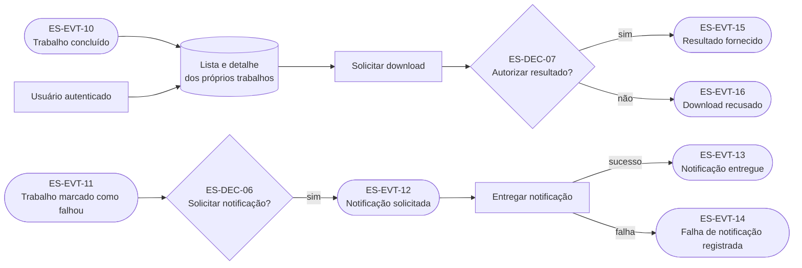

# Event Storming enxuto

## Escopo e estado

Este quadro percorre o fluxo desde a autenticação até o acesso ao resultado ou a comunicação de falha. Ele foi derivado das [histórias](historias.md) e do [glossário](glossario.md), sem usar os componentes existentes para limitar a descoberta.

O conteúdo foi validado pelo responsável pelo projeto em 2026-08-02. A revisão confirmou direções de negócio e preservou como pendências as escolhas de mecanismo e escopo incremental. O quadro não decide event sourcing, mensageria, serviços, bancos de dados, transporte de atualizações nem topologia de implantação.

Notação:

- **comando:** intenção de um ator, escrita no imperativo;
- **decisão/política:** pergunta ou regra que escolhe o próximo passo;
- **evento:** fato relevante ocorrido, escrito no passado;
- **modelo de leitura:** informação consultada para decidir ou acompanhar;
- **questão:** lacuna capaz de mudar regra, estado ou fronteira.

## Fluxo principal candidato

```mermaid
flowchart LR
    U[Usuário] --> C1[Apresentar credenciais]
    C1 --> D1{ES-DEC-01<br/>Conceder identidade?}
    D1 -->|sim| E1([ES-EVT-01<br/>Identidade autenticada])
    D1 -->|não| E2([ES-EVT-02<br/>Acesso recusado])

    E1 --> C2[Enviar vídeo]
    C2 --> E3([ES-EVT-03<br/>Envio recebido])
    E3 --> C4[Executar validações de admissão]
    C4 --> D2{ES-DEC-02<br/>Aceitar o trabalho?}
    D2 -->|não| E4([ES-EVT-04<br/>Envio rejeitado com problemas])
    D2 -->|sim| E5([ES-EVT-05<br/>Trabalho aceito])

    E5 --> D3{ES-DEC-03<br/>Solicitar processamento?}
    D3 --> E6([ES-EVT-06<br/>Processamento solicitado])
    E6 --> D4{ES-DEC-04<br/>Iniciar nova tentativa?}
    D4 --> E7([ES-EVT-07<br/>Tentativa iniciada])
    E7 --> C3[Extrair e empacotar imagens]
    C3 --> D5{ES-DEC-05<br/>Resultado utilizável?}
    D5 -->|sim| E8([ES-EVT-08<br/>Resultado produzido])
    E8 --> E10([ES-EVT-10<br/>Trabalho concluído])
    D5 -->|não| E9([ES-EVT-09<br/>Falha de processamento relatada])
    E9 --> E11([ES-EVT-11<br/>Trabalho marcado como falhou])
```

`ES-EVT-03` registra que o sistema recebeu a submissão e começou a tratar o fluxo; não afirma que todos os bytes já foram transferidos. Uma violação definitiva detectável por metadados confiáveis ou pela leitura progressiva pode interromper a transferência. Se a checagem antecipada não for conclusiva, a aceitação aguarda o conteúdo necessário para executar as demais validações de admissão.

## Consulta, download e notificação

Listar ou consultar trabalhos foi representado como modelo de leitura, não como evento de domínio obrigatório. Uma futura necessidade de auditoria pode justificar eventos de acesso, mas ela ainda não foi declarada.

## Linha temporal e políticas candidatas

| Ordem | Ator ou gatilho | Comando | Decisão | Evento resultante | Classificação |
|---|---|---|---|---|---|
| 1 | Usuário | Apresentar credenciais | `ES-DEC-01` — as credenciais estabelecem uma identidade? | `ES-EVT-01` Identidade autenticada ou `ES-EVT-02` Acesso recusado | Necessidade declarada; mecanismo `A confirmar` |
| 2 | Usuário autenticado | Enviar e validar vídeo | `ES-DEC-02` — todas as validações de admissão aplicáveis passaram e o trabalho pode ser recuperado depois da confirmação? | `ES-EVT-03` Envio recebido; depois `ES-EVT-04` Envio rejeitado com os problemas detectados ou `ES-EVT-05` Trabalho aceito | Envio declarado; validação completa antes da aceitação declarada pelo responsável; evidência técnica de recuperação ainda em análise |
| 3 | Trabalho aceito | Solicitar processamento | `ES-DEC-03` — o vídeo validado e preservado está disponível para processamento? | `ES-EVT-06` Processamento solicitado | Ordem confirmada; mecanismo de entrega `A confirmar` |
| 4 | Solicitação disponível | Iniciar tentativa | `ES-DEC-04` — esta entrega exige nova tentativa ou já foi tratada? | `ES-EVT-07` Tentativa iniciada | Sem limite funcional de novas tentativas; duplicidade, erro permanente e proteção operacional permanecem distintos |
| 5 | Tentativa ativa | Extrair e empacotar imagens | `ES-DEC-05` — foi produzido resultado completo e utilizável? | `ES-EVT-08` Resultado produzido ou `ES-EVT-09` Falha de processamento relatada | Transformação declarada; critério de sucesso `A confirmar` |
| 6a | Resultado produzido | Registrar sucesso | Política: um resultado utilizável conclui o trabalho após sua referência ser preservada | `ES-EVT-10` Trabalho concluído | Inferida; atomicidade `A confirmar` |
| 6b | Falha relatada | Registrar falha | Política: a falha da tentativa precisa produzir estado consultável e não impede uma nova tentativa do mesmo trabalho permitida pela política | `ES-EVT-11` Trabalho marcado como falhou | Necessidade declarada; sem limite funcional total de novas tentativas; gatilho `A confirmar` |
| 7 | Trabalho falhou | Solicitar notificação | `ES-DEC-06` — o usuário deve ser atualizado depois que a falha e os problemas aplicáveis forem consolidados? | `ES-EVT-12` Notificação solicitada | Momento declarado; canal e garantias `A confirmar`; WebSocket e SSE são opções, não decisões |
| 8 | Notificação solicitada | Entregar notificação | Política: falha do canal não altera o estado do trabalho | `ES-EVT-13` Notificação entregue ou `ES-EVT-14` Falha de notificação registrada | Distinção inferida do glossário |
| 9 | Usuário consulta trabalho concluído | Solicitar download | `ES-DEC-07` — identidade, propriedade, estado e disponibilidade autorizam o acesso? | `ES-EVT-15` Resultado fornecido ou `ES-EVT-16` Download recusado | Download declarado; política de autorização inferida |

## Decisões graph-ready em análise

| ID | Pergunta de decisão | Evidências mínimas | Saídas possíveis | Estado |
|---|---|---|---|---|
| `ES-DEC-01` | Quando credenciais estabelecem uma identidade autenticada? | Política de contas, mecanismo de autenticação e critérios de expiração | Conceder identidade; recusar acesso | Direção de autogestão confirmada; primeiro escopo `em_analise` |
| `ES-DEC-02` | Quando o sistema pode assumir responsabilidade por um trabalho? | Validações do envio, persistência do trabalho e do vídeo, cenários de reinício | Aceitar trabalho; rejeitar envio | Regra de admissão confirmada; evidência de durabilidade `em_analise` |
| `ES-DEC-03` | O que torna um trabalho apto a solicitar processamento? | Estados candidatos, validações e disponibilidade do vídeo | Solicitar; aguardar; rejeitar/falhar conforme regra futura | Ordem confirmada; contrato `em_analise` |
| `ES-DEC-04` | Uma entrega deve iniciar nova tentativa? | ID do trabalho, tentativas anteriores, estado e classificação da falha | Iniciar; ignorar duplicidade; reagendar | Sem limite funcional confirmado; salvaguardas `em_analise` |
| `ES-DEC-05` | O resultado da tentativa é completo e utilizável? | Saída do processador, integridade do pacote e referência persistida | Produzir resultado; relatar falha | `em_analise` |
| `ES-DEC-06` | Uma falha deve gerar notificação? | Problemas consolidados, preferência/obrigatoriedade e contato ou sessão autorizada | Solicitar atualização; não solicitar | Momento confirmado; transporte e garantias `em_analise` |
| `ES-DEC-07` | O resultado pode ser fornecido ao solicitante? | Identidade, propriedade, estado e existência do artefato | Fornecer resultado; recusar download | Retenção sem expiração confirmada por enquanto; demais regras `em_analise` |

Esses elementos são decisões de domínio candidatas, não ADRs. Quando uma pergunta exigir escolha arquitetural durável — por exemplo, atomicidade entre persistência e entrega — ela poderá motivar um ADR separado sem perder a relação com a decisão de negócio.

## Resultado da revisão das questões

| ID | Resolução da descoberta | Classificação e encaminhamento |
|---|---|---|
| `ES-Q-01` | Todas as validações de admissão aplicáveis, inclusive formato e tamanho, precedem `Trabalho aceito`. Sempre que uma verificação confiável puder ocorrer durante a transferência, ela deve antecipar a interrupção; cabeçalhos declarados pelo cliente não bastam como prova definitiva. Uma rejeição reúne todos os problemas que puderem ser verificados com segurança na mesma submissão. | Direção declarada pelo responsável. O conjunto exato de validações será incorporado em [`WORK-009`](../acompanhamento/roadmap.md#work-009--incorporar-descobertas-do-event-storming); inspeção progressiva e interrupção antecipada são recomendações técnicas. |
| `ES-Q-02` | Concluir validações de admissão é necessário, mas a confirmação também precisa significar que trabalho, proprietário, estado e referência do vídeo podem ser recuperados. | A regra de negócio foi delimitada; a evidência de durabilidade e a atomicidade serão decididas e testadas em [`WORK-012`](../acompanhamento/roadmap.md#work-012--registrar-as-primeiras-decisões-arquiteturais) e [`WORK-014`](../acompanhamento/roadmap.md#work-014--construir-a-primeira-fatia-de-risco-com-feedback-determinístico). |
| `ES-Q-03` | O mesmo trabalho pode ter novas tentativas sem um limite funcional total. Reentrega duplicada não é nova tentativa, e falhas permanentes não devem provocar repetição automática infinita. | Regra declarada. Ainda será definido quando a tentativa é automática ou solicitada pelo usuário. Classificação de falhas, espera progressiva, controle de concorrência e proteção contra abuso são salvaguardas operacionais, não uma cota total de tentativas. |
| `ES-Q-04` | Vídeo de origem, resultado e histórico permanecem retidos por tempo indeterminado, sem expiração automática, por enquanto. | Regra declarada e revisável quando custo, privacidade, obrigação legal ou solicitação de exclusão exigirem uma política explícita. |
| `ES-Q-05` | Problemas de validação são comunicados juntos depois de executar todas as verificações de admissão aplicáveis. Uma falha de processamento é comunicada somente depois de registrada e consolidada; a falha do canal continua sem alterar o trabalho. | Momento declarado. WebSocket e SSE são opções candidatas para atualização em tempo real, não escolhas aceitas; consentimento, canal externo e garantias de entrega seguem para refinamento. |
| `ES-Q-06` | A direção desejada é permitir autogestão de conta, incluindo progressivamente credenciais e dados pessoais, como em aplicações modernas. | Visão declarada, não requisito integral do primeiro incremento. O provisionamento da demonstração e o recorte inicial de cadastro, recuperação, alteração, exclusão e dados pessoais permanecem a definir. |

## Revisão de consistência

- Todas as sete histórias aparecem como comando, política, evento ou modelo de leitura.
- Rejeição do envio, falha de processamento e falha de notificação permanecem fatos distintos.
- Formato e tamanho inválidos produzem rejeição antes da aceitação; validações que dependem da transformação continuam pertencendo ao processamento.
- Trabalho de vídeo e tentativa de processamento permanecem identidades distintas.
- Ausência de limite funcional para novas tentativas não elimina idempotência, controle de concorrência nem proteção contra repetição automática sem progresso.
- Consulta não altera estado; download e notificação não redefinem o resultado do processamento.
- Retenção por tempo indeterminado não foi confundida com impossibilidade futura de excluir dados nem com decisão de tecnologia de armazenamento.
- Nenhum evento exige uma tecnologia ou unidade de implantação específica.

## Encaminhamento

O [`WORK-008`](../acompanhamento/realizacoes.md#work-008--conduzir-event-storming-enxuto) foi encerrado com as seis questões revisadas. As descobertas confirmadas foram incorporadas ao [glossário](glossario.md) e às [histórias](historias.md) em `WORK-009`; o quadro permanece como evidência da descoberta, não como fonte concorrente de requisitos.

A revisão não tornou WebSocket, SSE, quantidade de quanta, persistência, armazenamento ou mecanismo de identidade decisões arquiteturais. Essas escolhas dependem do refinamento de requisitos, das ameaças, dos contratos e das medições correspondentes.

Para um mesmo fluxo de atualização unidirecional, a recomendação inicial é não manter WebSocket e SSE em paralelo: SSE é o candidato mais simples quando apenas o servidor publica estados, enquanto WebSocket se justifica quando houver bidirecionalidade contínua comprovada. A resposta da própria submissão continua suficiente para comunicar rejeições de admissão. Necessidades distintas podem justificar canais distintos depois, sem transformar essa recomendação em requisito atual.
